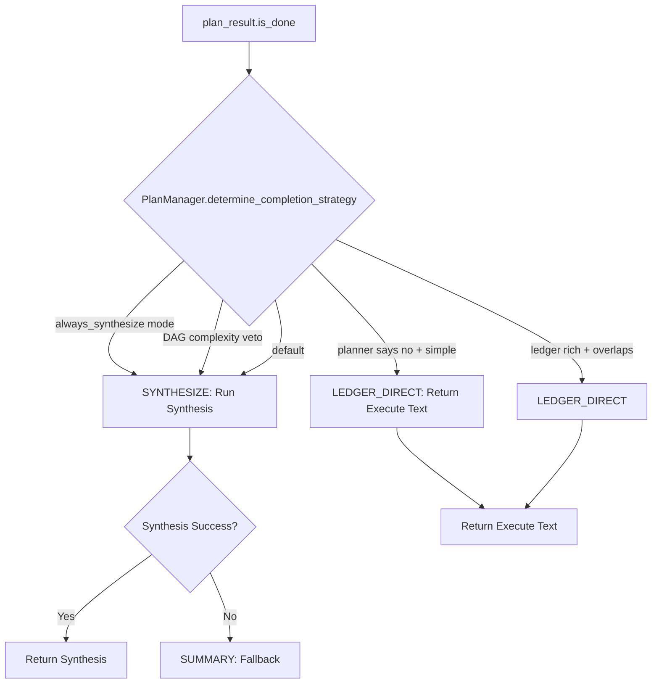

# Goal Completion Response Generation Workflow

> **RFC Reference**: RFC-204 (Consensus Loop), RFC-603 (Synthesis Phase), RFC-216 (Goal Lifecycle)
> **Implementation Guides**: IG-199 (Adaptive Final Response), IG-268 (Response Length Intelligence), IG-273 (Structural Richness)
> **Last Updated**: 2026-05-04

---

## Overview

The goal completion response generation workflow in Soothe is a multi-layer adaptive system that determines **when** to complete a goal and **how** to generate the final user response. This document analyzes the complete workflow from completion detection through response synthesis.

---

## Architecture (components)

| Component | Python package / path | Role |
|-----------|------------------------|------|
| **AgentLoop** | `packages/soothe/src/soothe/core/agent_loop/` | Plan–Execute loop; completion detection; adaptive final response |
| **GoalEngine** | `packages/soothe/src/soothe/core/goal_engine/` | Goal lifecycle, consensus, DAG scheduling |
| **Runner** | `packages/soothe/src/soothe/core/runner/` | Wires AgentLoop to transports and streams |

---

## Workflow Stages

### Stage 1: Completion Detection (Plan Phase)

**Location**: `packages/soothe/src/soothe/core/agent_loop/core/planner.py`

#### Primary Detection: LLM-Based Assessment

The Plan phase produces a `PlanResult` with:
- `status`: `"done"`, `"continue"`, or `"replan"`
- `goal_progress`: Estimated progress (0.0-1.0)
- `confidence`: Model confidence in assessment (0.0-1.0)
- `full_output`: Final user-visible answer when `status="done"`

**Progress (`goal_progress`)**: Taken from the assess model’s `StatusAssessment.goal_progress` and carried into `PlanResult` (RFC-604). Evidence-based **blending** of `goal_progress` was **removed** (IG-376); **`confidence`** may still be calibrated from execution metrics in `LLMPlanner.plan()`.

**Completion authority**: Only `StatusAssessment.status` (RFC-604) ends the loop. Heuristic force-done (`completion_classifier`, IG-433) was **removed** — evidence volume and diminishing-returns must not override assess `continue`.

---

### Stage 2: Response Length Determination (IG-268)

**Location**: Length / scenario logic lives under `packages/soothe/src/soothe/core/agent_loop/analysis/` (e.g. scenario classification). Older standalone `response_length_policy.py` references in this doc are **historical**. Completion strategy is now determined by `PlanManager.determine_completion_strategy()` in `core/plan_manager.py` (IG-400).

Before generating any response, the system uses configuration (`SootheConfig.agentic.final_response`) and policies to choose synthesis vs direct execute vs summary.

#### Response Length Categories

| Category | Word Count | Usage Scenario |
|----------|------------|----------------|
| **BRIEF** | 50-150 | Quiz, simple questions |
| **CONCISE** | 150-300 | Thread continuation, simple follow-ups |
| **STANDARD** | 300-500 | Medium tasks, research synthesis |
| **COMPREHENSIVE** | 600-800 | Architecture analysis, complex implementation |

#### Determination Rules (`response_length_policy.py:50-124`)

```python
def determine_response_length(
    intent_type: str,          # quiz/continue_thread/new_goal
    goal_type: str,            # architecture_analysis/research_synthesis/implementation_summary/general
    task_complexity: str,      # minimal/simple/medium/complex
    evidence_volume: int,      # Total evidence char count
    evidence_diversity: int,    # Unique step types count
) -> ResponseLengthCategory:
```

**Priority Rules**:

1. **Intent Override**:
   - Quiz → BRIEF (always short replies)
   - Thread continuation → CONCISE (builds on prior context)

2. **Goal Type Specialization**:
   - Architecture analysis → COMPREHENSIVE (structured layers, components)
   - Implementation summary → COMPREHENSIVE (code patterns, examples)
   - Research synthesis + medium → STANDARD (methodology + findings)

3. **Task Complexity**:
   - Complex → COMPREHENSIVE
   - Medium → STANDARD

4. **Evidence Override** (volume + diversity):
   - Large evidence (≥2000 chars) + high diversity (≥4 steps) → COMPREHENSIVE
   - Moderate evidence (≥1000 chars) + diversity (≥3 steps) → STANDARD

#### Evidence Metrics Calculation

```python
def calculate_evidence_metrics(step_results: list) -> tuple[int, int]:
    successful_steps = [r for r in step_results if r.success]
    
    # Volume: Total character count from evidence strings
    evidence_volume = sum(len(r.to_evidence_string(truncate=False)) for r in successful_steps)
    
    # Diversity: Unique step types count
    evidence_diversity = len({r.step_id for r in successful_steps})
    
    return evidence_volume, evidence_diversity
```

---

### Stage 3: Adaptive Response Generation (IG-199, IG-400)

**Location**: `packages/soothe/src/soothe/core/agent_loop/core/agent_loop.py` (goal completion branch after `plan_result.is_done()`)

Once `plan_result.is_done()` returns true, the system uses `PlanManager.determine_completion_strategy()` to choose one of three branches: `LEDGER_DIRECT`, `SYNTHESIZE`, or `SUMMARY`.

#### Decision Tree



#### PlanManager Completion Strategy

The `PlanManager` (IG-400) determines completion strategy from the full PlanDAG state:

**Strategy: LEDGER_DIRECT** — Return last Execute-phase assistant text directly.

**Eligibility** (all must be true):
1. Not `always_synthesize` mode
2. Planner says no synthesis needed (`require_goal_completion=False`)
3. Simple execution: single plan, no DAG dependencies, no failures, ≤2 steps
4. Ledger text exists and passes richness check
5. Ledger text overlaps with planner's `full_output`

**Strategy: SYNTHESIZE** — LLM synthesis required.

**Triggers** (any one):
- `always_synthesize` mode (config override)
- Replan detected (`plan_count >= 2`)
- Failed steps in DAG
- Subagents used
- Deep dependency chain (`max_chain_depth >= 3`)
- Subagent cap hit
- Parallel multi-step wave execution
- Low success rate (<60%) with failed steps
- DAG dependencies ≥ 3 on current plan
- Missing ledger text

#### Branch 2: Goal Completion Synthesis

**Triggered by**: `PlanManager.determine_completion_strategy()` returns `SYNTHESIZE`

**Triggers**:
- `always_synthesize` mode (config override)
- Wave-level vetoes (parallel multi-step, subagent cap)
- Evidence heuristics (`evidence_requires_final_synthesis()`)
- Missing Execute assistant text

**Evidence-Based Trigger** (`synthesis.py:30-58`):

All must be true:
1. ≥2 successful steps
2. ≥60% success rate
3. ≥500 chars total evidence
4. ≥2 unique step types

**Implementation** (`agent_loop.py:412-494`):

```python
# 1. Build synthesis request with length guidance
goal_completion_request = f"""Based on the complete execution history, generate a goal completion response.

RESPONSE LENGTH: {length_category.min_words}-{length_category.max_words} words ({length_category.value} category)

{self._get_length_guidance(length_category)}

The response should:
1. Summarize what was accomplished
2. **Include actual content** from tool results (ToolMessage.content)
3. Provide actionable results
4. Match the response length guidance
"""

# 2. Create special LoopHumanMessage with phase="goal_completion"
human_msg = LoopHumanMessage(
    content=goal_completion_request,
    thread_id=state.thread_id,
    iteration=state.iteration,
    phase="goal_completion",  # Special marker
)

# 3. Stream from CoreAgent with goal_completion_stream event type
accum = GoalCompletionAccumState()
async for chunk in self.core_agent.astream(
    {"messages": [human_msg]},
    stream_mode=["messages"],
):
    for msg in iter_messages_for_act_aggregation(chunk):
        update_goal_completion_from_message(accum, msg)
    
    # Yield special event type to bypass runner filtering
    yield ("goal_completion_stream", chunk)

# 4. Resolve accumulated text
final_output = resolve_goal_completion_text(accum)
```

**Streaming Accumulation** (`stream_chunk_normalize.py:142-191`):

```python
class GoalCompletionAccumState:
    accumulated_chunks: str = ""       # Concatenated AIMessageChunk text
    final_ai_message_text: str = ""    # Final AIMessage text
    ai_msg_count: int = 0

def resolve_goal_completion_text(state: GoalCompletionAccumState) -> str:
    # Prefer accumulated chunks over final message (handles sparse AIMessage)
    if len(state.accumulated_chunks) >= len(state.final_ai_message_text):
        return state.accumulated_chunks
    return state.final_ai_message_text
```

**Key Design**: Special `phase="goal_completion"` marker and `("goal_completion_stream", chunk)` event type ensure this response bypasses normal Runner filtering and reaches CLI/TUI unmodified.

#### Branch 3: User-Friendly Summary (Fallback)

**Condition**: Synthesis fails or no Execute text available

**Implementation** (`agent_loop.py:333-342`):

```python
# Generate user-friendly summary (NEVER leak verbose evidence_summary)
if plan_result.full_output:
    final_output = plan_result.full_output
elif state.step_results:
    successful_count = sum(1 for r in state.step_results if r.success)
    total_count = len(state.step_results)
    final_output = f"Completed {successful_count}/{total_count} steps successfully. {plan_result.next_action or ''}"
else:
    final_output = plan_result.next_action or "Goal achieved successfully"
```

**Critical Rule (IG-268)**: Never leak internal `evidence_summary` (verbose step strings) to users. Always generate user-friendly summary instead.

---

### Stage 4: GoalEngine consensus validation

**Location**: `packages/soothe/src/soothe/core/goal_engine/consensus.py`

After AgentLoop produces `status="done"` response, GoalEngine consensus validates completion before accepting.

#### Validation Process

```python
async def evaluate_goal_completion(
    goal_description: str,
    response_text: str,         # AgentLoop's completion response
    evidence_summary: str = "",
    success_criteria: list[str] | None = None,
    model: BaseChatModel | None = None,
) -> tuple[ConsensusDecision, str]:
```

**Decision Types** (`consensus.py:22`):

| Decision | Action | Condition |
|----------|--------|-----------|
| **accept** | Mark goal completed | Goal truly satisfied |
| **send_back** | Return to AgentLoop with refined instructions | Goal not fully satisfied |
| **suspend** | Pause goal (budget exhaustion) | Cannot proceed further |

#### LLM-Based Evaluation

**Prompt Construction** (`consensus.py:129-165`):

```python
prompt = f"""Evaluate whether this goal completion truly satisfies the original goal.

GOAL: {goal_description}
RESPONSE: {response_text}
EVIDENCE: {evidence_summary}
SUCCESS CRITERIA: {success_criteria}

Decision options:
- accept: Goal is fully satisfied, response meets all criteria
- send_back: Goal not fully satisfied, need more work
- suspend: Cannot proceed further, budget exhausted

Provide your decision and reasoning in format:
DECISION: [accept/send_back/suspend]
REASONING: [explanation]
"""
```

#### Heuristic Fallback

When LLM unavailable (`consensus.py:87-126`):

```python
def _heuristic_evaluation(response_text, evidence_summary, success_criteria) -> tuple[ConsensusDecision, str]:
    # 1. Response length check
    if len(response_text) < 50:
        return "send_back", "Response too short"
    
    # 2. Success criteria keyword match
    if success_criteria:
        criteria_hits = sum(1 for c in success_criteria if c.lower() in response_text.lower())
        if criteria_hits < len(success_criteria) * 0.5:
            return "send_back", "Missing success criteria mentions"
    
    # 3. Default: Accept when response exists
    return "accept", "Response present, no LLM available to validate"
```

---

### Stage 5: Goal lifecycle management

**Location**: `packages/soothe/src/soothe/core/goal_engine/engine.py`

#### Goal Completion Methods

**Complete Goal** (`engine.py:341-391`):

```python
async def complete_goal(self, goal_id: str, completion_response: str) -> None:
    """Mark goal as completed after GoalEngine validation.
    
    1. Update goal status to 'completed'
    2. Set completion_timestamp
    3. Store completion_response
    4. Update source file status (if from goal file)
    """
    goal = await self.get_goal(goal_id)
    goal.status = GoalStatus.COMPLETED
    goal.completion_response = completion_response
    goal.completion_timestamp = datetime.utcnow()
    
    # Update goal file if from managed source
    if goal.source_file:
        await self._update_goal_file_status(goal, "completed")
```

**Fail Goal** (`engine.py:393-510`):

```python
async def fail_goal(self, goal_id: str, error: str, evidence: EvidenceBundle) -> None:
    """Mark goal as failed with EvidenceBundle for GoalEngine review.
    
    1. Update goal status to 'failed'
    2. Store failure_reason and EvidenceBundle
    3. Apply backoff reasoning (incremental retry delays)
    4. Schedule retry if retry_count < max_retries
    """
    goal.status = GoalStatus.FAILED
    goal.failure_reason = error
    goal.evidence_bundle = evidence
    goal.retry_count += 1
    
    # Backoff reasoning: exponential delay with jitter
    backoff_delay = min(2 ** goal.retry_count, 3600)  # Cap at 1 hour
    await self._schedule_retry(goal_id, backoff_delay)
```

**Other Lifecycle Actions**:

- `validate_goal()`: GoalEngine accepted completion → status transition to `validated`
- `suspend_goal()`: Send-back budget exhaustion → status `suspended`
- `block_goal()`: Awaiting external input → status `blocked`
- `check_reactivated_goals()`: Auto-reactivate when dependencies resolved

---

## Key Design Principles

### 1. Evidence-aware completion (RFC-204)

- **`goal_progress`**: From StatusAssessment (IG-376).
- **`confidence`**: May blend LLM self-score with execution metrics in `LLMPlanner.plan()`.
- **Completion**: RFC-604 assess only; heuristic force-done removed.

### 2. Adaptive Response Sizing (IG-268)

**Match response length to task complexity**:
- BRIEF for simple interactions (quiz)
- CONCISE for thread continuation (builds on context)
- STANDARD for medium tasks (research synthesis)
- COMPREHENSIVE for complex work (architecture, implementation)

### 3. Three-Branch Response Generation (IG-199)

**Optimize for user experience and efficiency**:
- **Direct Execute**: Return when last Execute text is rich and aligned
- **Synthesis**: Generate when evidence requires consolidation
- **Fallback Summary**: Simple message when synthesis unavailable

### 4. GoalEngine validation (RFC-204)

**Holistic evaluation before accepting completion**:
- AgentLoop's `done` judgment can be validated independently
- Consensus can send back for refinement or suspend when exhausted
- Prevents premature completion declaration

### 5. Never Leak Internal Evidence (IG-268)

**User-friendly summaries only**:
- `evidence_summary` contains verbose step strings (for internal use)
- Always generate user-friendly summary for fallback
- Direct Execute and Synthesis handle content presentation properly

---

## Configuration Options

### Final Response Mode (`config.yml`)

```yaml
agentic:
  final_response: adaptive  # Options: adaptive, always_synthesize, always_last_execute
```

**Modes**:

| Mode | Behavior |
|------|----------|
| **adaptive** | Use heuristics to choose optimal branch (default) |
| **always_synthesize** | Always run synthesis phase (for complex workflows) |
| **always_last_execute** | Always return last Execute text when available |

### Response Length Override

```yaml
agentic:
  response_length_override: comprehensive  # Override automatic categorization
```

---

## Events

### Goal Completion Events

| Event | Type | Trigger |
|-------|------|---------|
| `GoalCompletedEvent` | `soothe.cognition.goal.completed` | Goal marked completed |
| `GoalFailedEvent` | `soothe.cognition.goal.failed` | Goal marked failed (includes retry_count) |
| `GoalReportEvent` | `soothe.cognition.goal.report` | Step counts and summary |
| `LoopAgentReasonEvent` | `soothe.cognition.agent_loop.reasoned` | User-visible progress after Plan phase (wire name unchanged) |

### Streaming Events

| Event Type | Payload | Usage |
|------------|---------|-------|
| `("goal_completion_stream", chunk)` | Stream chunk from CoreAgent synthesis | Bypasses Runner filtering, reaches CLI/TUI directly |
| `("completed", {"result": PlanResult, "step_results_count": int})` | Completion metadata | Runner finalizes goal lifecycle |

---

## Code References

### Key Classes

| Class | Location | Purpose |
|-------|----------|---------|
| `AgentLoop` | `packages/soothe/src/soothe/core/agent_loop/core/agent_loop.py` | Plan–Execute orchestration |
| `PlanManager` | `packages/soothe/src/soothe/core/agent_loop/core/plan_manager.py` | Plan orchestration + completion strategy (IG-400) |
| `PlanDAG` | `packages/soothe/src/soothe/core/agent_loop/core/plan_dag.py` | Unified DAG of all planned steps (IG-400) |
| `LLMPlanner` | `packages/soothe/src/soothe/core/agent_loop/core/planner.py` | Two-call Plan architecture (RFC-604) |
| `PlanResult` | `packages/soothe/src/soothe/core/agent_loop/state/schemas.py` | Plan phase output |
| `StatusAssessment` | `packages/soothe/src/soothe/core/agent_loop/state/schemas.py` | Lightweight status check |
| `GoalCompletionAccumState` | `packages/soothe/src/soothe/core/agent_loop/utils/stream_normalize.py` | Streaming accumulator for goal completion |
| `GoalEngine` | `packages/soothe/src/soothe/core/goal_engine/engine.py` | Goal lifecycle manager |
| `EvidenceBundle` | `packages/soothe/src/soothe/core/goal_engine/models.py` | AgentLoop → GoalEngine evidence exchange |

### Key Functions

| Function | Location | Purpose |
|----------|----------|---------|
| `PlanManager.determine_completion_strategy()` | `packages/soothe/src/soothe/core/agent_loop/core/plan_manager.py` | Choose LEDGER_DIRECT / SYNTHESIZE / SUMMARY |
| `PlanManager.determine_goal_completion_needs()` | `plan_manager.py` | `require_goal_completion` vs config mode |
| `determine_goal_completion_needs()` (standalone) | `plan_manager.py` | Used by planner.py without PlanManager |
| `PlanDAG.ingest_plan()` | `packages/soothe/src/soothe/core/agent_loop/core/plan_dag.py` | Merge plan steps into unified DAG |
| `generate_user_fallback_summary()` | `packages/soothe/src/soothe/core/agent_loop/core/fallback_summary.py` | User-safe summary when synthesis unavailable |
| `SynthesisGenerator` (class) | `packages/soothe/src/soothe/core/agent_loop/analysis/synthesis.py` | Optional synthesis stream for goal completion |
| `evaluate_goal_completion()` | `packages/soothe/src/soothe/core/goal_engine/consensus.py` | Consensus validation |

---

## Testing

### Test Locations

| Test Type | Location |
|-----------|----------|
| **PlanDAG / PlanManager** | `packages/soothe/tests/unit/core/agent_loop/policies/test_goal_completion_policy.py` |
| **Plan phase / planner** | `packages/soothe/tests/unit/core/agent_loop/core/` (`test_plan_phase_*.py`, etc.) |
| **Adaptive final response** | `packages/soothe/tests/unit/core/agent_loop/core/test_agent_loop_adaptive_final.py` |
| **GoalEngine** | `packages/soothe/tests/unit/core/goal_engine/` |
| **AgentLoop integration** | `packages/soothe/tests/integration/core/agent_loop/` |

### Verification Command

```bash
./scripts/verify_finally.sh
```

Runs:
- Code formatting check
- Linting (zero errors required)
- Unit tests (900+ tests must pass)

---

## Future Enhancements

### Planned Improvements (RFCs)

1. **Multi-Goal Completion**: Handle completion of multiple concurrent goals
2. **Completion Metrics**: Track completion time, iteration count, success rate per goal type
3. **Adaptive Backoff**: Learn from failure patterns to optimize retry delays
4. **User Feedback Integration**: Accept explicit user feedback on completion quality

---

## References

### RFC Documents

- **RFC-204**: Consensus loop for GoalEngine validation
- **RFC-603**: Synthesis Phase for Comprehensive Reports
- **RFC-216**: Goal Lifecycle Management

### Implementation Guides

- **IG-199**: Adaptive Final Response Policy
- **IG-268**: Response Length Intelligence System
- **IG-273**: Structural Richness Check for Direct Execute
- **IG-400**: PlanManager/PlanDAG Goal Completion Architecture

### Related Documentation

- **Debug Guide**: `docs/howto_debug.md` - LLM tracing, goal completion auditing
- **User Guide**: `docs/user_guide.md` - Response quality tuning
- **Architecture**: `docs/specs/RFC-000-system-conceptual-design.md`

---

## Summary

The goal completion response generation workflow in Soothe is a sophisticated adaptive system with:

1. **Completion detection** from RFC-604 `StatusAssessment` only
2. **Adaptive final response** (`agentic.final_response`) choosing direct execute vs synthesis vs summary
3. **Policies and analysis modules** under `core/agent_loop/policies` and `core/agent_loop/analysis`
4. **GoalEngine consensus** where applicable before accepting completion
5. **Lifecycle management** in `core/goal_engine` for completion, failure, retry, and reactivation

Implementation paths use `packages/soothe/src/soothe/core/` (AgentLoop and GoalEngine migrated from legacy `cognition/` packages).