# Soothed Daemon Memory Leak Diagnosis

Guide for investigating rapid RSS growth in the `soothed` container deployed via `deploy/docker-compose.yml`.

**Symptom reference:** RSS climbing by ~0.6 GB every ~2 seconds (also observed historically as 1 GB baseline growing toward 24 GB over time).

---

## Quick triage checklist

Run these first to narrow the root cause before enabling heavy profiling.

| Step | Command / check | What it tells you |
|------|-----------------|-------------------|
| 1 | `docker stats soothed --no-stream` (repeat every few seconds) | Confirms RSS slope; note baseline vs peak |
| 2 | `docker logs soothed 2>&1 \| tail -200` | Active query, queue warnings, profiler noise |
| 3 | Is a client connected and consuming events? | Slow/dead consumer → queue backlog |
| 4 | `SOOTHE_MEMORY_PROFILING_ENABLED` value | Profiling + aggressive polling can mimic or worsen leaks |
| 5 | Growth during **idle** vs **running query** | Idle → background task or monitor; query → stream backpressure |

---

## Architecture: where memory can grow

```mermaid
flowchart LR
    W[Worker thread\nSootheRunner.astream] -->|unbounded put| RQ[threading.Queue /\nasyncio.Queue]
    RQ --> QE[QueryEngine._process_stream]
    QE --> CO[StreamDeliveryCoalescer]
    CO --> BC[_broadcast]
    BC --> EB[EventBus.publish]
    EB --> EQ[Client event_queue\nmax 10000]
    EQ --> SD[Sender → WebSocket]

    EB -.->|CRITICAL blocks when full| BC
    W -.->|no backpressure| RQ
```



The default `thread_pool` runner has **no backpressure** from the main event loop back to the worker thread. If client delivery is slower than agent streaming, internal queues absorb the difference and RSS rises quickly.

---

## Suspected leak sources (ranked)

### 1. Unbounded thread-pool response queues (primary — during active queries)

**Location:** `packages/soothe-daemon/src/soothe_daemon/runner/thread_runner.py`

| Component | Limit | Risk |
|-----------|-------|------|
| `asyncio.Queue()` in `ThreadPool.submit()` | **Unbounded** | Main loop backlog |
| `threading.Queue()` in worker | **Unbounded** | Worker-side backlog |
| `ResponsePusher.push_from_worker()` | `put_nowait`, never blocks | Worker keeps emitting |

**Failure mode:**

1. Worker streams LangGraph chunks (tool results, file reads, subagent output).
2. `QueryEngine._process_stream` awaits `_broadcast` per chunk.
3. Client WebSocket is slow, disconnected, or sender task has exited.
4. `EventBus.publish` blocks on CRITICAL events when client queue is full.
5. Worker continues pushing chunks → queues grow without cap.

Large tool payloads (multi‑MB `read_file` / MCP resources) make **hundreds of MB per second** plausible.

**Code references:**

- `thread_runner.py` — `asyncio.Queue()` at submit (no `maxsize`)
- `thread_runner.py` — `_emit("chunk", chunk)` without backpressure
- `query/engine.py` — `_process_stream` awaits broadcast per coalescer output

---

### 2. Client event queue backlog + CRITICAL blocking

**Location:**

- `packages/soothe-daemon/src/soothe_daemon/server/session.py` — `event_queue` max 10,000
- `packages/soothe-daemon/src/soothe_daemon/event/bus.py` — priority overflow policy

Each queued event can be large (serialized AI messages, tool batches). When the queue is full:

- **NORMAL** / **LOW** events are dropped (throttled log).
- **CRITICAL** events (`status: running`, `status: idle`) **block** with `await queue.put(...)`.

That blocks the entire broadcast chain and amplifies response-queue growth (section 1).

**Log patterns to search:**

```text
Client %s event queue near capacity
Queue full for CRITICAL event, blocking until space available
Client %s sender stopped: disconnected ... (%d queued)
```

Queue depth warnings are emitted every 10 seconds by `_periodic_queue_monitoring` in `server/core.py`.

---

### 3. In-query state accumulation (secondary)

Bounded by IG-475 for multi-goal loops, but large single-step outputs still matter:

| Structure | Bounded? | Cleared on goal end? |
|-----------|----------|----------------------|
| `LoopState.step_results` | Yes (50) | Yes (`clear_goal_state`) |
| `LoopState.loop_messages` | Yes (200, trim) | Trim only |
| `LoopState.invoked_skill_bodies` | No | **No** |
| `LoopState.cached_mcp_resources` | No | **No** |
| `QueryEngine` `full_response` list | No | Per-query only |
| LangGraph checkpoint messages | Effectively per-wave | Persistence + in-memory graph |

**Location:** `packages/soothe/src/soothe/sloop/state/schemas.py` — `clear_goal_state()`

---

### 4. Memory profiler overhead (can look like a leak)

**Location:** `packages/soothe-daemon/src/soothe_daemon/services/memory_profiler.py`

If `SOOTHE_DAEMON_MEMORY_PROFILING__ENABLED=true` (docker-compose env `SOOTHE_MEMORY_PROFILING_ENABLED`) **and** an external monitor polls memory every ~2 seconds:

| Mode | Risk |
|------|------|
| `mode=daemon` | Calls `tracemalloc.take_snapshot()` on every request |
| `mode=objects` | Runs `gc.get_objects()` over entire heap — can spike RSS massively |
| tracemalloc with `trace_depth=25` | High overhead under heavy streaming allocation |

**This can produce “+0.6 GB every 2 seconds” without an application bug.**

Correct HTTP endpoint (not `/rpc/memory`):

```text
GET http://127.0.0.1:8765/api/v1/memory?mode=<daemon|gc|snapshot|compare|objects>
```

---

### 5. Lower-impact / slow leaks

| Source | Notes |
|--------|-------|
| Orphaned event-bus topics | Cleaned every 60s (`cleanup_orphaned_topics`) — metadata only |
| `_loop_stream_delivery` dict | Not cleaned on loop GC — small per loop |
| `LoopCardManager` ledgers | Released on loop purge; idle loops may retain until GC hours |
| Autopilot scheduling | Only if `config.agent.autonomous.enabled` and goals in flight |

---

## IG-475 mitigations vs this bug

IG-475 added bounded `LoopState` lists, goal-state clearing, event-bus topic cleanup, and optional tracemalloc profiling. These help **cross-goal** retention and **Python allocation** visibility but do **not** fix:

- Unbounded worker → daemon response queues
- Client delivery backpressure
- CRITICAL publish blocking

---

## Memory profiling: what works and what is missing

### Enabled via docker-compose

```yaml
SOOTHE_DAEMON_MEMORY_PROFILING__ENABLED: ${SOOTHE_MEMORY_PROFILING_ENABLED:-false}
SOOTHE_DAEMON_MEMORY_PROFILING__TRACE_DEPTH: ${SOOTHE_MEMORY_PROFILING_TRACE_DEPTH:-25}
SOOTHE_DAEMON_MEMORY_PROFILING__LOG_GROWTH_THRESHOLD_MB: ${SOOTHE_MEMORY_PROFILING_LOG_GROWTH_THRESHOLD_MB:-100}
```

Default: **disabled**.

### What the profiler provides

- RSS / VSZ via `psutil`
- tracemalloc traced size, peak, top allocations by line and traceback
- Snapshot compare (`growth_since_last`, `mode=compare`)
- Forced GC report (`mode=gc`)
- Object type counts (`mode=objects`) — use sparingly

### Gaps for catching this leak class

| Gap | Impact |
|-----|--------|
| `snapshot_interval_seconds` / `log_growth_interval_seconds` in config | **Not wired** — no automatic periodic snapshots or growth logs |
| Queue depths (`_pending_responses`, `event_queue.qsize()`, input dispatcher) | **Not exposed** in memory stats |
| `mode=runner` (RPC default) | Returns memory **backend name**, not runner RSS or stream state |
| `worker_pool` subprocess workers | Separate process — **invisible** to daemon tracemalloc |
| No unit tests for `MemoryProfiler` | Regression risk |
| Frequent polling of `mode=daemon` / `mode=objects` | Can worsen or mimic leak |

---

## Step-by-step diagnosis procedure

### Phase A — Classify the growth pattern

```bash
# Watch container memory
docker stats soothed --no-stream

# Correlate with daemon activity
docker logs soothed 2>&1 | tail -300 | rg -i \
  'query|stream|event queue|MemoryProfiler|CRITICAL|sender stopped|Loop GC'
```

| Observation | Likely cause |
|---------------|--------------|
| RSS rises only during agent queries | Stream backpressure (sections 1–2) |
| RSS rises while daemon idle | Profiling poll, autopilot, or runaway background task |
| RSS rises after client disconnect mid-query | Dead sender + continued publish / undrained queues |
| RSS drops after query completes but never to baseline | LangGraph / skill-MCP caches; tracemalloc retained |

---

### Phase B — Safe memory profiling

**Do not** poll every 2 seconds. **Do not** use `mode=objects` on a large heap in a loop.

1. Enable profiling and restart:

   ```bash
   # In deploy/.env or docker-compose environment
   SOOTHE_MEMORY_PROFILING_ENABLED=true
   ```

2. Baseline snapshot (once):

   ```bash
   curl -s 'http://127.0.0.1:8765/api/v1/memory?mode=snapshot' | jq .
   ```

3. Reproduce the leak for 30–60 seconds.

4. Compare once:

   ```bash
   curl -s 'http://127.0.0.1:8765/api/v1/memory?mode=compare' \
     | jq '.memory_stats.top_growth[:15]'
   ```

5. Optional — force GC and check reclaim:

   ```bash
   curl -s 'http://127.0.0.1:8765/api/v1/memory?mode=gc' | jq .
   ```

6. Disable profiling after diagnosis (tracemalloc has runtime overhead).

**Interpret top growth files:**

| Top allocation site | Interpretation |
|---------------------|----------------|
| `thread_runner.py`, `response_bridge.py` | Response queue backlog |
| `event/bus.py`, `session.py` | Event delivery / queue tuples |
| `memory_profiler.py`, `tracemalloc` | Profiler or monitoring artifact |
| `executor.py`, langchain message modules | In-graph message / tool result retention |

---

### Phase C — Client and queue health

1. Confirm a client is subscribed and sender task is alive during the query.
2. Check persisted logs (docker-compose mounts `./logs` → `/var/lib/soothe/logs`):

   ```bash
   rg 'event queue near capacity|CRITICAL event|sender stopped' deploy/logs/
   ```

3. If using HTTP REST only (no WebSocket consumer), events may pile up with no drain.

---

### Phase D — Rule out profiler-induced growth

1. Set `SOOTHE_MEMORY_PROFILING_ENABLED=false`, restart, reproduce.
2. If RSS slope disappears → profiling/monitoring was the cause.
3. If slope persists → application stream path (sections 1–2).

---

## Recommended fixes (engineering backlog)

Not implemented as of this document; listed for traceability.

1. **Bound response queues** in `thread_runner.py` / `pool_runner.py` with cooperative worker pause or drop policy.
2. **Backpressure** from `QueryEngine` to worker when `response_queue` exceeds threshold.
3. **On sender death:** unsubscribe loop topic and cancel query promptly; avoid CRITICAL blocking on dead sessions.
4. **Wire `snapshot_interval_seconds`** to a daemon periodic task; include queue depths in memory stats.
5. **Clear** `invoked_skill_bodies` and `cached_mcp_resources` in `clear_goal_state()`.
6. **Clean** `_loop_stream_delivery` in loop GC.
7. **Integration test:** fast producer + slow consumer → RSS must stay below bound.
8. **Fix docker-compose comment:** document `/api/v1/memory` not `/rpc/memory`.

---

## Related configuration

| File | Purpose |
|------|---------|
| `deploy/docker-compose.yml` | Profiling env vars, memory limit comments |
| `config/daemon.template.yml` | `memory_profiling`, `loop_gc`, queue limits |
| `docs/howto_debug.md` | General logging and trace locations |
| `packages/soothe-daemon/src/soothe_daemon/services/memory_profiler.py` | Profiler implementation |

---

## Summary

| Question | Answer |
|----------|--------|
| Most likely leak during queries? | **Unbounded stream response queues** when broadcast/client delivery is slower than worker production; amplified by **full client event queues** and **CRITICAL publish blocking**. |
| Most likely “leak” at 2s polling interval? | **tracemalloc snapshots** or **`gc.get_objects()`** via `/api/v1/memory`. |
| Is built-in memory profiling sufficient? | **Partially** — good for Python alloc hotspots; missing queue metrics, automatic snapshots, worker subprocess visibility, and safe polling guidance. |
| Do IG-475 bounds fix this? | **No** for the streaming backpressure path; they reduce cross-goal `LoopState` retention. |

---

## v0.6.1 Validation Results (2026-06-10)

### Reproduction Test

**Test configuration:**
- Image: `registry.cn-hangzhou.aliyuncs.com/lacogito/soothed:0.6.1`
- Memory profiling: Enabled (`SOOTHE_MEMORY_PROFILING_ENABLED=true`)
- Query: "List all files in current workspace" (simple `ls` tool invocation)
- Duration: ~25 seconds before OOM

**Memory growth observed:**

| Time (s) | RSS (GiB) | Growth Rate |
|----------|-----------|-------------|
| 0 (baseline) | 0.66 | — |
| 5 | 0.68 | ~0.03 GiB/s |
| 10 | 1.0 | ~0.06 GiB/s |
| 15 | 5.7 | ~0.95 GiB/s |
| 20 | 14.0 | ~2.6 GiB/s |
| 25 | 19.96 | ~1.2 GiB/s |
| 26 (OOM kill) | 0.02 | Container killed |

**Key observation:** Growth accelerated during LLM streaming phase (tool execution → response synthesis). Matches diagnosis document's symptom: **"RSS climbing by ~0.6 GB every ~2 seconds"**.

### tracemalloc Results

**Surprising finding:** tracemalloc traced only **~0.9 MB** of Python allocations while RSS grew by **~19 GiB**.

```
growth_count: 967
shrinkage_count: 1121
net_size_diff_kb: 926.62
```

**Top traced allocations:**

| File | Line | Size (KB) | Interpretation |
|------|------|-----------|----------------|
| `tracemalloc.py` | 193 | 390 | tracemalloc overhead |
| `permessage_deflate.py` | 72 | 262 | WebSocket compression buffer |
| `pydantic/main.py` | 263 | 38 | Model instantiation |
| `permessage_deflate.py` | 140 | 32 | WebSocket decompression |

**Conclusion:** The vast majority of memory growth is **NOT tracked by tracemalloc**. This indicates:

1. **Native allocations** (C extensions, buffer pools)
2. **Large string/bytes objects** that tracemalloc doesn't trace by size
3. **Queue buffers holding chunk payloads** (each chunk can be multi-MB)

### Confirmed Root Cause Locations

**Primary leak path confirmed:**

| File | Line | Issue |
|------|------|-------|
| `thread_runner.py` | 493 | `queue.Queue()` — **UNBOUNDED** worker response queue |
| `thread_runner.py` | 416 | `_pending_responses: dict[str, asyncio.Queue]` — created per request, unbounded |
| `response_bridge.py` | 51-57 | `_deliver()` uses `put_nowait()` — **NO backpressure** from full queue |
| `thread_runner.py` | 205 | `_emit("chunk", chunk)` — emits without checking queue depth |

**Why tracemalloc misses it:**
- Python `queue.Queue` uses internal `collections.deque` which allocates in blocks
- Large chunk strings (tool results, file contents) are stored as single objects
- tracemalloc only tracks allocation **counts**, not **sizes** of large objects
- WebSocket compression (`permessage_deflate`) maintains zlib buffers in C code

### Evidence: Queue Growth Pattern

From logs during leak:

```
[INFO] ThreadPool: client disconnected; worker thread-worker-0 request xxx ended with error after 0 undelivered chunk(s)
```

"0 undelivered chunks" indicates `_drain_abandoned_request` consumed the queue, but the queue **was growing faster than consumption** during active streaming.

### Why the Leak Wasn't Previously Caught

1. **IG-475 bounds `LoopState` lists (50/200 items)** — but not response queues
2. **tracemalloc tracks Python allocations** — but queue growth is in large payload objects
3. **Single-threaded tests** don't trigger cross-thread queue backpressure
4. **Short queries** don't accumulate enough chunks to show visible growth

### Recommended Immediate Mitigation

Add queue bounds to `thread_runner.py`:

```python
# Line 493: Change from unbounded to bounded with backpressure
response_queue: queue.Queue = queue.Queue(maxsize=100)  # ~10MB per queue
```

Add backpressure in `response_bridge.py`:

```python
# Line 51-57: Add blocking with timeout
def _deliver(self, msg_type: str, payload: Any) -> None:
    try:
        if msg_type == WORKER_MSG_CHUNK:
            # Block with timeout to slow worker if queue is full
            self._queue.put((WORKER_MSG_CHUNK, payload), timeout=0.5)
        ...
    except queue.Full:
        logger.warning("ResponsePusher: queue full, dropping chunk")
```

---

*Last updated: 2026-06-10 — validated on `soothed:0.6.1` with memory profiling enabled.*
