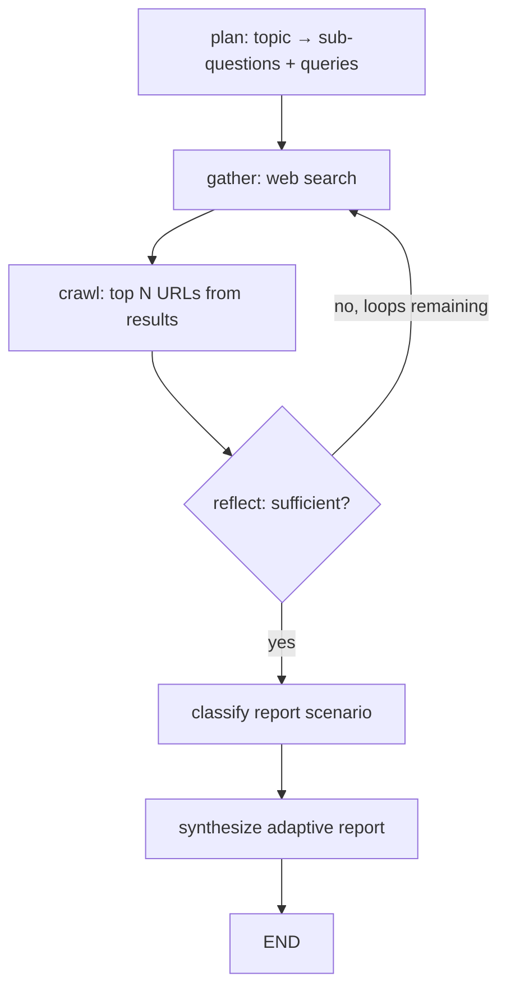

# Deep Research Subagent — Design Draft

**Date**: 2026-07-07  
**Status**: Implemented (RFC-619, IG-654/559)  
**RFC**: RFC-619 revised in place (2026-07-07)  
**Phase**: 1 — `deep_research` only; phase 2 — `academic_research`

---

## 1. Summary

Replace the built-in monolithic research subagent with **`deep_research`**: an iterative public-web research agent that searches the web, crawls discovered URLs, reflects on evidence gaps, and produces an **adaptive research report** (RFC-616 pattern). Local repository analysis remains on the main agent's file tools.

A follow-up **`academic_research`** subagent (phase 2) will cover academic sources only. Both subagents share a **`url_crawl`** toolkit for parsing web page content.

**Clean break**: no monolithic research subagent aliases, deprecated config keys, or legacy event types.

---

## 2. Problem

| Issue | Impact |
|-------|--------|
| `monolithic research subagent` id sounds generic | Users and planner route "deep research" tasks ambiguously |
| Multi-source monolithic research subagent (web + academic + url) | Blurs web research vs academic literature review |
| Answer-style output | Does not match goal-completion report quality users expect |
| Overlap with local recon | After explore removal (IG-547), file-based research should stay on main agent; monolithic research subagent description says "no local files" but routing and naming still confuse |
| RFC-619 references explore | Stale boundary documentation |

---

## 3. Goals

1. **Clear identity**: `deep_research` = public web search + crawl + adaptive report.
2. **Hybrid boundary**: May research public docs about a user's stack/topic; never reads local repo files.
3. **Report quality**: Adaptive sections via research-native scenario classifier (RFC-616 pattern).
4. **Clean migration**: Delete `<removed>/` entirely; no backward-compat shims.
5. **Extensibility**: Separate package pattern enables `academic_research` in phase 2.

### Non-goals (phase 1)

- `academic_research` implementation
- Browser automation (see `browser_use`)
- Local filesystem, shell, or document-QA gather
- Backward-compatible `monolithic research subagent` config or event aliases

---

## 4. Architecture

### 4.1 Subagent boundaries

| Concern | Owner |
|---------|--------|
| Public web facts, comparisons, how-tos, industry landscape | `deep_research` |
| Local repo / codebase analysis | Main agent (`read_file`, `grep`, `glob`, `ls`) |
| Academic papers, literature review | `academic_research` (phase 2) |

**Hybrid rule**: When a goal mentions the user's project (e.g. "how does our auth compare to industry practice?"), `deep_research` searches the **public web** for external knowledge. The main agent handles local code analysis separately. The report must state this explicitly (Scope banner).

### 4.2 Package layout (phase 1)

```
packages/soothe/src/soothe/
├── toolkits/
│   └── url_crawl/                 # shared; extracted from monolithic research subagent sources
├── subagents/
│   ├── deep_research/             # NEW
│   │   ├── __init__.py            # @plugin(name="deep_research")
│   │   ├── implementation.py      # create_deep_research_subagent()
│   │   ├── engine.py              # LangGraph research loop
│   │   ├── protocol.py            # DeepResearchConfig, SourceResult, …
│   │   ├── effort.py              # normal | thorough profiles
│   │   ├── report_classifier.py   # ReportScenarioClassifier
│   │   ├── events.py              # soothe.subagent.deep_research.*
│   │   └── sources/
│   │       └── web_search.py      # web search only (wizsearch / fallbacks)
│   └── <removed>/                   # DELETED
```

Phase 2 adds `subagents/academic_research/` as a separate package with the same structural pattern.

### 4.3 Engine flow

```
plan → gather (web search) → crawl (top N URLs) → reflect → [iterate] → classify report → synthesize → END
```



**Crawl-on-discovery**: After each web search, automatically crawl the top N result URLs (configurable) before reflect/synthesize. Crawl uses shared `url_crawl` toolkit.

### 4.4 Effort profiles

| Setting | `normal` | `thorough` |
|---------|----------|------------|
| Max loops | 2 | 4 |
| Max queries per loop | 4 | 8 |
| Crawl top-N per search | 3 | 5 |
| Primary LLM role | `fast` | `fast` |
| Synthesis role | `fast` | `fast` (optional `think` via config) |

Config: `subagents.deep_research.config.effort: normal | thorough`

---

## 5. Adaptive report

### 5.1 ReportScenarioClassifier

Research-native classifier following RFC-616 output shape:

```python
class ReportScenarioClassification(BaseModel):
    scenario: str                 # built-in name or "general_research"
    sections: list[str]           # ordered section headings
    contextual_focus: list[str]   # 2–3 focus areas for this topic
    evidence_emphasis: str        # how to weight gathered evidence
```

**Input**: research topic, effort level, loop count, source/URL count, condensed snippet summaries.

**Built-in scenarios** (phase 1):

| Scenario | Typical topic | Default sections |
|----------|---------------|------------------|
| `landscape_survey` | "state of X in 2026" | Scope, Executive Summary, Landscape, Key Players, Trends, References |
| `how_to_guide` | "how to set up X" | Scope, Overview, Prerequisites, Steps, Pitfalls, References |
| `comparison` | "X vs Y" | Scope, Context, Comparison Table, Trade-offs, Recommendation, References |
| `fact_check` | "is it true that…" | Scope, Claim, Evidence For, Evidence Against, Verdict, References |
| `general_research` | fallback | Scope, Executive Summary, Key Findings, Open Questions, References |

### 5.2 Format consistency

Reuse presentation rules from `synthesis_report_system.xml` (GFM tables, bullet lists, optional Mermaid source blocks per IG-552) so CLI/TUI rendering matches goal completion reports.

### 5.3 Mandatory Scope banner

Every report **must** open with a Scope section:

> **Scope:** This report is based on public web sources only. Local repository files were not analyzed.

This is injected regardless of scenario classification.

### 5.4 References

Append a References section listing crawled URLs with titles and search-query provenance where available.

---

## 6. Integration (clean break)

| Surface | Remove (`monolithic research subagent`) | Add (`deep_research`) |
|---------|--------------------|-----------------------|
| Subagent id / `subagent_type` | `monolithic research subagent` | `deep_research` |
| Plugin name | `monolithic research subagent` | `deep_research` |
| Config key | `subagents.monolithic research subagent` | `subagents.deep_research` |
| Slash route | `/monolithic research subagent` | `/deep_research` |
| Resolver factory | `create_legacy_research_subagent` | `create_deep_research_subagent` |
| Wire events | `soothe.subagent.monolithic research subagent.*` | `soothe.subagent.deep_research.*` |
| Planner / classifier hints | route `monolithic research subagent` | route `deep_research`; never for local-file tasks |

**No** deprecated aliases, config migration shims, or dual-registration.

### 6.1 Subagent description (routing)

```
deep_research: Iterative public web research with URL crawling and adaptive report
generation. Use for external facts, comparisons, how-tos, and industry landscape.
Do NOT use for local codebase, repository files, or academic literature (use
academic_research when available).
```

### 6.2 Events (phase 1)

| Event | When | Key fields |
|-------|------|------------|
| `soothe.subagent.deep_research.started` | Research begins | `topic_preview`, `effort` |
| `soothe.subagent.deep_research.progress` | Phase complete | `phase`, `loop_count`, `message` |
| `soothe.subagent.deep_research.gather.summary` | Search done | `query_preview`, `result_count` |
| `soothe.subagent.deep_research.crawl.summary` | Crawl batch done | `urls_crawled`, `success_count` |
| `soothe.subagent.deep_research.completed` | Report done | `duration_ms`, `scenario`, `report_length` |

---

## 7. Shared url_crawl toolkit

Extract URL crawling from current `<removed>/sources/url_crawl.py` into `toolkits/url_crawl/`:

- Polite HTTP (rate limiting, circuit breaker) from existing `polite_http.py`
- `crawl_urls(urls: list[str], *, max_concurrent, timeout_sec) -> list[CrawlResult]`
- Used by `deep_research` (phase 1) and `academic_research` (phase 2)

---

## 8. Error handling

| Failure | Behavior |
|---------|----------|
| Web search timeout / empty | Reflect retries with broadened query once; if still empty, report with "limited public evidence" |
| Individual URL crawl failure | Skip URL; use search snippet if available |
| All crawls fail | Proceed with search snippets only |
| Report classifier timeout | Fall back to `general_research` scenario |
| Synthesize timeout | `general_research` template + raw evidence appendix |

---

## 9. Testing

| Area | Tests |
|------|-------|
| Effort caps | `normal` vs `thorough` loop/query/crawl limits |
| Crawl-on-discovery | Mock search returns URLs → crawl invoked for top N |
| Report classifier | Scenario selection per topic fixture |
| Scope banner | Present in every synthesized report |
| Routing | Planner/classifier does not pick `deep_research` for local-file-only tasks |
| Clean break | No remaining `monolithic research subagent` references in code, config template, tests |

Run `./scripts/verify_finally.sh` before merge.

---

## 10. Documentation updates (phase 1)

| Artifact | Action |
|----------|--------|
| RFC-619 | Revised in place → `RFC-619-deep-research-subagent.md` |
| RFC-601 §4 Research | Update to reference `deep_research` (impl phase) |
| `docs/wiki/capabilities/subagents.md` | Replace monolithic research subagent section |
| `config/config.template.yml` | `subagents.deep_research` block |
| `config/develop/config.yml` | Matching structure |

---

## 11. Phase 2 preview — `academic_research`

Not in phase 1 scope. Separate package at `subagents/academic_research/`:

- Sources: academic search only (e.g. deepxiv) + shared `url_crawl`
- Own `ReportScenarioClassifier` with academic scenarios (`literature_review`, `paper_comparison`, …)
- Same engine pattern, separate events and config key

---

## 12. Decision log

| # | Decision |
|---|----------|
| 1 | Hybrid boundary — public web for external knowledge; local analysis on main agent |
| 2 | Adaptive report via research-specific classifier (RFC-616 pattern, not shared ScenarioClassifier) |
| 3 | Clean break — no `monolithic research subagent` legacy code or aliases |
| 4 | `deep_research` = web search only; `academic_research` in phase 2 |
| 5 | Separate packages (not shared monolithic engine) |
| 6 | Phase 1 delivers `deep_research` only |
| 7 | Crawl top-N URLs on discovery after each search |
| 8 | Explicit Scope banner in every report |
| 9 | Effort levels: `normal` / `thorough` |
| 10 | Extract shared `url_crawl` to toolkits |

---

## 13. Open items (none blocking phase 1 impl)

- IG number assignment for phase 1 implementation
- Whether `thorough` synthesis may optionally use `think` role (default `fast`)
