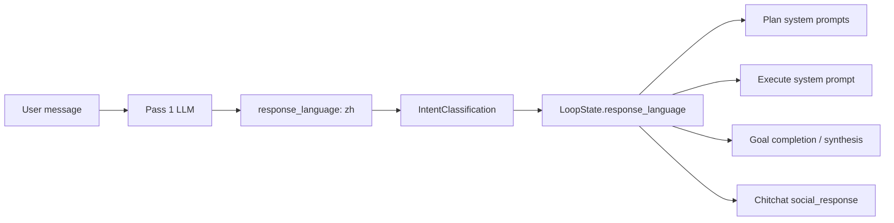

# Design Draft: Pass 1 Response Language Detection

**Status**: Approved → [IG-575](../impl/IG-575-response-language-pass1-detection.md)  
**Date**: 2026-07-10  
**Scope**: Agent-generated prose only (chitchat, plan reasoning, execute output, synthesis, goal completion). Static TUI chrome (spinners, slash help, daemon errors) is out of scope.

---

## Problem

Language preference for agent-generated text is unreliable today:

1. **Static hint** — `RESPONSE_LANGUAGE_HINT_FRAGMENT` asks the model to “prefer the same natural language as the user's goal” without naming a language.
2. **Scattered duplicates** — plan, synthesis, scenario classifier, and goal-completion prompts repeat similar vague language-lock wording.
3. **No structured signal** — Pass 1 matches language implicitly for `social_response` but does not emit a field; nothing propagates into `LoopState`.
4. **Brittle heuristic** — `query_prefers_chinese()` (Unicode range check) selects chitchat fallback pools.

Users writing in Chinese (or other non-English languages) often receive English plan reasoning, step summaries, or final reports despite English code in the goal.

---

## Goal

Detect the user's preferred response language once at intake (Pass 1), carry it through the loop, and inject an explicit language directive into all agent-facing prompts. Remove keyword/regex language heuristics.

---

## Non-Goals

- TUI i18n for static chrome (`Interpreting`, `/cron` usage, connection errors).
- BCP-47 locale precision (`zh-CN` vs `zh-TW`) in v1.
- Re-detecting language in Pass 2 or per-phase classifiers.

---

## Solution Overview



Pass 1 structured output gains `response_language`. The value copies into `IntentClassification` and `LoopState`, then drives a dynamic `RESPONSE_LANGUAGE_HINT` fragment everywhere agent prose is produced.

---

## Schema

### `ResponseLanguage` enum (moderate scope)

```python
class ResponseLanguage(StrEnum):
    EN = "en"
    ZH = "zh"
    JA = "ja"
    KO = "ko"
    OTHER = "other"
```

### `IntakePass1LLMResult` — new field

| Field | Type | Description |
|-------|------|-------------|
| `response_language` | `ResponseLanguage` | Primary language for user-facing prose this turn |

Required in Pass 1 JSON schema. Default `other` when the model is uncertain.

### `IntentClassification` — new field

| Field | Type | Description |
|-------|------|-------------|
| `response_language` | `ResponseLanguage \| None` | Copied from Pass 1; survives chitchat fast-path and full graph intake |

### `LoopState` — new field

| Field | Type | Description |
|-------|------|-------------|
| `response_language` | `ResponseLanguage \| None` | Set at intake from `IntentClassification`; updated each new user turn |

---

## Pass 1 prompt rules

Add to `intake_pass1_system.xml`:

1. **Detect conversational language** from the user message, not from code snippets, paths, or identifiers embedded in it.
2. **Explicit override wins** — e.g. “请用英文回答” → `en`; “respond in Japanese” → `ja`.
3. **Mixed input** — Chinese question + English code → `zh` (conversational language).
4. **Short acknowledgments** — when `prior_response_language` is supplied by the coordinator and the message is very short (“ok”, “好的”, “はい”), inherit the prior value instead of re-guessing.
5. **Examples** — extend existing Chinese identity example to show `"response_language":"zh"`.

### Coordinator context for short acks

`IntakePass1Classifier.classify()` accepts optional `prior_response_language: ResponseLanguage | None` from `LoopState` when:

- Continuing a loop with a new short user message.
- Clarification resume (Pass 1 skipped) — no re-detection; inherit prior.

This is structural context (prior turn metadata), not content-judgment heuristics — permitted under RFC-630.

---

## Dynamic language hint

Replace static `RESPONSE_LANGUAGE_HINT_FRAGMENT` with a builder:

```python
_LANGUAGE_DISPLAY = {
    ResponseLanguage.EN: "English",
    ResponseLanguage.ZH: "Chinese",
    ResponseLanguage.JA: "Japanese",
    ResponseLanguage.KO: "Korean",
}

def build_response_language_hint(language: ResponseLanguage | None) -> str:
    if language is None or language == ResponseLanguage.OTHER:
        return RESPONSE_LANGUAGE_HINT_FALLBACK  # today's generic text
    display = _LANGUAGE_DISPLAY[language]
    return (
        f"<RESPONSE_LANGUAGE_HINT>\n"
        f"Write all user-facing prose in {display} ({language.value}). "
        f"Keep code, file paths, identifiers, and quoted literals unchanged.\n"
        f"</RESPONSE_LANGUAGE_HINT>"
    )
```

Keep `RESPONSE_LANGUAGE_HINT_FALLBACK` as the current static fragment for fail-safe / `other` cases.

### Injection sites

| Site | Change |
|------|--------|
| `middleware/system_prompt.py` | Pass `loop_state.response_language` into builder |
| `prompts/builder.py` (plan) | Same |
| `goal_completion.py` | Replace inline ledger human language line with language-aware text |
| `prompts/user_message.py` (synthesis) | Use builder or language param |
| `state/resume_topic.py` | Use explicit language when available |

### Redundant copy to remove

After dynamic hint is wired, delete duplicated language-lock lines from:

- `plan_generate_instructions.xml`
- `synthesis_report_system.xml`
- `scenario_classifier_system.xml` (language line only)
- `intake_pass1_social_reply.xml` (“match user's language” → explicit language in prompt when known)

Single source of truth: `build_response_language_hint()`.

---

## Chitchat fallbacks — remove heuristics

### Delete

- `query_prefers_chinese()` function and its export.
- Any tests asserting Unicode-range detection.

### Replace

```python
def pick_generic_chitchat_fallback(language: ResponseLanguage | None = None) -> str:
    pool = {
        ResponseLanguage.ZH: GENERIC_CHITCHAT_FALLBACKS_ZH,
        ResponseLanguage.EN: GENERIC_CHITCHAT_FALLBACKS_EN,
        # ja/ko: fall back to EN pool until localized pools exist
    }.get(language, GENERIC_CHITCHAT_FALLBACKS_EN)
    return random.choice(pool)
```

Call sites (`pass1_classifier.py`, `classifier.py`) pass `pass1_result.response_language` instead of `query`.

---

## Propagation flow

```
Pass 1 classify(query, prior_response_language?)
  → IntakePass1LLMResult.response_language
  → IntentClassification.response_language (pass1_to_intent, _pass2_to_intent via pass1)
  → LoopState.response_language (intent_classify node, strange_loop pre-graph)
  → build_response_language_hint() in all prompt builders
```

### Edge cases

| Case | Behavior |
|------|----------|
| Pass 1 LLM failure / no model | `response_language=None`; generic fallback hint |
| Pass 1 skipped (clarification resume) | Inherit `LoopState.response_language` |
| User switches language mid-loop | New turn re-runs Pass 1; updates field |
| `OTHER` or missing | Generic fallback hint (current behavior) |
| Structural loop-control bypass | Inherit prior language if available; else `other` |

---

## Cache impact

Language is stable within a loop goal. Dynamic hint replaces the static block in the same system-prompt slot — prefix cache behavior unchanged per goal.

---

## Testing

| Test | Assert |
|------|--------|
| Pass 1 schema | `response_language` required; enum validation |
| Pass 1 prompt | Examples include language field; override rule present |
| Propagation | Chinese query → `IntentClassification.response_language == ZH` → `LoopState` set |
| Dynamic hint | `zh` → prompt contains “Chinese (zh)”; `None` → generic fallback |
| Chitchat fallback | `pick_generic_chitchat_fallback(ZH)` never uses `query_prefers_chinese` |
| Heuristic removal | No imports of `query_prefers_chinese` remain |
| Goal completion / plan | Language hint present in system prompt with explicit language |

---

## Implementation touch list

| Area | Files |
|------|-------|
| Schema | `intention/models.py`, `state/schemas.py` |
| Pass 1 | `pass1_classifier.py`, `intake_pass1_system.xml`, `pass1_social_response.py` (schema) |
| Propagation | `classifier.py`, `two_pass_coordinator.py`, `intent_classify.py`, `strange_loop.py` |
| Hint builder | `prompts/system_templates.py`, `prompts/builder.py`, `middleware/system_prompt.py` |
| Cleanup | `chitchat_fallbacks.py`, redundant XML language lines |
| Tests | `test_intent_classification.py`, `test_system_prompt.py`, `test_two_pass_intake_integration.py` |

---

## Related specs

- **RFC-630** — Pass 1/2 structured intake (amend: add `response_language` to Pass 1 schema)
- **RFC-214** — Prompt architecture (`RESPONSE_LANGUAGE_HINT` slot; dynamic content)
- **IG-554** — Two-pass intake implementation (extend)
- **IG-567** — Heuristic-to-rules migration pattern (remove `query_prefers_chinese`)

---

## Open questions (resolved)

| Question | Decision |
|----------|----------|
| Scope: agent text vs TUI chrome | Agent-generated text only |
| Enum breadth | Moderate: `en`, `zh`, `ja`, `ko`, `other` |
| Remove heuristics | Yes — delete `query_prefers_chinese` |
