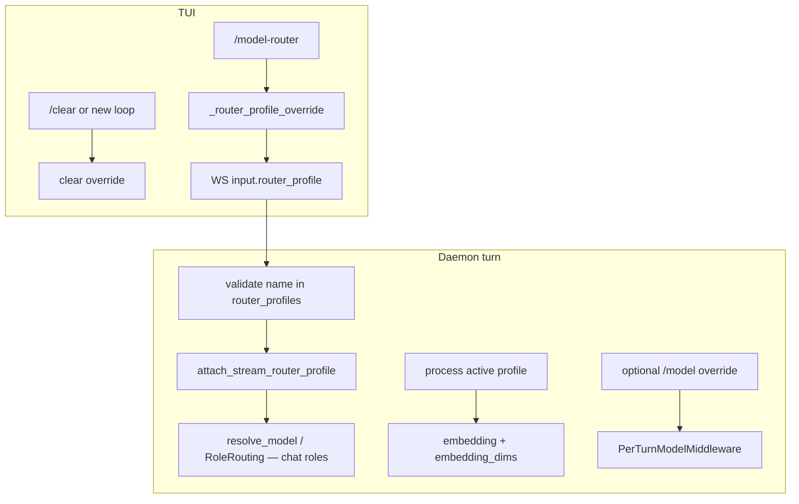

# Design Draft: Loop-Scoped Router Profile

**Status**: Formalized → [RFC-632](../specs/RFC-632-loop-scoped-router-profile-override.md)  
**Date**: 2026-07-14  
**Scope**: TUI `/model-router` selects a configured `router_profiles` entry for the current loop; chat roles for following turns use that preset. Config `active_router_profile` remains the process default.

---

## Problem

Soothe already supports multiple named `router_profiles` and an `active_router_profile` that is resolved once at config load into process-wide `router` + `embedding_dims`. Users cannot switch the role map for a single interactive loop without editing YAML / env and reloading.

`/model` already provides a **loop-scoped** override for the stream/default model, but it does not switch `think` / `fast` / other roles as a named preset.

---

## Goal

1. From the TUI, select a router profile for the **current loop**.
2. All **following goals/turns in that loop** use that profile’s **chat roles**.
3. On **new loop** or **`/clear`**, revert to the config `active_router_profile`.
4. Do not persist the selection to disk or loop metadata in v1 (same durability class as `/model`).

---

## Non-Goals

- Persisting profile on the loop record or restoring it on `/resume` / TUI restart.
- Switching process-wide `embedding` model or `embedding_dims` mid-loop (indexes stay tied to the process active profile).
- Writing `active_router_profile` back to `config.yml` (no `--default` in v1).
- Autopilot / channel clients adopting the field (wire may accept it; no UX required).
- Changing how `router_profiles` are declared in YAML.

---

## Decisions (brainstorm)

| Topic | Decision |
|-------|----------|
| Scope unit | **Loop** (not per-goal); sticks across goals until clear/new loop |
| Reset | New loop or `/clear` → config `active_router_profile` |
| vs `/model` | Profile fills roles; `/model` stream override still wins on the default/stream hop |
| Embedding | **Chat roles only**; embedding + dims remain process active profile |
| Persistence | Client session memory only |
| Apply timing | Next user turn / next daemon query |
| Mechanism | Per-turn wire field (Approach A), mirroring `/model` |

---

## Solution Overview

Three seams:

1. **TUI session state** — `_router_profile_override: str | None` beside `_model_override`.
2. **Wire** — optional `router_profile` on each turn input (alongside `model` / `model_params`).
3. **Daemon turn overlay** — contextvar + resolution path for chat roles only.

---

## Components

### TUI

| Piece | Responsibility |
|-------|----------------|
| `command_registry` | Register `/model-router` (`BypassTier.IMMEDIATE_UI`, like `/model`) |
| `_execution` / handler | Bare → selector; `/model-router <name>` → set; `/model-router --clear` → clear |
| App state | `_router_profile_override`; clear in the same places as `_clear_loop_model_override` (new loop, `/clear`, resume start) |
| Turn send | Pass override into `CLIContext` / WS payload when set |
| Selector UI | List `router_profiles` names from daemon (or cached config snapshot); mark config default and current selection |

Status bar: optional light indicator when overridden; not required for v1 correctness.

### Daemon / protocol

| Piece | Responsibility |
|-------|----------------|
| Input schema | Optional `router_profile: str \| null` |
| Validation | Name must exist in loaded `SootheConfig.router_profiles`; unknown → clear error, no silent fallback |
| Turn lifecycle | `attach_stream_router_profile` / `reset_…` around the stream (same shape as `_model_override`) |
| Resolution | Chat roles (`default`, `think`, `fast`, `image`, `ocr`, …) read overlay when set; **never** overlay `embedding` or mutate process `embedding_dims` |

### Core resolution

- Prefer a narrow override API used by `resolve_model` / `RoleRoutingMiddleware` rather than mutating global `SootheConfig.router`.
- Embedding callers continue using the process active profile exclusively.

---

## Layering with `/model`

Effective model selection for a hop:

1. If `PerTurnModelMiddleware` / stream model override is set → that spec wins for the patched request.
2. Else if stream router-profile overlay is set → use that profile’s role map for `resolve_model(role)` (except `embedding`).
3. Else → process `active_router_profile` / derived `router`.

Selecting a profile does **not** clear `_model_override`. Clearing the profile does **not** clear `/model`.

---

## UX contract

| Command | Behavior |
|---------|----------|
| `/model-router` | Open selector of configured profile names |
| `/model-router <name>` | Set loop override; error if unknown |
| `/model-router --clear` | Drop override; subsequent turns use config active profile |
| New loop / `/clear` | Drop override |
| `/resume` | Start without a restored profile override (v1) |

User-visible copy must not mention IG/RFC identifiers.

---

## Error handling

| Case | Behavior |
|------|----------|
| Unknown profile name (TUI) | Chat error; do not set override |
| Unknown profile name (daemon) | Reject turn with explicit error |
| Missing / empty `router_profile` | No overlay; process default |
| Busy agent | Bare `/model-router` follows `/model` IMMEDIATE_UI rules |

---

## Testing

- **Daemon unit**: turn with `router_profile` changes `resolve_model("think")` / `fast` / `default`; `resolve_model("embedding")` and `embedding_dims` unchanged.
- **Daemon unit**: unknown name rejected.
- **TUI unit**: set / `--clear` / `/clear` / new loop clear override; payload includes field when set.
- **Layering**: profile + `/model` → stream model wins on default hop; other roles still from profile.
- **Regression**: no profile field → identical behavior to today.

---

## Rollout / files (implementation hint)

Likely touch points (not exhaustive):

- `packages/soothe-cli/.../command_registry.py`, app `_execution` / `_model`-adjacent state, turn payload
- `packages/soothe-daemon/...` input schema + query stream attach/reset
- `packages/soothe/.../middleware/_model_override.py` (or sibling) + `resolve_model` / role routing
- Protocol param models / wiki slash-command docs as follow-on

---

## Open questions (deferred)

None blocking v1. Optional later:

- Status bar profile badge
- `/model-router --default` to persist config active profile
- Persist on loop metadata for `/resume`
)
