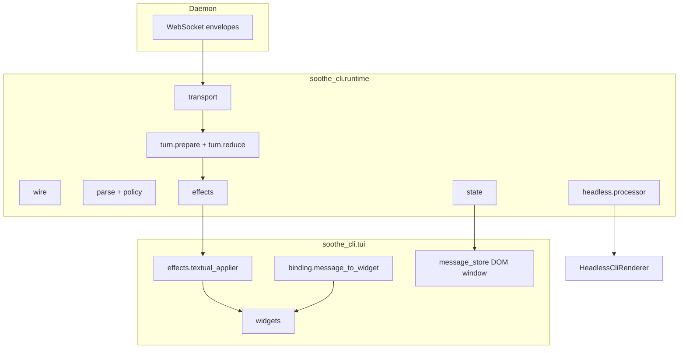

# IG-422: CLI Runtime Module (TUI display source of truth)

**Status**: Planned  
**Started**: 2026-05-20  
**Implementation Guide Number**: IG-422

## Goal

Introduce `soothe_cli.runtime` as the **only** layer that interprets daemon WebSocket data into display state and declarative UI effects. `soothe_cli.tui` owns Textual widgets, layout, and effect application only.

**Constraints**

- Existing user-visible behavior unchanged (streaming cards, dedupe, history replay, headless stdout).
- **Clean cut**: delete `soothe_cli/events/` and moved `tui/` modules; **no** re-export shims, `DeprecationWarning`, or `__getattr__` facades at old paths.
- All imports updated in the same change set per phase.
- `./scripts/verify_finally.sh` green after each phase.

## Non-goals (v1)

- Unifying headless `EventProcessor` with TUI `reduce_prepared_chunk` (headless moves under `runtime.headless` but keeps imperative processor).
- Changing daemon wire protocol or SDK types.

---

## Problem statement

| Today | Issue |
|-------|--------|
| `soothe_cli/events/` | Parsing, policy, headless processor, TUI `prepare_turn_chunk` |
| `tui/textual_adapter.py` (~2.6k lines) | Turn orchestration + widget mutation + routing state |
| `tui/daemon_session.py`, `step_task_routing.py`, `message_display_filter.py`, `widgets/message_store.MessageData` | Data logic mixed with UI |

TUI bypasses `EventProcessor` and duplicates orchestration. `events/turn/turn_stream_prepare.py` imports `tui` (cycle risk).

---

## Target architecture



**Dependency rule (enforced)**

```text
soothe_sdk → runtime → tui → textual
cli/execution/daemon.py → runtime.headless
```

**Forbidden:** `runtime` imports `soothe_cli.tui` or `textual`.

---

## Package layout (final)

```
packages/soothe-cli/src/soothe_cli/runtime/
├── __init__.py
├── transport/
│   ├── session.py          # DaemonSession (from tui/daemon_session.TuiDaemonSession)
│   └── chunks.py           # iter_turn_chunks, post-idle drain
├── wire/
│   ├── envelopes.py
│   └── messages.py         # normalize + display text (message_display_filter + turn/messages)
├── parse/
│   ├── message_processing.py
│   ├── tool_call_resolution.py
│   ├── tool_message_format.py
│   ├── tool_result.py
│   └── _utils.py
├── policy/
│   ├── display_policy.py
│   ├── essential_events.py
│   └── tui_trace_log.py
├── presentation/
│   ├── engine.py           # PresentationEngine
│   ├── renderer_base.py
│   ├── renderer_protocol.py
│   ├── async_renderer_protocol.py
│   ├── duration_format.py
│   └── explore_task_display.py
├── state/
│   ├── transcript.py       # MessageData, MessageType, ToolStatus
│   ├── turn.py             # TurnDisplayState
│   ├── step_router.py      # StepTaskRouter
│   ├── session_stats.py    # SessionStats, TurnEventStats, SpinnerStatus
│   ├── stream_accumulator.py
│   └── file_tracker.py     # FileOpTracker, compute_unified_diff (from tui/file_ops)
├── turn/
│   ├── prepare.py          # PreparedTurnChunk, prepare_turn_chunk
│   ├── pipeline.py         # TurnEventPipeline, run_turn_pipeline
│   └── reduce.py           # reduce_prepared_chunk → effects
├── history/
│   └── checkpoint.py       # checkpoint/log → list[MessageData]
├── effects/
│   ├── model.py            # DisplayEffect frozen union
│   └── batch.py            # TurnToolUiCoalescer logic
├── headless/
│   ├── processor.py        # EventProcessor
│   └── processor_state.py
└── task_scope.py           # from events/task_scope.py if still used
```

**Deleted after migration**

- Entire `packages/soothe-cli/src/soothe_cli/events/` tree
- `tui/daemon_session.py`
- `tui/step_task_routing.py`
- `tui/message_display_filter.py`
- `tui/_session_stats.py`
- `MessageData` / enums removed from `tui/widgets/message_store.py` (store keeps DOM virtualization only)

---

## Functional design

### 1. Prepare (worker thread, sync)

Unchanged contract from `turn_stream_prepare`:

```python
def prepare_turn_chunk(state: TurnPrepareState, chunk: tuple) -> PreparedTurnChunk | None: ...
```

`TurnPrepareState` uses `runtime.state.step_router.StepTaskRouter` and `runtime.state.session_stats.TurnEventStats`.

### 2. Reduce (worker thread or main — same thread as prepare today)

```python
def reduce_prepared_chunk(
    state: TurnDisplayState,
    prepared: PreparedTurnChunk,
) -> tuple[TurnDisplayState, tuple[DisplayEffect, ...]]:
    ...
```

`TurnDisplayState` holds serializable maps only:

- `step_router: StepTaskRouter`
- `tool_call_id → message_id`, `step_id → message_id`
- Assistant buffer per namespace (text + metadata)
- Dedupe fields (`last_main_flushed_assistant_prose`, `last_completed_main_step_execute_prose`)
- Pending tool/stream overlays (same semantics as `TextualUIAdapter` dicts today)

### 3. DisplayEffect (frozen dataclasses)

| Effect | Purpose |
|--------|---------|
| `AppendMessage` | New `MessageData` row |
| `UpdateMessage` | Patch fields on existing id |
| `SetActiveStream` | Streaming assistant id or clear |
| `UpsertStepCard` | Create/update cognition step card data |
| `PatchStepTools` | Tool rows JSON / running stats |
| `CompleteStep` / `InterruptStep` | Step lifecycle |
| `SetSpinner` / `SetStatusText` | Chrome |
| `FlushToolRefreshes` | Deferred tool repaint batch |
| `ReportTokens` | Context token count |
| `ShowError` | App-level error row |

TUI `TextualEffectApplier.apply(effect)` maps id → widget via `MessageStore` + step card registry.

### 4. Transcript vs DOM

| Layer | Owns |
|-------|------|
| `runtime.state.transcript` | `MessageData`, validation, `update_fields` |
| `tui.widgets.message_store` | Sliding window, scroll hydration, `from_widget` |
| `tui.binding` | `message_to_widget(data) -> Widget` (only place importing widget classes) |

---

## File move map (git mv)

| Source | Destination |
|--------|-------------|
| `events/core/event_processor.py` | `runtime/headless/processor.py` |
| `events/core/processor_state.py` | `runtime/headless/processor_state.py` |
| `events/core/presentation_engine.py` | `runtime/presentation/engine.py` |
| `events/core/renderer_protocol.py` | `runtime/presentation/renderer_protocol.py` |
| `events/rendering/renderer_base.py` | `runtime/presentation/renderer_base.py` |
| `events/rendering/async_renderer_protocol.py` | `runtime/presentation/async_renderer_protocol.py` |
| `events/duration_format.py` | `runtime/presentation/duration_format.py` |
| `events/policy/*` | `runtime/policy/*` |
| `events/tools/*` | `runtime/parse/*` (rename files per layout) |
| `events/turn/turn_event_pipeline.py` | `runtime/turn/pipeline.py` |
| `events/turn/turn_stream_prepare.py` | `runtime/turn/prepare.py` |
| `events/turn/messages.py` | `runtime/wire/messages.py` (merge helpers) |
| `events/task_scope.py` | `runtime/task_scope.py` |
| `tui/daemon_session.py` | `runtime/transport/session.py` |
| `tui/step_task_routing.py` | `runtime/state/step_router.py` |
| `tui/_session_stats.py` | `runtime/state/session_stats.py` |
| `tui/message_display_filter.py` | `runtime/wire/messages.py` (merge) |
| `tui/file_ops.py` | `runtime/state/file_tracker.py` |
| `tui/widgets/message_store.py` (MessageData部分) | `runtime/state/transcript.py` |

**New modules (no move)**

- `runtime/turn/reduce.py`
- `runtime/effects/model.py`, `runtime/effects/batch.py`
- `runtime/state/turn.py`
- `runtime/history/checkpoint.py` (extract from `tui/app/_history.py`)
- `tui/effects/textual_applier.py`
- `tui/binding.py`

---

## Import migration checklist (clean cut)

Update **all** references in one commit per phase. No `soothe_cli.events` left in repo when done.

### Production code

| File | Old import | New import |
|------|------------|------------|
| `cli/execution/daemon.py` | `soothe_cli.events` | `soothe_cli.runtime.headless` |
| `cli/execution/headless_renderer.py` | `events.*` | `runtime.presentation.*` |
| `tui/textual_adapter.py` | `events.*`, `tui._session_stats`, `tui.step_task_routing` | `runtime.*`, `tui.effects` |
| `tui/widgets/messages.py` | `events.duration_format`, `events.tools.*` | `runtime.presentation`, `runtime.parse.*` |
| `tui/app/_history.py` | `events.tools`, `tui.message_display_filter`, `message_store.MessageData` | `runtime.history`, `runtime.state.transcript` |
| `tui/app/_startup.py` | `tui.daemon_session` | `runtime.transport.session` |
| `tui/app/_*.py` | `tui._session_stats` | `runtime.state.session_stats` |
| `tui/daemon_session.py` | — | **deleted** |

### Tests (relocate + rename imports)

| Current path | New path |
|--------------|----------|
| `tests/unit/events/*` | `tests/unit/runtime/parse/`, `runtime/policy/`, etc. |
| `tests/unit/ux/test_event_processor.py` | `tests/unit/runtime/headless/test_processor.py` |
| `tests/unit/ux/tui/test_step_task_routing.py` | `tests/unit/runtime/state/test_step_router.py` |
| `tests/unit/ux/tui/test_daemon_session_*.py` | `tests/unit/runtime/transport/test_session.py` |
| `tests/unit/tui/test_turn_event_pipeline.py` | `tests/unit/runtime/turn/test_pipeline.py` |
| `tests/unit/ux/tui/test_textual_adapter_*.py` | Split: `runtime/turn/test_reduce_*.py` + thin TUI applier tests |

### Prewarm import in `_startup.py`

Change:

```python
importlib.import_module("soothe_cli.events.turn.turn_stream_prepare")
```

to:

```python
importlib.import_module("soothe_cli.runtime.turn.prepare")
```

---

## Implementation phases

### Phase 0 — IG approval

- [x] This document
- [ ] Plan reviewed; no backward-compat shims

### Phase 1 — Package skeleton + physical moves (behavior unchanged)

**Work**

1. Create `runtime/` tree per layout above.
2. `git mv` all files in move map; fix **internal** `runtime` imports only.
3. **Delete** `soothe_cli/events/` directory entirely.
4. Update every `soothe_cli.events` import in `packages/soothe-cli` to `soothe_cli.runtime.*` (grep-driven).
5. Move `TuiDaemonSession` → `DaemonSession` in `runtime/transport/session.py`; update app startup.
6. Split `MessageData` into `runtime/state/transcript.py`; leave `MessageStore` in `tui/widgets/message_store.py` importing transcript types.
7. Add `tui/binding.py` with `message_to_widget`; remove `MessageData.to_widget` from runtime.

**Verify**

```bash
./scripts/verify_finally.sh
```

**Exit criteria:** Zero files under `soothe_cli/events/`; zero imports matching `soothe_cli.events`.

### Phase 2 — History extraction

**Work**

1. Move pure functions from `tui/app/_history.py` → `runtime/history/checkpoint.py` (`messages_to_message_data`, cognition merge, internal phase filter).
2. `_HistoryMixin` calls runtime builders; mounting stays in mixin.

**Verify:** `tests/unit/tui/test_convert_messages_to_data.py` updated imports; cognition store tests pass.

### Phase 3 — Effects + reducer

**Work**

1. Implement `runtime/effects/model.py` (full union used by current `textual_adapter._apply_turn_chunk`).
2. Implement `runtime/turn/reduce.py` by porting apply logic category-by-category:
   - tool stream / tool results
   - step cards + `StepTaskRouter` callbacks
   - assistant streaming + summarization
   - goal completion dedupe (IG-406 semantics)
   - interrupt cleanup
3. Add `tui/effects/textual_applier.py` — sole module that touches `CognitionStepMessage`, `AssistantMessage`, etc.
4. Replace `TextualUIAdapter` widget dicts with `TurnDisplayState` + applier id registry.
5. Move `TurnToolUiCoalescer` → `runtime/effects/batch.py`; applier calls flush hooks.

**Tests**

- New table-driven tests: `tests/unit/runtime/turn/test_reduce_*.py` (state in, effects out, no Textual).
- Keep minimal `tests/unit/ux/tui/test_textual_applier.py` for widget wiring only.

**Verify:** All prior `test_textual_adapter_*` behaviors covered by reduce tests or applier tests.

### Phase 4 — Thin orchestration + delete dead code

**Work**

1. Shrink `tui/textual_adapter.py` to:
   - `execute_task_textual` (prompt, `send_turn`, `run_turn_pipeline`)
   - interrupt/token side effects delegating to runtime helpers
2. Remove duplicate state from applier.
3. Grep for orphaned symbols (`TextualUIAdapter` fields that moved).
4. Update `soothe_cli/runtime/__init__.py` `__all__` to document public API.

**Verify:** Full `verify_finally.sh`; manual smoke: one turn with tools + step card + history load.

---

## `runtime/__init__.py` public API (v1)

Export only stable entry points used outside runtime:

- `DaemonSession`, `iter_turn_chunks`
- `run_turn_pipeline`, `prepare_turn_chunk`, `reduce_prepared_chunk`
- `MessageData`, `MessageType`, `ToolStatus`
- `EventProcessor`, `ProcessorState` (headless)
- `PresentationEngine`, `DisplayPolicy`
- `DisplayEffect` types

Do **not** re-export from deleted `events` path.

---

## Risk register

| Risk | Mitigation |
|------|------------|
| Large single PR | Land phases 1–4 as sequential commits on one branch; each phase verifies |
| Widget id drift | Applier owns `dict[str, Widget]`; effects reference ids only |
| Reduce parity bugs | Port tests before deleting old apply branches |
| Import churn | `rg soothe_cli.events` must be empty before merge |

---

## Success criteria

- [ ] `soothe_cli/events/` does not exist
- [ ] `rg 'soothe_cli\.events'` → no matches
- [ ] `rg 'from soothe_cli\.tui\.(daemon_session|step_task_routing|message_display_filter|_session_stats)'` → no matches (except comments)
- [ ] `runtime` has no `textual` import
- [ ] `textual_adapter.py` < 400 lines (orchestration only)
- [ ] `./scripts/verify_finally.sh` passes

---

## Related work

- IG-351 (CLI shared reorganization — historical)
- IG-406 (goal completion output / dedupe semantics to preserve in reduce)
- IG-402 (step card tool aggregator — `StepTaskRouter` behavior)
