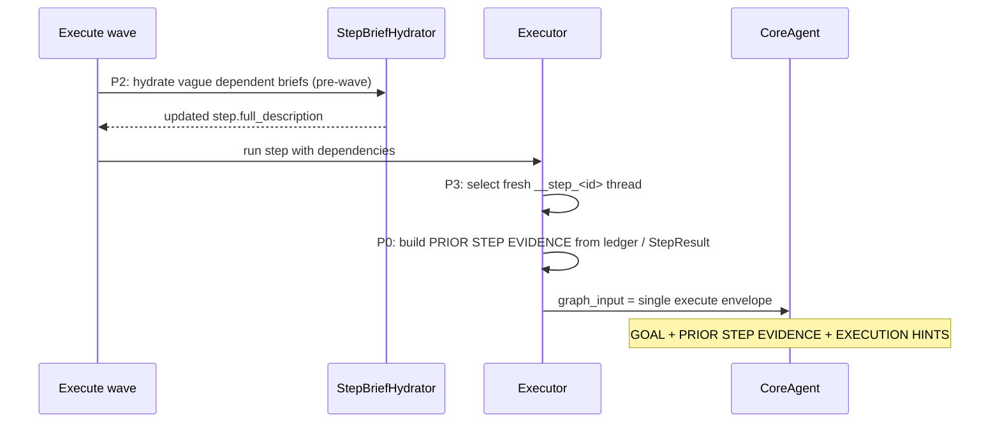

# IG-536: Dependent Step Prompt Grounding

**Related**: [IG-508](IG-508-step-full-description.md) (step `full_description`); RFC-214 (unified execute-step ledger / dependent-step envelope grounding)
**Created**: 2026-07-01
**Status**: Implemented

---

## Problem

When a plan uses dependency chains (e.g. verify → fix), dependent execute steps often repeat
discovery actions already completed by predecessors. Typical failure modes:

1. **Milestone-only briefs** — `description` is a short TUI label; the executor falls back to
   vague text like "Fix identified test or lint failures" with no concrete failures or paths.
2. **Missing predecessor output** — Even when step 1 recorded failures in the ledger, step 2's
   CoreAgent prompt did not include that evidence, so the agent re-ran the verify script.
3. **Sole-child thread reuse** — Reusing the predecessor's LangGraph thread could leak sibling
   context; starting fresh without injection left the agent blind.

Example chain:

| Step | Milestone | Bad behavior |
|------|-----------|--------------|
| 01 | Run `verify_finally.sh` | Reports `F821 undefined name Any` in `dreaming_reasoner.py` |
| 02 | Fix identified failures | Re-runs `verify_finally.sh` instead of editing the named files |

---

## Solution (P0–P3)

| Phase | What | Where |
|-------|------|-------|
| **P0** | `PRIOR STEP EVIDENCE` section in every dependent execute envelope | `step_predecessor_context.py`, `user_message.py`, `executor.py` |
| **P1** | Planner requires concrete `full_description` when `dependencies` is set | `planner.py`, `plan_generate_instructions.xml` |
| **P2** | Between-wave brief hydration (LLM + template fallback) for vague dependent steps | `step_brief_hydrator.py`, `executor._hydrate_dependent_steps_before_wave` |
| **P3** | Fresh `__step_<id>` thread per step; dependent steps ground via envelope only | `thread_selection.py`, `executor.py` |

### Execute flow (dependent step)



---

## P0: PRIOR STEP EVIDENCE in execute envelopes

**Module**: `packages/soothe/src/soothe/foundation/sloop/engine/step_predecessor_context.py`

| Task | Status | Notes |
|------|--------|-------|
| `build_prior_step_evidence()` | Done | Transitive deps via `transitive_dependency_step_ids`; body from latest execute_step AI ledger row, else `StepResult` outcome |
| `build_dependent_execution_hints()` | Done | Adds "do not repeat completed discovery" instructions when evidence present |
| `UserMessageBuilder.build_execute_step_message()` | Done | New `predecessor_evidence` param → `PRIOR STEP EVIDENCE` section after `GOAL` |
| `Executor._compose_execute_step_envelope()` | Done | Wires evidence + hints for all dependent steps |

Evidence is capped at `PRIOR_STEP_EVIDENCE_MAX_CHARS` (4000) with ellipsis truncation.

---

## P1: Planner rules for dependent `full_description`

**Files**:

- `packages/soothe/src/soothe/foundation/sloop/planning/planner.py` — JSON spec + `<PLANNING_RULES>`
- `packages/soothe/src/soothe/foundation/sloop/prompts/fragments/instructions/plan_generate_instructions.xml` — `<DEPENDENT_STEP_RULES>`

Rules added:

- When `dependencies` is set, `full_description` is **required** (50–120 words).
- Must instruct using predecessor output and forbid repeating predecessor discovery.
- Diagnose→fix and read→write chain patterns documented explicitly.
- `execution_mode` must be `dependency` when any step has dependencies.

P2 hydration is a safety net when the planner still emits generic briefs.

---

## P2: Between-wave step brief hydration

**Module**: `packages/soothe/src/soothe/foundation/sloop/engine/step_brief_hydrator.py`

| Task | Status | Notes |
|------|--------|-------|
| `step_needs_brief_hydration()` heuristic | Done | Triggers on empty/milestone-only/generic dependent briefs |
| `StepBriefHydrator.hydrate()` | Done | Structured LLM output (`StepBriefHydration`); template fallback on failure |
| `template_hydrate_step_brief()` | Done | Embeds predecessor evidence + anti-rediscovery instructions |
| `_hydrate_dependent_steps_before_wave()` | Done | Runs once per ready wave before parallel execution |
| `execute_steps` node wiring | Done | Passes planner model as `StepBriefHydrator` into `Executor` |

**Config**: `agent.loop.step_brief_hydration_enabled` (default `true` in `SootheConfig`; optional YAML override).

Hydration mutates `step.full_description` in memory for the current wave only; it does not rewrite the stored plan.

---

## P3: Thread isolation + envelope-only predecessor grounding

**Files**:

- `packages/soothe/src/soothe/foundation/sloop/engine/thread_selection.py`
- `packages/soothe/src/soothe/foundation/sloop/engine/executor.py`

| Task | Status | Notes |
|------|--------|-------|
| Fresh `__step_<id>` thread for every step | Done | Removed sole-child chain reuse; dependent steps no longer inherit predecessor checkpoint |
| `build_prior_step_evidence()` in envelope | Done | Transitive deps; body from latest execute_step AI ledger row or `StepResult` |
| No predecessor ledger replay for DAG deps | Done | Removed `_predecessor_graph_messages` — replay duplicated AI bodies already in `PRIOR STEP EVIDENCE` |
| `continue_loop` bootstrap replay | Done | `prior_loop_execute_messages()` still replays prior-goal execute rows (RFC-225; no envelope evidence on that path) |

---

## Key files

| File | Role |
|------|------|
| `foundation/sloop/engine/step_predecessor_context.py` | Evidence builder, hydration heuristics, execution hints |
| `foundation/sloop/engine/step_brief_hydrator.py` | LLM between-wave brief expansion |
| `foundation/sloop/engine/executor.py` | Orchestrates hydration, envelope, continuation bootstrap replay |
| `foundation/sloop/engine/thread_selection.py` | Per-step isolated thread IDs |
| `foundation/sloop/engine/predecessor_branch_context.py` | Transitive dep closure + ledger slice helpers |
| `foundation/sloop/prompts/user_message.py` | `PRIOR STEP EVIDENCE` envelope section |
| `foundation/sloop/planning/planner.py` | Dependent-step planning rules |
| `foundation/sloop/prompts/fragments/instructions/plan_generate_instructions.xml` | `<DEPENDENT_STEP_RULES>` |
| `foundation/sloop/orchestrator/nodes/execute_steps.py` | Constructs `StepBriefHydrator` + `Executor` |
| `config/models.py` | `step_brief_hydration_enabled` field |

---

## Tests

| Test file | Coverage |
|-----------|----------|
| `tests/unit/core/loop/engine/test_step_predecessor_context.py` | Hydration heuristic, evidence from ledger, hints, template brief |
| `tests/unit/core/loop/engine/test_step_brief_hydrator.py` | LLM path + template fallback |
| `tests/unit/core/loop/engine/test_executor_branch_predecessor.py` | Fresh thread + envelope evidence + no ledger replay for deps + P2 hydration + continuation bootstrap |
| `tests/unit/core/prompts/test_user_envelope.py` | `PRIOR STEP EVIDENCE` envelope section ordering |

---

## Exit criteria

- [x] Dependent execute envelopes include `PRIOR STEP EVIDENCE` with predecessor output
- [x] EXECUTION HINTS forbid repeating completed discovery when evidence is present
- [x] Planner prompts require grounded `full_description` for dependent steps
- [x] Vague dependent briefs are hydrated between waves when enabled
- [x] Each step runs on a fresh isolated thread; dependent steps use envelope-only predecessor grounding
- [x] Unit tests cover evidence building, hydration, and executor integration

---

## Verification

```bash
./scripts/verify_finally.sh
```

Or targeted:

```bash
uv run pytest packages/soothe/tests/unit/core/loop/engine/test_step_predecessor_context.py \
  packages/soothe/tests/unit/core/loop/engine/test_step_brief_hydrator.py \
  packages/soothe/tests/unit/core/loop/engine/test_executor_branch_predecessor.py \
  packages/soothe/tests/unit/core/prompts/test_user_envelope.py -q
```
