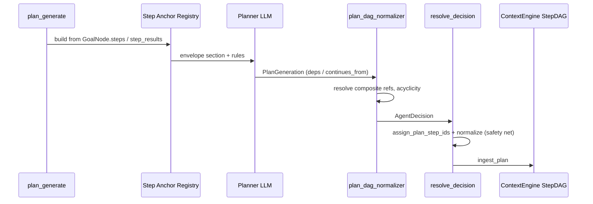

# IG-539: Cross-Wave Step DAG Planning

**Related**: [RFC-624](../specs/RFC-624-context-engine.md) §3.1, [RFC-201](../specs/RFC-201-strangeloop-plan-execute-loop.md), [RFC-304](../specs/RFC-304-planner-protocol-architecture.md), [IG-536](IG-536-dependent-step-prompt-grounding.md) (execute-time grounding)
**Created**: 2026-07-02
**Status**: Implemented

---

## Problem

Multi-wave goals accumulate steps in one flat CE `StepDAG`, but plan-generate LLM calls often fail to declare valid cross-wave `dependencies`:

1. Instructions described deps as "sibling step ids" — models only linked steps within the current plan wave.
2. Prompts showed aggregate `DAG STATUS` counts, not canonical composite ids (`KFA-01`).
3. `STEP ID HINT` covered next local ids (`03`, `04`) but not which completed anchors to reference.
4. No deterministic validation after plan-generate — invalid or missing cross-wave edges reached execute.

IG-536 fixes execute envelopes **when deps exist**; this IG fixes **plan-time authoring and validation**.

---

## Solution

| Component | Role | Module |
|-----------|------|--------|
| **Step Anchor Registry** | Plan-generate envelope section listing completed/pending/failed steps with composite ids and outcome snippets | `cognition/step_anchor_registry.py` |
| **Plan DAG Normalizer** | Post-process `AgentDecision`: resolve refs, drop invalid targets, break in-plan cycles, force `dependency` mode | `cognition/plan_dag_normalizer.py` |
| **`continues_from` field** | Optional `PlanGenerateStep` schema field for cross-wave composite ids; merged into `dependencies` at conversion | `state/schemas.py` |
| **Instruction update** | Distinguish in-wave vs cross-wave deps in `plan_generate_instructions.xml` | prompts fragment |

---

## Flow



---

## Implementation checklist

| Task | Status | Notes |
|------|--------|-------|
| `build_step_anchor_registry()` | Done | CE `GoalNode` preferred; `step_results` fallback |
| Inject `STEP ANCHOR REGISTRY` in plan-generate envelope | Done | `user_message.py`, `builder.py` |
| `PlanGenerateStep.continues_from` + merge at conversion | Done | `plan_generate_steps_to_step_actions()` |
| `normalize_plan_dag()` | Done | Pre-renumber in `_finalize_generated_plan_result`; post-scope in `resolve_decision` |
| Update `plan_generate_instructions.xml` | Done | In-wave vs cross-wave dependency rules |
| RFC-624 §3.1, RFC-201, RFC-304 updates | Done | |
| Unit tests | Done | `test_step_anchor_registry.py`, `test_plan_dag_normalizer.py` |

---

## Key files

| File | Role |
|------|------|
| `foundation/sloop/cognition/step_anchor_registry.py` | Registry builder |
| `foundation/sloop/cognition/plan_dag_normalizer.py` | DAG validation / normalization |
| `foundation/sloop/prompts/user_message.py` | Envelope section injection |
| `foundation/sloop/prompts/builder.py` | Wires registry into plan-generate |
| `foundation/sloop/cognition/planner.py` | Pre-renumber normalize hook |
| `foundation/sloop/nodes/resolve_decision.py` | Post-scope normalize hook |
| `foundation/sloop/state/schemas.py` | `continues_from` schema + merge helper |
| `foundation/sloop/prompts/fragments/instructions/plan_generate_instructions.xml` | LLM rules |

---

## Exit criteria

- [x] Plan-generate shows completed composite step ids when prior waves exist
- [x] Cross-wave deps validated deterministically before execute
- [x] `continues_from` merged into runtime dependencies
- [x] In-plan cycles broken; invalid refs dropped with log
- [x] `execution_mode` forced to `dependency` when edges exist
- [x] RFCs and unit tests updated

---

## Verification

```bash
./scripts/verify_finally.sh
```

Targeted:

```bash
uv run pytest packages/soothe/tests/unit/core/loop/cognition/test_step_anchor_registry.py \
  packages/soothe/tests/unit/core/loop/cognition/test_plan_dag_normalizer.py -q
```
