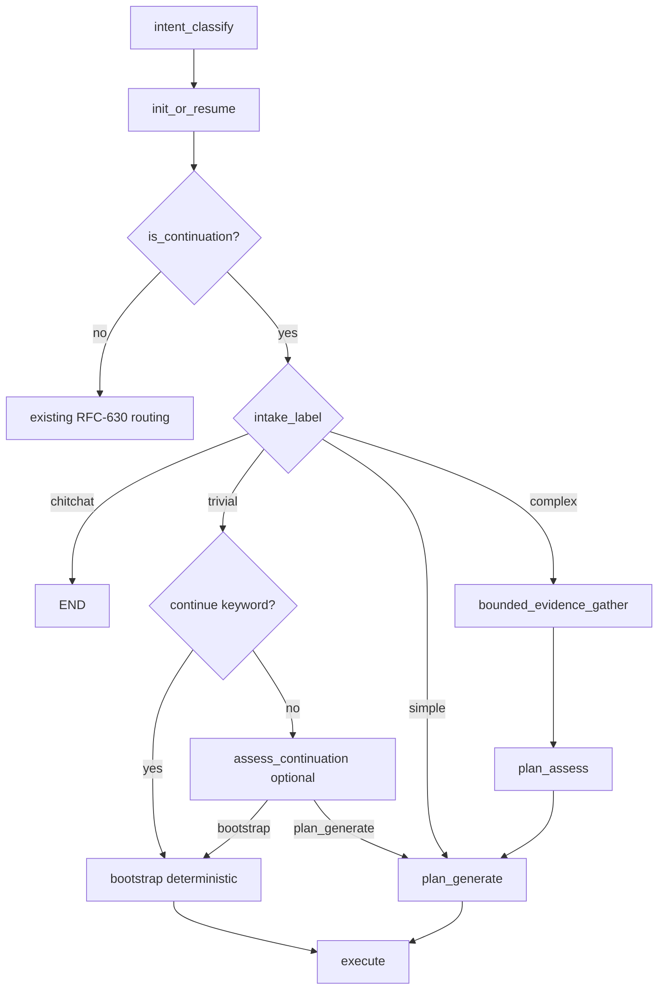

# IG-551: Mid-Loop Continuation Planning Coordination

**RFCs**: [RFC-225](../specs/RFC-225-loop-continuity-and-goal-record-enrichment.md), [RFC-226](../specs/RFC-226-loop-continuation-routing.md) (continuation routing), RFC-630 (intake branch routing), RFC-214 (ledger phases)  
**Created**: 2026-07-06  
**Status**: Implemented (P0–P2)  
**Related**: [IG-538](IG-538-unified-planner-prompt-assembly.md), [IG-540](IG-540-intent-classify-prompt-ledger-optimization.md), [IG-549](IG-549-loop-worker-goal-boundary-hardening.md)  
**Incident loop**: `0b37` (`019f3543-de29-7bb1-9e6a-487262690b37`, goal_4)

---

## Executive Summary

Mid-loop new goals run **intent-classify** then **continuation-assess** as independent LLM gates. The continuation overlay (`is_continuation`) always routes to `plan_assess`, which can choose **bootstrap** (single generic execute step + `terminal_after_execute`) even when intake classified the goal as **simple** or **complex**.

Loop `0b37` goal_4 is the canonical failure: intake `complex` (“docker-build → start components → e2e”), continuation-assess `bootstrap`, one 35-minute mega-step, command timeout, premature goal completion.

**Decision**: **Coordinate** intake and continuation routing with structural guardrails. Do **not** merge the two LLM calls (graph topology, ledger phases, and projection policies differ by design).

| Priority | Change | Effect |
|----------|--------|--------|
| **P0** | `simple`/`complex` intake on continuation → never bootstrap | Fixes goal_4 class of failures |
| **P1** | Skip `assess_continuation` when intake already decides route | −1 LLM, no contradictory signals |
| **P1** | Restore `complex → bounded_evidence_gather` on continuation | Parity with fresh-loop spine |
| **P2** | Lean continuation-assess projection for trivial-only path | Fewer tokens, less noise |
| **P2** | Bootstrap quality + `terminal_after_execute` policy | Better steps when bootstrap is correct |

---

## Problem

### Current flow (mid-loop new goal)

```
intent_classify (LLM #1)
  → init_or_resume (is_continuation=true)
  → route_by_intent → plan_assess   # intake_label ignored
  → assess_continuation (LLM #2)  # bootstrap | plan_generate
  → bootstrap: single step + terminal_after_execute
     OR plan_generate (LLM #3)
```

### Failure mode (loop 0b37 goal_4)

| Signal | Value |
|--------|-------|
| User goal | `run make docker-build … then start docker components and run e2e` |
| `intent_classify` | `complex` |
| `continuation-assess` | `bootstrap` (empty reasoning) |
| Execute envelope | Generic bootstrap template (one step for entire goal) |
| Outcome | ~35 min single step, command timeout, goal completion still emitted |

### Root causes

1. **Dual gates, no coordinator** — intake and continuation-assess can disagree; continuation wins.
2. **Continuation overlay bypasses RFC-630 intake routing** — `complex` never reaches `bounded_evidence_gather` on continuation turns.
3. **Bootstrap is too aggressive** — `build_continue_loop_bootstrap_plan` always sets `terminal_after_execute=True`, skipping iter=1 replan after partial failure.
4. **Ledger projection mismatch** — intake uses last `goal_completion` only (IG-540); continuation-assess uses full `new_goal` history including all prior `intent_classify` pairs (growing noise).

### Why not merge (P1 merge rejected)

| Concern | Merge impact |
|---------|--------------|
| Graph entry | `intent_classify` must run first for chitchat/trivial/simple fresh-loop branches |
| Ledger | `intent_classify` is a first-class phase in `new_goal` planner projection (IG-540) |
| Projection | Intake = lean Slice A; continuation = heavy history — one policy cannot serve both |
| Downstream | `plan_generate` already branches on `state.intent.intake_label` (lightweight vs full) |
| IG-537 | Non-goal: graph topology / prompt template redesign |

**Coordination** preserves existing contracts and fixes the decision layer.

---

## Target Design

### Continuation-aware routing matrix

When `is_continuation=true` and `continue_loop_mode` with prior goals:

| `intake_label` | Route | Continuation-assess LLM | Planning outcome |
|----------------|-------|-------------------------|------------------|
| `chitchat` | `END` (fast-path) | Skip | Unchanged |
| `trivial` + `continue` keyword | `plan_assess` → bootstrap | Skip (deterministic) | Bootstrap from prior completion report |
| `trivial` (other) | `plan_assess` | **Optional** (ambiguous chat-like follow-ups) | bootstrap or plan_generate |
| `simple` | `plan_assess` | **Enabled** | bootstrap or plan_generate |
| `complex` | `bounded_evidence_gather` → `plan_assess` → `plan_generate` | **Skip** | Full spine, decomposed steps |

`route_by_intent` now routes continuation turns by intake: `trivial/simple` to `plan_assess`,
`complex` to `bounded_evidence_gather`.

### Structural guardrails (P0 — must hold even if LLM runs)

```python
# In plan_assess continuation block, before assess_continuation:
if intake_label in (IntakeLabel.SIMPLE, IntakeLabel.COMPLEX):
    # Never bootstrap; escalate to plan_generate path
    ctx.scratch.plan_assessment = StatusAssessment(
        status="continue",
        goal_progress="none",
        assessment_reasoning="Continuation defers to intake complexity routing.",
        require_goal_completion=False,
    )
    return {"assess_route": "continue_generate"}

# Optional: multi-step heuristic on raw goal text
if _goal_has_explicit_multi_step_markers(state.goal):
    return {"assess_route": "continue_generate"}
```

```python
# In assess_continuation fallback (when LLM still runs for trivial):
if result.action == "bootstrap" and intake_label in (SIMPLE, COMPLEX):
    result = result.model_copy(update={
        "action": "plan_generate",
        "reasoning": "Intake complexity requires full planning.",
    })
```

### Bootstrap policy (P2)

When bootstrap is chosen legitimately (`trivial` or `continue` keyword):

1. Use `intent.goal_description` as `StepAction.full_description` when present (not generic template).
2. Set `terminal_after_execute=False` when goal implies tool execution (heuristic: non-empty `goal_description` differs from raw submission, or capabilities include shell/docker).
3. Empty continuation-assess `reasoning` → treat as `plan_generate` fallback (mirror invalid-action fallback).

---

## Implementation Phases

### P0 — Guardrails (ship first)

**Goal**: Prevent `complex`/`simple` continuation goals from bootstrapping.

| File | Change |
|------|--------|
| `orchestrator/nodes/plan_assess.py` | Guard before `assess_continuation`; override bootstrap when intake is simple/complex |
| `cognition/planner.py` | Post-process `ContinuationAssessment`: reject bootstrap for simple/complex intake |
| `tests/unit/core/loop/orchestrator/nodes/test_plan_assess_continue_generate.py` | goal_4 scenario: complex intake → `continue_generate`, never bootstrap |
| `tests/unit/core/loop/planning/test_continuation_assess.py` | bootstrap override when intake complex |

**Acceptance**

- Loop shaped like 0b37 goal_4 routes to `plan_generate`, not bootstrap.
- `./scripts/verify_finally.sh` passes.

### P1 — Coordination routing (skip redundant LLM)

**Goal**: Align `route_by_intent` with intake on continuation turns while preserving
single-pass bootstrap for continuation `simple` follow-ups.

| File | Change |
|------|--------|
| `orchestrator/routing.py` | Continuation-aware `route_by_intent`: simple/trivial→`plan_assess`, complex→`bounded_evidence_gather` |
| `orchestrator/nodes/init_or_resume.py` | Keep synthesized assessment for fresh-loop `simple`; skip synthetic continuation `simple` assessment |
| `orchestrator/nodes/plan_assess.py` | Call `assess_continuation` for continuation `trivial` and `simple`; keep keyword fast-path bootstrap |
| `tests/unit/core/loop/orchestrator/test_route_by_intent.py` | Extend truth table for continuation × intake_label |

**Acceptance**

- Mid-loop `simple` goal: continuation-assess may bootstrap directly when prior context is sufficient.
- Mid-loop `complex` goal: intent → evidence_gather → plan_assess → plan_generate (no continuation-assess).
- Mid-loop `trivial` “create git commit”: bootstrap still works (goal_3 pattern).

### P2 — Projection + bootstrap quality

**Goal**: Reduce continuation-assess noise; improve bootstrap when it is the right path.

| File | Change |
|------|--------|
| `prompts/plan_ledger_projection.py` | `project_continuation_assess_ledger()` — reuse `project_last_goal_completion_for_intake` + current goal segment; exclude prior `intent_classify` from continuation routing context |
| `prompts/builder.py` | Wire lean projection for `call_kind="continuation"` only |
| `engine/continuation_context.py` | `build_continue_bootstrap_step_briefs`: prefer `goal_description` from intent |
| `orchestrator/nodes/plan_assess.py` | `terminal_after_execute` conditional on bootstrap kind |

**Acceptance**

- Continuation-assess prompt for trivial goals uses ≤ last goal_completion unit + caps (not full 22-msg history).
- Bootstrap step `full_description` reflects intent `goal_description` when available.

### P3 — Deferred / out of scope

- Merge intent-classify + continuation-assess into one LLM call
- New ledger phase for combined intake
- Graph topology change (collapse `intent_classify` node)
- Config template changes (unless new projection knobs needed)

---

## Routing Diagram (target)



---

## Test Plan

### Unit

| Test | Assert |
|------|--------|
| `test_route_by_intent_continuation_complex` | Routes to `bounded_evidence_gather`, not `plan_assess` only |
| `test_route_by_intent_continuation_simple` | Routes to `plan_assess` |
| `test_plan_assess_continuation_complex_skips_bootstrap` | No `build_continue_loop_bootstrap_plan` |
| `test_plan_assess_continue_keyword_bootstrap` | `"continue"` → bootstrap without assess_continuation LLM |
| `test_continuation_assess_lean_projection` | Prior `intent_classify` rows omitted |
| `test_bootstrap_uses_goal_description` | `full_description` from intent |

### Regression (loop 0b37 shapes)

| Case | Expected route |
|------|----------------|
| goal_1: upgrade client (simple) | plan_assess → bootstrap or plan_generate |
| goal_3: create git commit (trivial) | bootstrap |
| goal_4: docker-build + e2e (complex) | evidence_gather → plan_generate, multi-step |

### Integration

- `tests/integration/core/test_loop_agent_continuation_planning.py` — complex continuation (goal_4 shape) exercises `bounded_evidence_gather` → `plan_assess` → `plan_generate` with ≥2 steps and no bootstrap; trivial continuation (goal_3 shape) regression for bootstrap path.

---

## Observability

- Log line when guardrail overrides bootstrap: `[Plan] continuation guardrail: intake=%s forced plan_generate`
- Log when `assess_continuation` skipped: `[Plan] continuation-assess skipped (intake=%s)`
- Preserve separate Langfuse runs: `intent-classify` vs `continuation-assess` (when invoked)

No user-visible strings referencing IG-551.

---

## Verification

```bash
./scripts/verify_finally.sh
```

Manual: replay loop `0b37` goal_4 submission; confirm `plan_generate` fires and step count > 1.

---

## Open Questions

1. Should `trivial` continuation always skip `assess_continuation` and use the trivial pseudo-plan path (`init_or_resume` + `resolve_decision`) instead of bootstrap?
2. Should `bounded_evidence_gather` run for continuation `simple`, or only `complex`?
3. Config knob `agent.loop.continuation.skip_assess_for_intake: [simple, complex]` for gradual rollout?

---

## References

- `packages/soothe/src/soothe/foundation/sloop/orchestrator/routing.py` — `route_by_intent`
- `packages/soothe/src/soothe/foundation/sloop/orchestrator/nodes/plan_assess.py` — continuation discriminator
- `packages/soothe/src/soothe/foundation/sloop/cognition/planner.py` — `assess_continuation`
- `packages/soothe/src/soothe/foundation/sloop/prompts/plan_ledger_projection.py` — projection modes
- `docs/wiki/protocols/planner.md` — continuation routing overview
