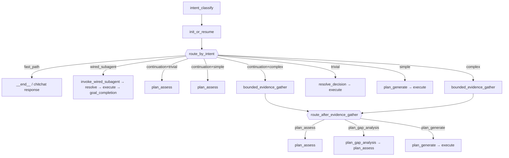

# StrangeLoop LangGraph Design

Auto-generated topology from ``build_strange_loop_graph()`` (RFC-220, RFC-630).
Regenerate: ``python scripts/visualize_strange_loop_graph.py``

## Graph entry

Every goal turn runs:

1. ``intent_classify`` — intake LLM (or heuristic) → ``IntakeLabel`` + optional ``chitchat_response`` / ``wire_subagent``
2. ``init_or_resume`` — surface label on graph state; inject trivial pseudo-plan or select wired-subagent route; emit chitchat fast-path event
3. ``route_by_intent`` — branch dispatch (conditional edge from ``init_or_resume``)

## ``route_by_intent`` priority (RFC-630 / IG-650)

Evaluated in order; first match wins:

| Priority | Condition | Target | Notes |
|----------|-----------|--------|-------|
| 1 | ``intent_route == fast_path`` | ``__end__`` | **Chitchat fast-path** — emits piggybacked ``chitchat_response`` via runner; **always wins**, including loop continuation turns |
| 2 | ``intent_route == wired_subagent`` | ``invoke_wired_subagent`` | Pass 2 / slash specialist → resolve → execute → goal_completion |
| 3 | ``is_continuation`` + ``trivial`` | ``plan_assess`` | Continuation discriminator (bootstrap vs plan_generate) |
| 3b | ``is_continuation`` + ``simple`` | ``plan_assess`` | Continuation discriminator (bootstrap vs plan_generate) |
| 3c | ``is_continuation`` + ``complex`` / missing | ``bounded_evidence_gather`` | Full spine; same as fresh-loop complex |
| 4 | ``intake_label == trivial`` (fresh) | ``resolve_decision`` | Pseudo 1-step plan injected in ``init_or_resume`` |
| 5 | ``intake_label == simple`` (fresh) | ``plan_generate`` | Skips ``bounded_evidence_gather`` + ``plan_assess`` |
| 6 | default / ``complex`` (fresh) | ``bounded_evidence_gather`` | Full spine; fresh-loop skip (IG-476) intact |

### Chitchat fast-path (``init_or_resume``)

When intake is ``chitchat`` and ``chitchat_response`` is non-empty (and goal is not an explicit continue keyword):

- Sets ``intent_route = fast_path`` and emits ``intent_fast_path`` to the runner
- Runner streams the piggybacked reply directly — **no** ``plan_assess``, ``plan_generate``, or ``execute``
- Applies on **first and subsequent goals** in the same loop (continuation does not override chitchat)

### Wired-subagent route (``invoke_wired_subagent``)

When Pass 2 ``wire_subagent`` or slash ``preferred_subagent`` resolves to
``planner`` / ``browser_use`` / ``deep_research`` / ``academic_research``:

- ``init_or_resume`` sets ``intent_route = wired_subagent``
- ``invoke_wired_subagent`` builds the terminal 1-step plan, then edges to ``resolve_decision`` → execute → ``goal_completion``
- Skips evidence gather / plan assess / plan generate; ledger via existing goal completion

## Nodes

- `__start__`
- `intent_classify`
- `init_or_resume`
- `invoke_wired_subagent`
- `iteration_gate`
- `iteration_start`
- `bounded_evidence_gather`
- `plan_gap_analysis`
- `plan_assess`
- `plan_generate`
- `goal_completion`
- `resolve_decision`
- `validate_evidence_bindings`
- `execute`
- `record_iteration`
- `await_clarification`
- `__end__`

## Conditional edges

Solid arrows in the Mermaid/SVG diagram are unconditional; dashed arrows are conditional.

### From ``init_or_resume`` (`route_by_intent`)

- → ``__end__`` — chitchat fast-path
- → ``invoke_wired_subagent`` — Pass 2 / slash specialist direct route
- → ``plan_assess`` — continuation + trivial, or continuation + simple
- → ``plan_generate`` — fresh simple
- → ``bounded_evidence_gather`` — continuation + complex, or fresh complex
- → ``resolve_decision`` — fresh trivial pseudo-plan

### All edges

- `__start__` → `intent_classify`
- `await_clarification` → `__end__`
- `await_clarification` → `execute`
- `await_clarification` → `plan_assess`
- `await_clarification` → `plan_gap_analysis`
- `await_clarification` → `plan_generate`
- `bounded_evidence_gather` → `plan_assess`
- `bounded_evidence_gather` → `plan_gap_analysis`
- `bounded_evidence_gather` → `plan_generate`
- `execute` → `__end__`
- `execute` → `await_clarification`
- `execute` → `iteration_gate`
- `execute` → `record_iteration`
- `init_or_resume` → `__end__`
- `init_or_resume` → `bounded_evidence_gather`
- `init_or_resume` → `invoke_wired_subagent`
- `init_or_resume` → `iteration_gate`
- `init_or_resume` → `plan_assess`
- `init_or_resume` → `plan_generate`
- `init_or_resume` → `resolve_decision`
- `intent_classify` → `init_or_resume`
- `invoke_wired_subagent` → `resolve_decision`
- `iteration_gate` → `__end__`
- `iteration_gate` → `iteration_start`
- `iteration_start` → `bounded_evidence_gather`
- `plan_assess` → `await_clarification`
- `plan_assess` → `goal_completion`
- `plan_assess` → `plan_generate`
- `plan_assess` → `resolve_decision`
- `plan_gap_analysis` → `plan_assess`
- `plan_generate` → `await_clarification`
- `plan_generate` → `goal_completion`
- `plan_generate` → `plan_generate`
- `plan_generate` → `resolve_decision`
- `record_iteration` → `__end__`
- `record_iteration` → `goal_completion`
- `record_iteration` → `iteration_gate`
- `resolve_decision` → `__end__`
- `resolve_decision` → `validate_evidence_bindings`
- `validate_evidence_bindings` → `__end__`
- `validate_evidence_bindings` → `execute`
- `goal_completion` → `__end__`
