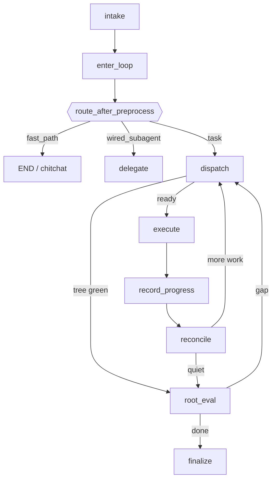

# StrangeLoop LangGraph Design

Canonical architecture view: [`strange_loop_stem.mmd`](strange_loop_stem.mmd)
(preprocess → DISPATCH ⇄ EXECUTE → RECONCILE → ROOT_EVAL → finalize).
Full-edge dumps from ``draw_mermaid()`` are an appendix for implementers —
regenerate with ``python scripts/visualize_strange_loop_graph.py``.

Orchestrator modules: [`orchestrator_modules.mmd`](orchestrator_modules.mmd).

Spec: [RFC-904](../specs/RFC-904-sloop-recursive-decomposition.md).
Legacy plan-spine stations (`gather_evidence` / `evaluate` / `generate_plan` /
`commit_plan` / `check_limits`) are removed from the live graph (IG-752).

## Graph entry (preprocess)

Every goal turn runs:

1. ``intake`` — Pass-1 intake LLM → ``IntakeLabel`` + optional ``chitchat_response`` / ``wire_subagent``
2. ``enter_loop`` — surface label / continuation flags on graph state; emit chitchat fast-path when applicable
3. ``route_after_preprocess`` — branch from ``enter_loop``

## ``route_after_preprocess`` priority (RFC-904)

Evaluated in order; first match wins:

| Priority | Condition | Target | Notes |
|----------|-----------|--------|-------|
| 1 | ``intent_route == fast_path`` | ``__end__`` | Chitchat fast-path (blocked if ``new_goal_created`` → DISPATCH) |
| 2 | ``intent_route == wired_subagent`` | ``delegate`` | Intake-only specialist → finalize / review / DISPATCH handoff |
| 3 | default | ``dispatch`` | All task labels; DISPATCH owns the root StepNode |

## Stations (canonical IDs)

| Station | Stage | Notes |
|---------|-------|-------|
| `intake` | preprocess | Pass-1 social vs task |
| `enter_loop` | preprocess | Structural continuation / fresh-goal flags |
| `dispatch` | decompose | Claim CE ready steps; loop budget; Approve grounding |
| `execute` | execute | CoreAgent thread wave |
| `record_progress` | execute | Persist wave outcomes |
| `reconcile` | decompose | Commit `decompose_task` proposals into CE StepDAG |
| `root_eval` | decompose | Tree-green → finalize, or gap re-dispatch |
| `finalize` | complete | Goal completion / synthesis |
| `await_user` | sidecar | Clarification park; resume → execute / DISPATCH / delegate |
| `delegate` | sidecar | Wired intake subagent (e.g. planner Approve) |

Removed from the live graph (ledger dual-read / clarification resume only):
``gather_evidence``, ``evaluate``, ``generate_plan``, ``commit_plan``,
``check_limits``. Legacy clarification origins resume at ``dispatch``.

Registry: `soothe.sloop.orchestrator.stations`. Wire deliverable phases
`goal_completion` / `execute_step` remain unchanged (soothe-sdk contract).
