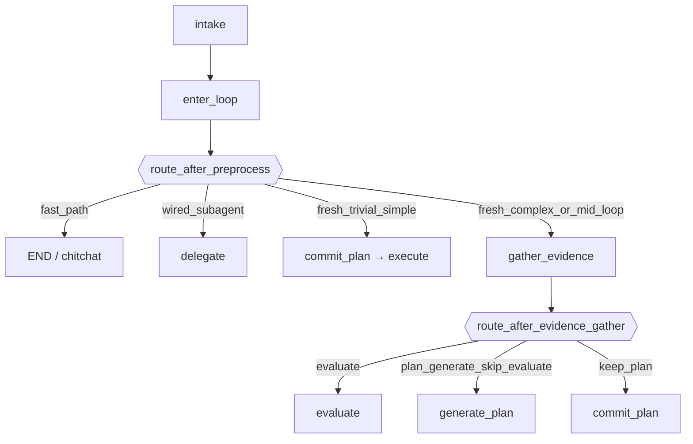

# StrangeLoop LangGraph Design

Canonical architecture view: [`strange_loop_stem.mmd`](strange_loop_stem.mmd)
(preprocess → plan → execute → complete). Full-edge dumps from
``draw_mermaid()`` are an appendix for implementers — regenerate with
``python scripts/visualize_strange_loop_graph.py``.

Orchestrator modules: [`orchestrator_modules.mmd`](orchestrator_modules.mmd).

## Graph entry (preprocess)

Every goal turn runs:

1. ``intake`` — intake LLM → ``IntakeLabel`` + optional ``chitchat_response`` / ``wire_subagent``
2. ``enter_loop`` — surface label on graph state; inject trivial/simple pseudo-plan or select delegate route; emit chitchat fast-path event
3. ``route_after_preprocess`` — branch dispatch (conditional edge from ``enter_loop``)

## ``route_after_preprocess`` priority (RFC-630)

Evaluated in order; first match wins:

| Priority | Condition | Target | Notes |
|----------|-----------|--------|-------|
| 1 | ``intent_route == fast_path`` | ``__end__`` | Chitchat fast-path (blocked if ``new_goal_created``) |
| 2 | ``intent_route == wired_subagent`` | ``delegate`` | Intake-only direct invoke → finalize / review |
| 3 | ``is_fresh_goal`` + ``trivial``/``simple`` | ``commit_plan`` | Injected pseudo-plan |
| 4 | default | ``gather_evidence`` | Fresh complex + all mid-loop |

Mid-loop intake tiers (trivial bootstrap / simple lightweight / complex full)
live inside gather → evaluate → generate — not as a preprocess overlay
(``soothe.sloop.orchestrator.continuation``).

## Stations (canonical IDs)

| Station | Stage | Notes |
|---------|-------|-------|
| `intake` | preprocess | |
| `enter_loop` | preprocess | |
| `gather_evidence` | plan | |
| `evaluate` | plan | status assess + gap inventory |
| `generate_plan` | plan | |
| `commit_plan` | execute | decision resolve + evidence validate (folded) |
| `execute` | execute | |
| `record_progress` | execute | |
| `check_limits` | execute | iteration gate + begin-iteration setup (folded) |
| `finalize` | complete | |
| `await_user` | sidecar | clarification park |
| `delegate` | sidecar | wired subagent |

Folded (no longer separate nodes): ``validate_plan`` → ``commit_plan``;
``begin_iteration`` → ``check_limits``.

Registry: `soothe.sloop.orchestrator.stations`. Wire deliverable phases
`goal_completion` / `execute_step` remain unchanged (soothe-sdk contract).
