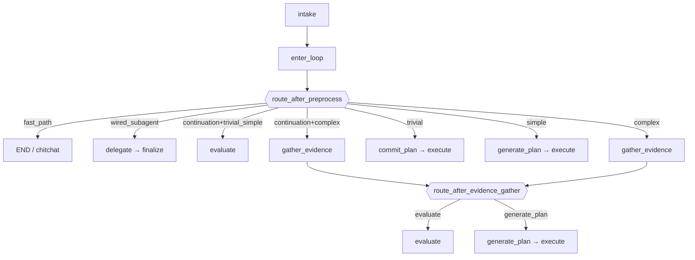

# StrangeLoop LangGraph Design (IG-663)

Canonical architecture view: [`strange_loop_stem.mmd`](strange_loop_stem.mmd)
(preprocess → plan → execute → complete). Full-edge dumps from
``draw_mermaid()`` are an appendix for implementers — regenerate with
``python scripts/visualize_strange_loop_graph.py``.

## Graph entry (preprocess)

Every goal turn runs:

1. ``intake`` — intake LLM (or heuristic) → ``IntakeLabel`` + optional ``chitchat_response`` / ``wire_subagent``
2. ``enter_loop`` — surface label on graph state; inject trivial pseudo-plan or select delegate route; emit chitchat fast-path event
3. ``route_after_preprocess`` — branch dispatch (conditional edge from ``enter_loop``)

## ``route_after_preprocess`` priority (RFC-630 / IG-599 / IG-663)

Evaluated in order; first match wins:

| Priority | Condition | Target | Notes |
|----------|-----------|--------|-------|
| 1 | ``intent_route == fast_path`` | ``__end__`` | Chitchat fast-path |
| 2 | ``intent_route == wired_subagent`` | ``delegate`` | Intake-only direct invoke → finalize |
| 3 | ``is_continuation`` + ``trivial``/``simple`` | ``evaluate`` | Continuation discriminator (IG-672) |
| 3c | ``is_continuation`` + ``complex`` / missing | ``gather_evidence`` | Full spine |
| 4 | ``intake_label == trivial`` (fresh) | ``commit_plan`` | Pseudo 1-step plan |
| 5 | ``intake_label == simple`` (fresh) | ``generate_plan`` | Skips gather + evaluate |
| 6 | default / ``complex`` (fresh) | ``gather_evidence`` | Full spine |

## Stations (canonical IDs)

| Station | Stage | Legacy ID |
|---------|-------|-----------|
| `intake` | preprocess | `intent_classify` |
| `enter_loop` | preprocess | `init_or_resume` |
| `gather_evidence` | plan | `bounded_evidence_gather` |
| `evaluate` | plan | `plan_gap_analysis` + `plan_assess` (IG-672) |
| `generate_plan` | plan | `plan_generate` |
| `commit_plan` | execute | `resolve_decision` |
| `validate_plan` | execute | `validate_evidence_bindings` |
| `execute` | execute | `execute` |
| `record_progress` | execute | `record_iteration` |
| `check_limits` | execute | `iteration_gate` |
| `begin_iteration` | execute | `iteration_start` |
| `finalize` | complete | `goal_completion` |
| `await_user` | sidecar | `await_clarification` |
| `delegate` | sidecar | `invoke_wired_subagent` |

Registry: `soothe.sloop.orchestrator.stations`. Wire deliverable phases
`goal_completion` / `execute_step` remain unchanged (soothe-sdk contract).
