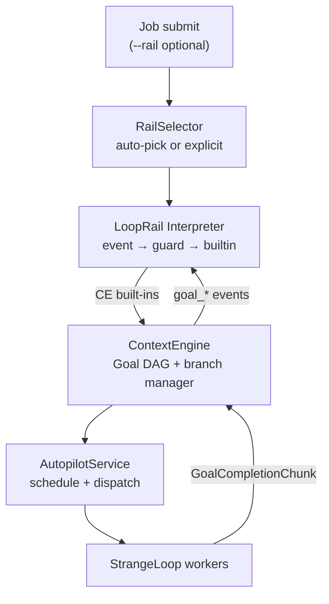
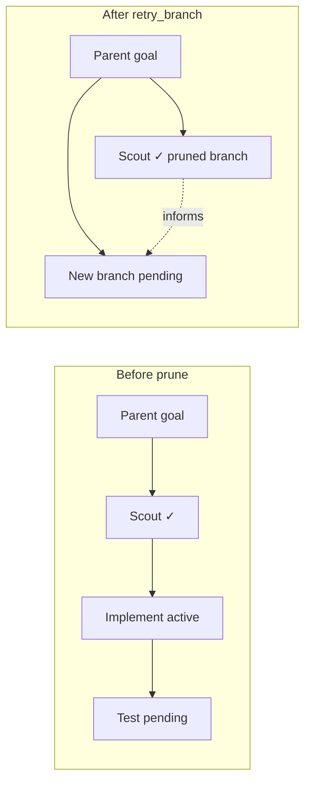

# LoopRail — Autopilot Workflow Patterns

**Status**: Draft (in review)  
**Date**: 2026-07-11  
**Kind**: Design  
**Related**: RFC-222 (Autopilot Architecture), RFC-228 (Autopilot Job IPC), RFC-625 (AutopilotMonitor / ContextEngine), RFC-626 (Entity Model), RFC-630 (No Keyword Heuristics), RFC-105 (Skills — distillation source)  

---

## Abstract

LoopRail is a job-scoped, event-driven workflow pattern system for autopilot. End users author **when** orchestration should act — in natural language embedded in YAML — while ContextEngine owns **what** happens to the goal DAG (decompose, review, prune, replant). Rails live in a three-tier catalog (`builtin_rails/` → `~/.soothe/rails/` → `<workspace>/.soothe/rails/`). A `rail-distiller` subagent converts existing skills into draft rails. Observable state is a derived soft state machine: live DAG + append-only rule trace.

---

## 1. Problem

Autopilot today orchestrates jobs through implicit, hard-coded behavior spread across `AutopilotMonitor`, `GoalDAGVerifier`, backoff reasoners, and consensus flows. Decomposition, parallelism, workspace isolation, review gates, branch recovery, and quality checks work — but:

- There is **no declarative pattern** a team can read, version, or share.
- End users cannot express **when** orchestration should shift without touching framework code.
- Existing **skill assets** (multi-step workflow documentation) are not reusable as autopilot orchestration policy.
- DAG restructuring (prune wrong branch, replant with salvaged context) is ad hoc LLM suggestions, not a first-class, traceable policy.

**LoopRail** introduces job-scoped **workflow patterns**: descriptive YAML documents that tell autopilot *when* to act, while ContextEngine owns *what* to do to the goal DAG.

---

## 2. Design principles

| Principle | Meaning |
|-----------|---------|
| **User defines *when*, framework defines *what*** | End users author **conditions** in natural language (or optional structured rules). Branch evaluation, pruning policy, decomposition, and review spawning are **CE built-ins** — never user-configured. |
| **Event-driven, no named phases** | No `intake → implement → review` enum. Observable state = live goal DAG + branch metadata + append-only rule trace. |
| **Soft state machine** | Transitions are traceable (`rule_fired`, guard reasoning, builtin invoked) but state is **derived**, not stored as a phase counter. |
| **LLM-default guards** | Condition evaluation defaults to structured LLM output (RFC-630). Deterministic checks (`retry_count`, tags) are opt-in shortcuts. |
| **NL flexibility in YAML** | Structured keys hold natural-language values. Same semantics available in NL-first `flow` style or power-user `rules` style. |
| **Skills parity for storage** | Three-tier rail catalog mirrors skills: built-in → `~/.soothe/rails/` → `<workspace>/.soothe/rails/`. |

### Architectural invariant (unchanged from RFC-222)

> **StrangeLoop executes one goal. LoopRail shapes the DAG. AutopilotService schedules ready goals.**

StrangeLoop must not learn DAG shape, sibling goals, or rail policy. LoopRail must not dispatch workers directly.

---

## 3. Architecture



**Responsibility split**

| Layer | Owns |
|-------|------|
| **LoopRail interpreter** | Rail selection, condition evaluation, invoke CE built-ins, rail trace |
| **ContextEngine** | Goal DAG entities, branch manager, built-in DAG operations, prune/salvage policy |
| **AutopilotService** | Scheduling, parallelism limits, workspace reservation, worker lifecycle |
| **AutopilotMonitor** | Dreaming, backoff helpers; forwards events to LoopRail for job-scoped jobs |
| **StrangeLoop** | Single-goal plan/execute/reflect |

---

## 4. Rail document format

### 4.1 Dual syntax (equivalent semantics)

**Style A — NL-first `flow` (recommended for humans)**

```yaml
id: feature-dev
version: "1.0"

summary: |
  Implement or refactor a feature with parallel exploration,
  planning, implementation, review, and QA.

applies_when: |
  The user wants to build or change functionality in an existing codebase,
  not a one-line fix or pure research.

conditions:
  ready_to_plan: |
    All exploration scouts for the current effort have completed,
    and their findings are sufficient to write an implementation plan.

  needs_review: |
    An implementation goal just finished and the changes should be
    reviewed before merging or continuing.

  branch_is_stuck: |
    This approach has failed review or execution twice, or evidence
    shows it conflicts with the codebase architecture.

  job_complete: |
    All review and QA goals passed and no pending work remains.

flow:
  - on: job_start
    then: decompose_parallel

  - on: goal_completed
    when: ready_to_plan
    then: plan_and_implement

  - on: goal_completed
    when: needs_review
    then: review

  - on: goal_failed
    when: branch_is_stuck
    then: retry_branch

  - on: dag_idle
    when: job_complete
    then: complete_job
```

**Style B — `rules` (power users, distiller output, precision)**

```yaml
rules:
  - id: review_after_impl
    on: goal_completed
    when:
      nl: $conditions.needs_review
    then: review

  - id: replant_stuck_branch
    on: goal_failed
    when:
      all:
        - nl: $conditions.branch_is_stuck
        - check: goal.retry_count >= 2
    then: retry_branch
```

Both styles may coexist in one file.

**Evaluation order** (single algorithm for `flow` + `rules`):

1. Normalize `flow` entries into synthetic rules (stable index as `rule_id`).
2. Merge with explicit `rules`; sort by `priority` ascending (default 100).
3. On each event, walk sorted list; evaluate `when` top to bottom.
4. First matching rule invokes its `then:` builtin and **stops** unless `allow_multiple: true`.
5. At equal priority, explicit `rules` precede synthetic `flow` rules.

### 4.2 Field reference

| Field | Required | Description |
|-------|----------|-------------|
| `id` | yes | Rail identifier; must match filename stem (`feature-dev.yml`) |
| `version` | yes | Semver string for catalog compatibility |
| `summary` | yes | NL overview; used by auto-pick and documentation |
| `applies_when` | yes | NL condition for rail selection |
| `conditions` | optional | Named NL guards referenced by `when:` / `$conditions.*` |
| `flow` | optional | NL-first event hooks |
| `rules` | optional | Explicit rule list |
| `rules[].priority` | no | Sort key; lower runs first (default 100) |
| `rules[].allow_multiple` | no | When true, do not stop after first match |

Inline `when:` strings are allowed in `flow` without a named `conditions` entry:

```yaml
flow:
  - on: goal_completed
    when: |
      The completed goal tagged exploration and all siblings are done.
    then: plan_and_implement
```

### 4.3 Guard evaluation (LLM-default)

Every `when` clause is evaluated as:

1. **Primary:** structured LLM call with schema `{ matched: bool, confidence: float, reasoning: str }` and input bundle (goal summary, branch projection, event payload).
2. **Optional shortcuts:** `check:` deterministic predicates combined via `all` / `any`.

Named conditions (`conditions.ready_to_plan`) are expanded once and cached per evaluation context to avoid duplicate LLM calls within the same event handling tick.

Guard results are always appended to the rail trace.

### 4.4 Minimal end-user example

What a team lead typically writes — no builtins, no branch mechanics:

```yaml
id: our-feature-workflow
version: "1.0"

summary: How we ship features in this repo.

applies_when: |
  Feature or refactor work touching application code.

conditions:
  needs_security_review: |
    Changes touch auth, credentials, or network boundaries.
  branch_is_stuck: |
    Two failed CI runs or reviewer sent back critical issues twice.

flow:
  - on: job_start
    then: decompose_parallel
  - on: goal_completed
    when: needs_security_review
    then: review
  - on: goal_failed
    when: branch_is_stuck
    then: retry_branch
```

---

## 5. CE built-in operations

Users reference built-ins only via `then:`. Implementation lives in ContextEngine; not overridable per rail in v1.

| Built-in | Behavior |
|----------|----------|
| `decompose_parallel` | LLM decomposition from job `summary`; spawn parallel exploration goals; workspace isolation per branch |
| `plan_and_implement` | Spawn planner informed by completed scouts (`informs` edges); chain implementation goal(s) |
| `review` | Spawn review goal depending on implementation; read-only / diff-scoped workspace |
| `qa_verify` | Spawn verify goal (tests, lint gate) |
| `retry_branch` | Prune active/pending descendants; **salvage completed** via `informs`; replant sibling branch |
| `merge_branches` | Merge compatible parallel branches when CE detects overlap |
| `pause_for_user` | Suspend branch; emit clarification / intervention event |
| `complete_job` | Mark job root complete; stop scheduling new goals |

Operator-level tuning (e.g. `max_parallel_goals`, workspace reservation) stays in `config.yml` — not in rail YAML.

### 5.1 Branch manager (CE internal)

Branch lifecycle is **framework-owned**:

```
Branch states: active | pruned | suspended
```

**`retry_branch` policy (fixed v1 default — salvage as context):**

1. Cancel `active` / `pending` descendants on the branch.
2. Mark branch root `branch_status: pruned`.
3. **Keep** `completed` goals on the pruned branch unchanged.
4. Spawn replacement branch under the same parent with `informs: [salvaged_goal_ids…]`.
5. New goals receive salvaged summaries through existing `GoalDispatchContextBundle` projection.

Dead-end detection combines user NL condition **and** CE structural signals (retry count, send-back budget, worker timeout). User condition alone is insufficient when structural budget is not exhausted — configurable only at operator level, not per rail.



### 5.2 CE extensions required

| Extension | Purpose |
|-----------|---------|
| `branch_id`, `branch_root_id`, `branch_status` on goals | Branch tracking |
| `goal.tags: list[str]` | Targeting (`exploration`, `implementation`, `review`, `qa`) |
| `prune_branch(branch_root_id, reason)` | Atomic prune with salvage |
| `replant_branch(parent_id, spec, informs_from)` | Sibling branch with context links |
| Job root: `rail_id`, `rail_version` | Job ↔ rail binding |
| Rail trace ref on job root | Pointer to trace store |

---

## 6. Events

LoopRail interpreter subscribes to:

| Event | Source |
|-------|--------|
| `job_submitted` | Autopilot intake |
| `goal_completed` | ContextEngine |
| `goal_failed` | ContextEngine |
| `goal_blocked` | ContextEngine |
| `goal_send_back` | Consensus / CE |
| `dag_idle` | Scheduler tick (no runnable goals, job incomplete) |
| `worker_timeout` | AutopilotService |
| `user_intervention` | CLI / TUI |

Each event triggers evaluation of matching `flow` / `rules` entries in declaration order (respecting priority).

---

## 7. Derived state and trace

No phase enum. Reconstructable snapshot:

```python
@dataclass
class RailSnapshot:
    job_id: str
    rail_id: str
    rail_version: str
    active_branches: list[BranchInfo]
    pruned_branches: list[PrunedBranchInfo]  # includes salvaged goal ids
    fired_rules: list[RuleFireRecord]        # append-only, bounded retention
```

Each `RuleFireRecord`:

```python
@dataclass
class RuleFireRecord:
    timestamp: datetime
    rule_id: str | None          # from rules[].id or synthetic flow index
    event: str
    condition: str               # NL text or condition name
    guard_result: GuardResult    # matched, confidence, reasoning
    builtin: str | None          # then: verb invoked
    builtin_result: str | None   # success / error summary
```

**Persistence:** job root metadata + `~/.soothe/data/loops/{loop_id}/rail_trace.jsonl` (runtime — not in `rails/` catalog dirs).

**Events:** emit `soothe.system.loop_rail.rule_fired` for TUI timeline (verbosity NORMAL).

---

## 8. Rail catalog storage

Three-tier layout, **mirrors skills precedence** (last wins for duplicate `id`):

| Tier | Path |
|------|------|
| Built-in | `packages/soothe/src/soothe/rails/builtin_rails/` |
| User / daemon-wide | `~/.soothe/rails/` |
| Project | `<workspace>/.soothe/rails/` |

### 8.1 Directory layout

**Built-in (source tree)**

```
packages/soothe/src/soothe/rails/
├── __init__.py
├── catalog.py
├── builtins.py                 # get_rails_paths(workspace) — mirrors skills/builtins.py
└── builtin_rails/
    ├── README.md
    ├── default.yml
    ├── feature-dev.yml
    └── bugfix.yml
```

**User (`~/.soothe`)**

```
~/.soothe/rails/
├── *.yml                       # one file per rail id
└── drafts/                     # distiller output pending promotion
    └── 2026-07-11-platonic-impl.yml
```

**Project (`<workspace>/.soothe`)**

```
<workspace>/.soothe/rails/
├── *.yml                       # overrides user + built-in same id
├── .rail-default               # optional: single-line default rail id for repo
└── drafts/
    └── 2026-07-11-from-scout-then-plan.yml
```

**Subdir name:** `rails/` — parallel to existing `.soothe/skills/`, `.soothe/agents/`, `.soothe/output/`.

**Consolidated layout reference:**

```
packages/soothe/src/soothe/rails/builtin_rails/   ← shipped (lowest precedence)

~/.soothe/
├── config/
├── rails/                    ← user/daemon-wide
│   ├── *.yml
│   └── drafts/
├── skills/                   ← existing
└── data/loops/{id}/
    └── rail_trace.jsonl      ← runtime trace (not catalog)

<workspace>/.soothe/
├── rails/                    ← project (highest precedence)
│   ├── *.yml
│   ├── .rail-default
│   └── drafts/
├── skills/                   ← existing
└── agents/                   ← existing
```

### 8.2 File conventions

- One rail = one YAML file: `<rails>/<rail-id>.yml`
- Loader validates `id` field matches filename stem
- Drafts under `drafts/` are **not** loaded until promoted to parent `rails/`

### 8.3 Rail selection and defaults

**Explicit rail** — highest priority:

- CLI: `soothe autopilot run "…" --rail feature-dev`
- TUI / IPC: `rail_id` param on autopilot submit (RFC-228 extension)

**Auto-pick** (no `--rail`): structured LLM compares job description to merged catalog entries (`applies_when` + `summary`) → `{ rail_id, confidence, reasoning }`.

**Fallback when auto-pick confidence is low** (first hit wins):

1. `<workspace>/.soothe/rails/.rail-default` (single line, rail id)
2. `config.yml` → `agent.autopilot.default_rail` (see §8.3)
3. Built-in `default`

Config field (operator-level, sync to `config/config.template.yml` + `config/develop/config.yml` on implementation):

```yaml
agent:
  autopilot:
    default_rail: default
    rail_auto_pick_min_confidence: 0.6
```

### 8.4 Catalog loader API

Mirrors `get_built_in_skills_paths()`:

```python
def get_rails_paths(workspace: str | None = None) -> list[Path]:
    """Rail directories in precedence order (low → high).

    Returns:
        [builtin_rails/, ~/.soothe/rails/, <workspace>/.soothe/rails/]
    """

def LoopRailCatalog.resolve(rail_id: str, workspace: str | None) -> RailDefinition:
    """Load rail by id; last path wins on duplicate ids."""
```

### 8.5 Virtual mode

Project rails resolve to `/.soothe/rails/` under virtual workspace (same as skills). Host `~/.soothe/rails/` unchanged unless synced.

### 8.6 What does not live in `rails/`

| Data | Location |
|------|----------|
| Per-job trace | `~/.soothe/data/loops/{id}/rail_trace.jsonl` |
| Guard cache (v2) | `~/.soothe/data/rails/cache/` |
| Distiller subagent runtime | `~/.soothe/agents/rail-distiller/` |

`rails/` holds **declarative definitions only**.

---

## 9. Rail-distiller subagent

Converts existing skill assets into draft LoopRail YAML.

**Input:** skill names or paths (e.g. `platonic-coding`, `scout-then-plan`, project `.soothe/skills/*`)

**Process:**

1. Load `SKILL.md` + `references/` workflow docs
2. Extract: triggers, multi-step procedures, gates, failure recovery, parallelism hints
3. Emit NL-first rail YAML: `summary`, `applies_when`, `conditions.*`, `flow`
4. Optionally emit `rules` block for regression / validation
5. Write to `<rails>/drafts/YYYY-MM-DD-<topic>.yml`

**Human review required** before promotion to active catalog.

**CLI (sketch):**

```bash
soothe rail distill --skills platonic-coding,scout-then-plan \
  --out .soothe/rails/drafts/platonic-impl.yml

soothe rail promote drafts/platonic-impl.yml --id platonic-impl
soothe rail list
soothe rail validate
```

Subagent registered as built-in or plugin; runtime under `~/.soothe/agents/rail-distiller/`.

**Example distiller output** (abbreviated):

```yaml
id: platonic-impl
version: "1.0"
summary: |
  Spec-driven implementation: brainstorm → RFC → guide → code → verify.
  Distilled from platonic-coding skill.

applies_when: |
  User wants specification-driven development or Platonic Coding workflow.

conditions:
  ready_for_rfc: |
    Design draft is approved and no blocking open questions remain.
  ready_to_implement: |
    An implementation guide exists and matches the approved RFC scope.

flow:
  - on: job_start
    then: decompose_parallel
  - on: goal_completed
    when: ready_for_rfc
    then: plan_and_implement
  - on: goal_completed
    when: ready_to_implement
    then: qa_verify
  - on: goal_failed
    when: branch_is_stuck
    then: retry_branch
```

Promotion copies (or renames) the draft to `.soothe/rails/platonic-impl.yml` after human review.

---

## 10. End-to-end flow (feature-dev example)

```
1. User: soothe autopilot run "Add OAuth login" [--rail feature-dev]
2. RailSelector picks rail → interpreter bound to job root goal
3. job_submitted → decompose_parallel → 3 scout goals in CE DAG
4. AutopilotService dispatches ready scouts to StrangeLoop workers
5. Scout completes → goal_completed → guard ready_to_plan (false until all scouts done)
6. Last scout completes → ready_to_plan matches → plan_and_implement
7. Implementation completes → needs_review matches → review builtin
8. Review fails twice → branch_is_stuck matches → retry_branch
   - Prune branch (salvage scout + partial impl summaries via informs)
   - Replant alternate approach
9. QA passes, dag_idle + job_complete → complete_job
10. Rail trace available in TUI / diagnose tooling
```

---

## 11. AutopilotMonitor integration

For jobs with `rail_id` set:

| Today | With LoopRail |
|-------|---------------|
| `GoalDAGVerifier` suggests remove/decompose/merge | Verifier emits **events** or defers to CE health builtins; LoopRail owns job-scoped restructuring |
| Monitor applies verifier suggestions directly | Monitor **forwards events** to LoopRail interpreter |
| Implicit decomposition after completion | `then:` built-ins triggered by rail conditions |

Dreaming, backoff reasoning, and cron intake remain in AutopilotMonitor unchanged.

Jobs **without** `rail_id` (solo / legacy autopilot) keep current monitor behavior until migration.

---

## 12. Error handling

| Failure | Behavior |
|---------|----------|
| LLM guard timeout / error | Log `guard_error`; skip rule; optional fallback rule with deterministic `check:` |
| Unknown `then:` verb | Rail **validation error at load time** (fail fast) |
| CE builtin failure | Trace `builtin_error`; no partial DAG commit (atomic builtin batch) |
| Conflicting rules | Priority ordering; first match wins unless `allow_multiple: true` on rule |
| Rail not found | Reject at intake with actionable error |
| Auto-pick low confidence | Fall back to `default`; log reasoning |
| Prune while worker active | `cancel_goal` existing path first, then prune |

---

## 13. Testing strategy

| Layer | Coverage |
|-------|----------|
| YAML schema validation | Parse both syntax styles; reject unknown `then:` verbs |
| Catalog precedence | Project overrides user overrides built-in |
| Guard evaluation | Mock LLM structured output → match / no-match |
| CE builtins | `retry_branch` preserves completed + `informs` wiring |
| Interpreter integration | Event sequences → expected DAG shapes |
| Distiller | Fixture skills → valid draft YAML → validate passes |
| Trace | Rule fire order; replay reproduces snapshot |

---

## 14. Non-goals (v1)

- User-defined custom CE builtins
- Per-rail prune policy overrides
- Runtime user-submitted rails without catalog promotion
- Cross-job or workspace-default rails (only `.rail-default` hint)
- LoopRail driving StrangeLoop prompts directly
- Visual rail editor
- Replacing dreaming / backoff subsystems

---

## 15. Decision log

| Topic | Decision |
|-------|----------|
| Scope | Job-scoped rail |
| Orchestration target | CE goal DAG mutations via built-ins |
| State model | Event-driven; no named phases |
| User surface | NL `conditions` + `flow`; optional `rules` |
| Guards | LLM-default; deterministic opt-in |
| Prune default | Salvage completed work via `informs` + projection |
| Rail storage | `rails/` under `~/.soothe` and `<workspace>/.soothe`; built-in in source |
| Precedence | built-in → user → project (last wins) |
| Bootstrap | `rail-distiller` subagent from skills |
| StrangeLoop boundary | Unchanged RFC-222 invariant |

---

## 16. Component map (implementation sketch)

| Module | Path (proposed) |
|--------|-----------------|
| `LoopRailCatalog` | `soothe/rails/catalog.py` |
| `get_rails_paths` | `soothe/rails/builtins.py` |
| `LoopRailInterpreter` | `soothe/foundation/autopilot/rail/interpreter.py` |
| `RailSelector` | `soothe/foundation/autopilot/rail/selector.py` |
| CE branch builtins | `soothe/foundation/context/branch_manager.py` |
| Guard schemas | `soothe/foundation/autopilot/rail/guards/` |
| `rail-distiller` subagent | `soothe/subagents/rail_distiller/` |
| Built-in rails | `soothe/rails/builtin_rails/*.yml` |

---

## 17. Open questions (post-v1)

- Should distiller auto-register promoted rails in a project `catalog.yml` manifest?
- Guard result caching across identical events within a job?
- TUI rail timeline as first-class card (RFC-628 pattern)?
- Migration path: auto-attach `default` rail to all new autopilot jobs?
- Should `flow` entries support `then: [review, qa_verify]` sequences in one hook?

---

## 18. Suggested downstream routing

No existing LoopRail RFC. Closest related: RFC-222, RFC-625, RFC-626.

**Recommended:** create new RFC (`RFC-6xx-loop-rail`) → `specs-refine` → implementation guide.

---

## Appendix A: built-in `default.yml` (sketch)

Minimal rail for jobs that do not match a specialized pattern:

```yaml
id: default
version: "1.0"

summary: |
  Single-threaded autopilot: one root goal, standard retry and review on failure.

applies_when: |
  General task with no specialized workflow requirement.

conditions:
  needs_retry: |
    The goal failed but the approach may still succeed with a fresh attempt.
  job_complete: |
    The root goal completed successfully with no pending children.

flow:
  - on: job_start
    then: decompose_parallel   # degenerates to single goal when LLM sees simple task
  - on: goal_failed
    when: needs_retry
    then: retry_branch
  - on: dag_idle
    when: job_complete
    then: complete_job
```

Built-in catalog should also ship `feature-dev.yml` and `bugfix.yml` as documented examples in §4.1 and §10.
