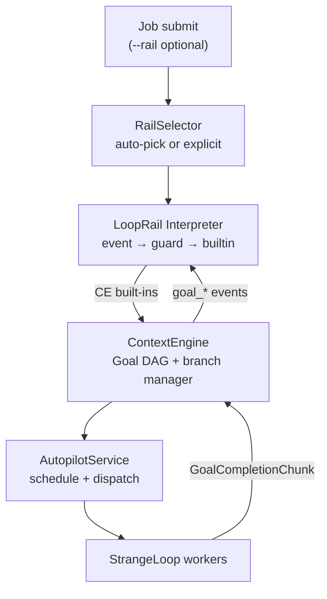
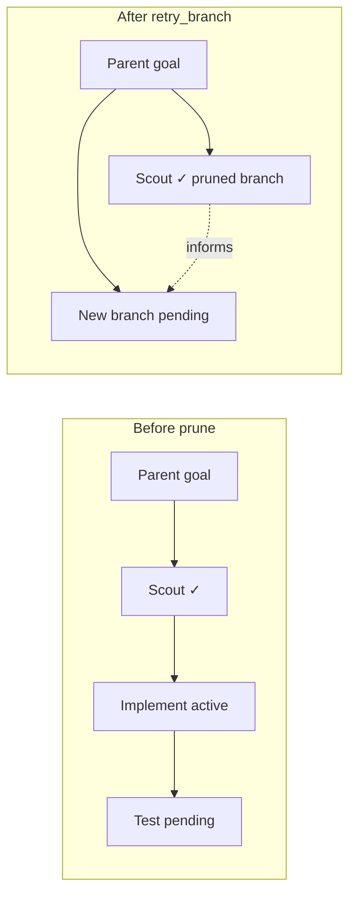

# LoopRail — Autopilot Workflow Patterns

**Status**: Draft (in review)  
**Date**: 2026-07-11  
**Kind**: Design  
**Related**: RFC-222 (Autopilot Architecture), RFC-228 (Autopilot Job IPC),
RFC-230 (Job Maturity Assessment — `acceptance_met`, production `dag_idle`,
rail-exclusive spawn), RFC-625 (AutopilotMonitor / ContextEngine),
RFC-626 (Entity Model), RFC-630 (No Keyword Heuristics),
RFC-105 (Skills — distillation source), IG-677 (Job↔Loop Index),
IG-687 (greenfield-system), IG-692 (maturity implementation),
IG-RQJ-02 (rail trace continuity)

---

## Abstract

LoopRail is a job-scoped, event-driven workflow pattern system for autopilot. End users author **when** orchestration should act — in natural language embedded in YAML — while ContextEngine owns **what** happens to the goal DAG (decompose, review, prune, replant). Rails live in a three-tier catalog (`builtin_rails/` → `~/.soothe/rails/` → `<workspace>/.soothe/rails/`). A `rail-distiller` subagent converts existing skills into draft rails. Observable state is a derived soft state machine: live DAG + append-only rule trace.

---

## 1. Problem

Autopilot today orchestrates jobs through implicit, hard-coded behavior spread across `AutopilotMonitor`, `GoalDAGVerifier`, backoff reasoners, and consensus flows. Decomposition, parallelism, workspace isolation, review gates, branch recovery, and quality checks work — but:

- There is **no declarative pattern** a team can read, version, or share.
- End users cannot express **when** orchestration should shift without touching framework code.
- Existing **skill assets** (multi-step workflow documentation) are not reusable as autopilot orchestration policy.
- DAG restructuring (prune wrong branch, replant with salvaged context) is ad hoc LLM suggestions, not a first-class, traceable policy.

**LoopRail** introduces job-scoped **workflow patterns**: descriptive YAML documents that tell autopilot *when* to act, while ContextEngine owns *what* to do to the goal DAG.

---

## 2. Design principles

| Principle | Meaning |
|-----------|---------|
| **User defines *when*, framework defines *what*** | End users author **conditions** in natural language (or optional structured rules). Branch evaluation, pruning policy, decomposition, and review spawning are **CE built-ins** — never user-configured. |
| **Event-driven, no named phases** | No `intake → implement → review` enum. Observable state = live goal DAG + branch metadata + append-only rule trace. |
| **Soft state machine** | Transitions are traceable (`rule_fired`, guard reasoning, builtin invoked) but state is **derived**, not stored as a phase counter. |
| **LLM-default guards** | Condition evaluation defaults to structured LLM output (RFC-630). Deterministic checks (`retry_count`, tags) are opt-in shortcuts. |
| **NL flexibility in YAML** | Structured keys hold natural-language values. Same semantics available in NL-first `flow` style or power-user `rules` style. |
| **Skills parity for storage** | Three-tier rail catalog mirrors skills: built-in → `~/.soothe/rails/` → `<workspace>/.soothe/rails/`. |

### Architectural invariant (unchanged from RFC-222)

> **StrangeLoop executes one goal. LoopRail shapes the DAG. AutopilotService schedules ready goals.**

StrangeLoop must not learn DAG shape, sibling goals, or rail policy. LoopRail must not dispatch workers directly.

---

## 3. Architecture



**Responsibility split**

| Layer | Owns |
|-------|------|
| **LoopRail interpreter** | Rail selection, condition evaluation, invoke CE built-ins, rail trace |
| **ContextEngine** | Goal DAG entities, branch manager, built-in DAG operations, prune/salvage policy |
| **AutopilotService** | Scheduling, parallelism limits, workspace reservation, worker lifecycle |
| **AutopilotMonitor** | Dreaming, backoff helpers; forwards events to LoopRail for job-scoped jobs |
| **StrangeLoop** | Single-goal plan/execute/reflect |

---

## 4. Rail document format

### 4.1 Dual syntax (equivalent semantics)

**Style A — NL-first `flow` (recommended for humans)**

```yaml
id: feature-dev
version: "1.0"

summary: |
  Implement or refactor a feature with parallel exploration,
  planning, implementation, review, and QA.

applies_when: |
  The user wants to build or change functionality in an existing codebase,
  not a one-line fix or pure research.

conditions:
  ready_to_plan: |
    All exploration scouts for the current effort have completed,
    and their findings are sufficient to write an implementation plan.

  needs_review: |
    An implementation goal just finished and the changes should be
    reviewed before merging or continuing.

  branch_is_stuck: |
    This approach has failed review or execution twice, or evidence
    shows it conflicts with the codebase architecture.

  job_complete: |
    All review and QA goals passed and no pending work remains.

flow:
  - event: job_start
    then: decompose_parallel

  - event: goal_completed
    when: ready_to_plan
    then: plan_and_implement

  - event: goal_completed
    when: needs_review
    then: review

  - event: goal_failed
    when: branch_is_stuck
    then: retry_branch

  - event: dag_idle
    when: job_complete
    then: complete_job
```

**Style B — `rules` (power users, distiller output, precision)**

```yaml
rules:
  - id: review_after_impl
    event: goal_completed
    when:
      nl: $conditions.needs_review
    then: review

  - id: replant_stuck_branch
    event: goal_failed
    when:
      all:
        - nl: $conditions.branch_is_stuck
        - check: goal.retry_count >= 2
    then: retry_branch
```

Both styles may coexist in one file.

**Evaluation order** (single algorithm for `flow` + `rules`):

1. Normalize `flow` entries into synthetic rules (stable index as `rule_id`).
2. Merge with explicit `rules`; sort by `priority` ascending (default 100).
3. On each event, walk sorted list; evaluate `when` top to bottom.
4. First matching rule invokes its `then:` builtin and **stops** unless `allow_multiple: true`.
5. At equal priority, explicit `rules` precede synthetic `flow` rules.

### 4.2 Field reference

| Field | Required | Description |
|-------|----------|-------------|
| `id` | yes | Rail identifier; must match filename stem (`feature-dev.yml`) |
| `version` | yes | Semver string for catalog compatibility |
| `summary` | yes | NL overview; used by auto-pick and documentation |
| `applies_when` | yes | NL condition for rail selection |
| `conditions` | optional | Named NL guards referenced by `when:` / `$conditions.*` |
| `flow` | optional | NL-first event hooks (`event` + optional `when` + `then`) |
| `rules` | optional | Explicit rule list (`event` / `when` / `then`; legacy `on` accepted) |
| `rules[].event` | yes* | Trigger event name (`job_start`, `goal_completed`, …). Prefer over legacy `on` (YAML 1.1 boolean trap) |
| `rules[].priority` | no | Sort key; lower runs first (default 100) |
| `rules[].allow_multiple` | no | When true, do not stop after first match |

Inline `when:` strings are allowed in `flow` without a named `conditions` entry:

```yaml
flow:
  - event: goal_completed
    when: |
      The completed goal tagged exploration and all siblings are done.
    then: plan_and_implement
```

### 4.3 Guard evaluation (LLM-default)

Every `when` clause is evaluated as:

1. **Primary:** structured LLM call with schema `{ matched: bool, confidence: float, reasoning: str }` and input bundle (goal summary, branch projection, event payload).
2. **Optional shortcuts:** `check:` deterministic predicates combined via `all` / `any`.

Named conditions (`conditions.ready_to_plan`) are expanded once and cached per evaluation context to avoid duplicate LLM calls within the same event handling tick.

Guard results are always appended to the rail trace.

### 4.4 Minimal end-user example

What a team lead typically writes — no builtins, no branch mechanics:

```yaml
id: our-feature-workflow
version: "1.0"

summary: How we ship features in this repo.

applies_when: |
  Feature or refactor work touching application code.

conditions:
  needs_security_review: |
    Changes touch auth, credentials, or network boundaries.
  branch_is_stuck: |
    Two failed CI runs or reviewer sent back critical issues twice.

flow:
  - event: job_start
    then: decompose_parallel
  - event: goal_completed
    when: needs_security_review
    then: review
  - event: goal_failed
    when: branch_is_stuck
    then: retry_branch
```

---

## 5. CE built-in operations

Users reference built-ins only via `then:`. Implementation lives in ContextEngine; not overridable per rail in v1.

| Built-in | Behavior |
|----------|----------|
| `decompose_parallel` | LLM decomposition from job `summary`; spawn parallel exploration goals; workspace isolation per branch |
| `plan_and_implement` | Spawn planner informed by completed scouts (`informs` edges); chain implementation goal(s) |
| `review` | Spawn review goal depending on implementation; read-only / diff-scoped workspace |
| `qa_verify` | Spawn verify goal (tests, lint gate) |
| `retry_branch` | Prune active/pending descendants; **salvage completed** via `informs`; replant sibling branch |
| `merge_branches` | Merge compatible parallel branches when CE detects overlap |
| `pause_for_user` | Suspend branch; emit clarification / intervention event |
| `complete_job` | Mark job root complete; stop scheduling new goals |

Operator-level tuning (e.g. `max_parallel_goals`, workspace reservation) stays in `config.yml` — not in rail YAML.

### 5.1 Branch manager (CE internal)

Branch lifecycle is **framework-owned**:

```
Branch states: active | pruned | suspended
```

**`retry_branch` policy (fixed v1 default — salvage as context):**

1. Cancel `active` / `pending` descendants on the branch.
2. Mark branch root `branch_status: pruned`.
3. **Keep** `completed` goals on the pruned branch unchanged.
4. Spawn replacement branch under the same parent with `informs: [salvaged_goal_ids…]`.
5. New goals receive salvaged summaries through existing `GoalDispatchContextBundle` projection.

Dead-end detection combines user NL condition **and** CE structural signals (retry count, send-back budget, worker timeout). User condition alone is insufficient when structural budget is not exhausted — configurable only at operator level, not per rail.



### 5.2 CE extensions required

| Extension | Purpose |
|-----------|---------|
| `branch_id`, `branch_root_id`, `branch_status` on goals | Branch tracking |
| `goal.tags: list[str]` | Targeting (`exploration`, `implementation`, `review`, `qa`) |
| `prune_branch(branch_root_id, reason)` | Atomic prune with salvage |
| `replant_branch(parent_id, spec, informs_from)` | Sibling branch with context links |
| Job root: `rail_id`, `rail_version` | Job ↔ rail binding |

**Rail trace path is derivable from `job_id`** — no separate trace-ref field on the goal node. The path `~/.soothe/data/loops/{job_id}/rail_trace.jsonl` (SQLite) or the `rail_trace` table keyed by `job_id` (Postgres) is computed from the root goal ID at runtime (see §7).

---

## 6. Events

LoopRail interpreter subscribes to:

| Event | Source |
|-------|--------|
| `job_submitted` | Autopilot intake |
| `goal_completed` | ContextEngine |
| `goal_failed` | ContextEngine |
| `goal_blocked` | ContextEngine |
| `goal_send_back` | Consensus / CE |
| `dag_idle` | Scheduler tick (no runnable goals, job incomplete) |
| `worker_timeout` | AutopilotService |
| `user_intervention` | CLI / TUI |

Each event triggers evaluation of matching `flow` / `rules` entries in declaration order (respecting priority).

---

## 7. Derived state and trace

No phase enum. Reconstructable snapshot:

```python
@dataclass
class RailSnapshot:
    job_id: str
    rail_id: str
    rail_version: str
    active_branches: list[BranchInfo]
    pruned_branches: list[PrunedBranchInfo]  # includes salvaged goal ids
    fired_rules: list[RuleFireRecord]        # append-only, bounded retention
```

Each `RuleFireRecord`:

```python
@dataclass
class RuleFireRecord:
    timestamp: datetime
    rule_id: str | None          # from rules[].id or synthetic flow index
    event: str
    condition: str               # NL text or condition name
    guard_result: GuardResult    # matched, confidence, reasoning
    builtin: str | None          # then: verb invoked
    builtin_result: str | None   # success / error summary
```

**Persistence (SQLite mode):** job root metadata + a **job-scoped** append-only
trace file (runtime — not in `rails/` catalog dirs):

```text
~/.soothe/data/loops/{job_id}/rail_trace.jsonl
```

Where `job_id` = the **root goal ID** of the autopilot job. This directory is a
**job artifact home**, distinct from per-assignment StrangeLoop dirs
(`data/loops/autopilot__{job_id}__{uuid}/` per IG-677). Assignment `loop_id`s
are never used in the rail trace path.

A single job's goal DAG may span multiple assignment loops (e.g.
`decompose_parallel` dispatches scouts to separate workers) — the trace is one
append-only file per job regardless of which worker executes each goal.

The rail interpreter is the **sole trace writer**, bound to the job root. Workers emit `goal_*` events that the interpreter consumes; workers never touch the trace file. This means:
- **No cross-loop trace fragmentation**: decomposition spawns child goals in the same DAG under the same `job_id`; the interpreter continues writing to the same trace.
- **No trace inheritance needed for sub-loops**: there are no "sub-loops" for trace purposes. Assignment loops are execution contexts; the trace lives above them (JobLoopIndex maps job → loops; rail does not).
- **Trace survives `retry_branch`**: the append-only log is never pruned. Pruned-branch `RuleFireRecord` entries remain in the log. The `informs` mechanism carries *salvaged context* (goal summaries, findings — not trace records) to the replacement branch via `GoalDispatchContextBundle` projection.

**Persistence (PostgreSQL mode):** when `persistence.default_backend: postgresql` (AGENTS.md §10), the trace and job metadata MUST be Postgres tables, not filesystem `jsonl` files. Three tables are required:

```sql
-- rail_job_meta: job ↔ rail binding (one row per autopilot job with a rail attached).
CREATE TABLE IF NOT EXISTS rail_job_meta (
    job_id      TEXT PRIMARY KEY,          -- root goal ID; stable, job-scoped
    rail_id     TEXT NOT NULL,             -- rail catalog id (e.g. "feature-dev")
    rail_version TEXT NOT NULL,            -- semver from rail document
    created_at  TIMESTAMPTZ NOT NULL DEFAULT NOW(),
    updated_at  TIMESTAMPTZ NOT NULL DEFAULT NOW()
);

-- rail_trace: append-only rule-fire log (many rows per job).
CREATE TABLE IF NOT EXISTS rail_trace (
    job_id      TEXT NOT NULL,
    seq         BIGINT NOT NULL,           -- monotonic append ordering per job
    rule_id     TEXT,                     -- from rules[].id or synthetic flow index
    event       TEXT NOT NULL,            -- triggering event (e.g. "goal_completed")
    condition   TEXT,                     -- NL text or condition name evaluated
    guard_result JSONB NOT NULL,          -- {matched, confidence, reasoning}
    builtin     TEXT,                     -- then: verb invoked (e.g. "retry_branch")
    builtin_result TEXT,                  -- success / error summary
    record      JSONB NOT NULL,           -- full serialized RuleFireRecord
    created_at  TIMESTAMPTZ NOT NULL DEFAULT NOW(),
    PRIMARY KEY (job_id, seq),
    FOREIGN KEY (job_id) REFERENCES rail_job_meta(job_id) ON DELETE CASCADE
);

-- Indexes (match naming convention from soothe_checkpoints/init.sql).
CREATE INDEX IF NOT EXISTS idx_rail_trace_job_created
    ON rail_trace(job_id, created_at DESC);
CREATE INDEX IF NOT EXISTS idx_rail_trace_created
    ON rail_trace(created_at DESC);       -- global retention purge scan

-- rail_branch_state: snapshot-optimized branch view (denormalized from goal DAG).
-- Branch lifecycle is CE-owned (goal DAG entities); this table is a query cache
-- for RailSnapshot reconstruction. The goal DAG remains the source of truth.
CREATE TABLE IF NOT EXISTS rail_branch_state (
    job_id         TEXT NOT NULL,
    branch_id      TEXT NOT NULL,          -- branch root goal ID
    branch_root_id TEXT NOT NULL,          -- parent goal ID anchoring the branch
    branch_status  TEXT NOT NULL,          -- active | pruned | suspended
    salvaged_goal_ids JSONB,               -- completed goals kept on pruned branches
    updated_at     TIMESTAMPTZ NOT NULL DEFAULT NOW(),
    PRIMARY KEY (job_id, branch_id),
    FOREIGN KEY (job_id) REFERENCES rail_job_meta(job_id) ON DELETE CASCADE
);

CREATE INDEX IF NOT EXISTS idx_rail_branch_state_job_status
    ON rail_branch_state(job_id, branch_status);
```

**Migration:** tables are created by `init.sql` in a new `soothe_rails` database (registered under `persistence.postgres_databases.rails`), idempotent via `IF NOT EXISTS`. Incremental schema changes use numbered migration files (`NNN_name.sql`), matching the convention in `soothe_checkpoints/init.sql`.

**Branch state is CE-owned (goal DAG), not loop-owned.** Branch lifecycle (`active` / `pruned` / `suspended`) lives on goal DAG entities (§5.2 extensions), traversed from the root goal via `parent_id` / `depends_on` / `informs` edges. The `rail_branch_state` table is a denormalized query cache for fast `RailSnapshot` reconstruction; the goal DAG remains the single source of truth and is written first. The trace is reconstructable from two job-scoped inputs: the branch list (from `rail_branch_state` or derived from the goal DAG) + the fired-rules log (from `rail_trace` or `{job_id}/rail_trace.jsonl`). No per-`loop_id` directory visits or table scans are required for snapshot reconstruction.

**Retention config** (operator-level, not in rail YAML):

```yaml
agent:
  autopilot:
    rails:
      # --- Trace retention ---
      trace_max_rule_fires_per_job: 1000    # oldest entries evicted per job (both backends)
      trace_max_dirs: 500                   # SQLite: LRU eviction of {job_id}/ directories
      trace_retention_days: 30              # Postgres: periodic purge of rail_trace rows
      trace_purge_interval_seconds: 3600    # Postgres: how often the purge sweep runs
      # --- Job metadata retention ---
      job_meta_retention_days: 90           # Postgres: purge completed-job rows from rail_job_meta
      # --- Branch state cache ---
      branch_state_cache_ttl_seconds: 300   # rail_branch_state rows considered stale after this age
```

On implementation, sync these fields to `config/soothe.template.yml` (under `agent.autopilot.rails`) and `config/develop/nano.yml` with matching structure (AGENTS.md §2 Config Sync). The `rails` key under `persistence.postgres_databases` must also be added:

```yaml
persistence:
  postgres_databases:
    checkpoints: soothe_checkpoints
    metadata: soothe_metadata
    vectors: soothe_vectors
    memory: soothe_memory
    rails: soothe_rails                   # NEW — rail_trace, rail_job_meta, rail_branch_state
```

**Events:** emit `soothe.system.loop_rail.rule_fired` for TUI timeline (verbosity NORMAL).

### 7.1 Resume and trace continuity

A job may be interrupted by daemon restart, crash, worker timeout, or operator pause. Resume re-establishes the interpreter's binding to the job root and continues the append-only trace. **No trace merge is needed** — there is one trace file per job, the interpreter is the sole writer, and workers never produce trace fragments that need reconciliation.

**Resume triggers and handling:**

| Trigger | What resumes | What is lost |
|---------|-------------|-------------|
| Daemon restart / crash recovery | Goal DAG (persisted), trace log (append-only file), interpreter rebinds to job root | In-flight worker sessions (workers are ephemeral; their goals are re-dispatched) |
| Worker timeout / release | Goal re-dispatched to a new worker by AutopilotService; interpreter trace continues unbroken | Nothing in trace — workers don't write trace |
| `pause_for_user` | Branch suspended; interpreter remains bound; trace holds `pause` record | Nothing — resume unsuspends branch and continues appending |
| `retry_branch` during resume | Pruned branch entries preserved in append-only log; replacement branch spawned | Nothing — trace is never pruned |

**Resume workflow (daemon restart):**

```
1. AutopilotService loads persisted goal DAG for each job_id from CE store
2. For each job with rail_id set:
   a. RailSelector re-resolves rail (same rail_id + version from job root metadata)
   b. LoopRailInterpreter rebinds to job root goal (job_id)
   c. Trace file reopened in append mode:
      - SQLite: open ~/.soothe/data/loops/{job_id}/rail_trace.jsonl (append)
      - Postgres: SELECT MAX(seq) FROM rail_trace WHERE job_id = ? → next seq = max+1
   d. Snapshot reconstruction (see below)
   e. In-flight goals (status=active, no worker) → re-queued for dispatch
   f. Interpreter resumes event processing from live DAG state
3. Emit soothe.system.loop_rail.job_resumed (verbosity NORMAL)
```

**Snapshot reconstruction:**

The `RailSnapshot` (§7) is rebuilt from two job-scoped inputs on resume — neither requires per-worker or per-`loop_id` directory visits:

```python
def reconstruct_snapshot(job_id: str, goal_dag: GoalDAG) -> RailSnapshot:
    # 1. Branch state: traverse goal DAG from root via parent_id / depends_on / informs
    active_branches = derive_branches(goal_dag, status="active")
    pruned_branches = derive_branches(goal_dag, status="pruned")  # includes salvaged goal ids

    # 2. Fired rules: replay append-only trace log
    fired_rules = read_trace_records(job_id)  # jsonl file or rail_trace table

    # 3. Rail binding from job root metadata
    rail_id = goal_dag.root.rail_id
    rail_version = goal_dag.root.rail_version

    return RailSnapshot(
        job_id=job_id,
        rail_id=rail_id,
        rail_version=rail_version,
        active_branches=active_branches,
        pruned_branches=pruned_branches,
        fired_rules=fired_rules,
    )
```

Branch state is **live-derived** from the goal DAG, not replayed from the trace. The trace log provides the rule-fire history (guard results, builtins invoked) but is not the source of truth for current branch topology — the goal DAG is. This means:

- If the goal DAG was persisted but the trace log is missing (data loss), the interpreter can still resume: branch state is intact, only rule-fire history is lost. The interpreter starts appending fresh records from the resume point.
- If the trace log exists but the goal DAG is missing (worse data loss), the job cannot resume — the DAG is the source of truth for what work remains.

**Trace seq continuity (Postgres mode):**

On resume, the interpreter queries `MAX(seq)` for the `job_id` and continues from `max+1`. The `PRIMARY KEY (job_id, seq)` constraint guarantees no duplicate seq even if the previous interpreter instance crashed mid-write (the uncommitted transaction is rolled back). SQLite mode uses file-append; JSONL lines are atomic at the line level (one `RuleFireRecord` per line, flushed with `fsync` after each append).

**Cross-loop context inheritance (summary):**

| Artifact | Crosses loop/worker boundary? | Mechanism |
|----------|-------------------------------|-----------|
| Rail trace | N/A — job-scoped, never per-worker | Single file/table at `{job_id}` |
| Salvaged context (summaries, findings) | ✅ Yes | `informs` edges → `GoalDispatchContextBundle` projection |
| Branch topology | ✅ Yes (within job) | CE-owned goal DAG, live-derived from root |
| StrangeLoop checkpoint | ❌ No | Per `loop_id` (RFC-225); ephemeral worker state, not resumed |
| Rule-fire history | ✅ Yes (within job) | Append-only trace log, replayed on resume |

StrangeLoop checkpoints (RFC-225) are per-`loop_id` and **do not survive worker release**. This is by design: when a worker is released or times out, its StrangeLoop checkpoint is abandoned. The goal is re-dispatched to a new worker, which starts a fresh StrangeLoop session. The new worker receives dispatch context (including `informs` from salvaged goals) via `GoalDispatchContextBundle` — this is the **only** context that crosses the worker boundary. The rail trace is unaffected because it lives above the worker layer.

**Concurrent worker events — no merge needed:**

Multiple workers may emit `goal_completed` / `goal_failed` events concurrently for different goals in the same job. The interpreter processes these events sequentially (single-threaded event loop or serialized via queue). Since the interpreter is the sole trace writer and the trace is append-only with monotonic seq, there are no concurrent writes to reconcile. No "trace merge" step exists — events are simply appended in processing order.

**Resume after `retry_branch`:**

If the daemon restarts while a `retry_branch` is in progress (branch pruned, replacement not yet spawned):

1. Reconstruct snapshot: goal DAG shows the pruned branch (goals marked `branch_status: pruned`) and no replacement branch yet.
2. The last trace record is the `retry_branch` builtin invocation (possibly with `builtin_result: null` if crash interrupted it).
3. Interpreter detects the incomplete builtin: pruned branch exists but no replacement branch under the same parent.
4. CE built-in recovery: `replant_branch` is re-invoked with the original `informs_from` list (stored on the pruned branch root's metadata).
5. Trace continues with a `builtin_resume` record noting the recovery.

This recovery is possible because `retry_branch` is **atomic at the CE level**: either the full prune + replant completed (branch pruned + replacement spawned), or neither did. The CE goal DAG transaction commits both operations together. On resume, the interpreter checks for this half-done state and completes it.

---

## 8. Rail catalog storage

Three-tier layout, **mirrors skills precedence** (last wins for duplicate `id`):

| Tier | Path |
|------|------|
| Built-in | `packages/soothe/src/soothe/rails/builtin_rails/` |
| User / daemon-wide | `~/.soothe/rails/` |
| Project | `<workspace>/.soothe/rails/` |

### 8.1 Directory layout

**Built-in (source tree)**

```
packages/soothe/src/soothe/rails/
├── __init__.py
├── catalog.py
├── builtins.py                 # get_rails_paths(workspace) — mirrors skills/builtins.py
└── builtin_rails/
    ├── README.md
    ├── feature-dev.yml         # scout barrier → impl → review → QA
    ├── bugfix.yml             # repro gate → fix → review → QA
    ├── maker-checker.yml       # evaluator-optimizer (separate checker + replant)
    ├── hotfix.yml              # narrow path + human on blast radius
    ├── spike.yml               # explore → pause (no auto-impl)
    ├── pr-review.yml           # review-only (+ optional QA)
    └── migration.yml           # wave goal-loop until checkable stop
```

There is **no** `default.yml`. Jobs without `rail_id` keep AutopilotMonitor /
ContextEngine opportunistic behavior. A rail ships only when its policy
**differs** from that path (see `builtin_rails/README.md`).

**User (`~/.soothe`)**

```
~/.soothe/rails/
├── *.yml                       # one file per rail id
└── drafts/                     # distiller output pending promotion
    └── 2026-07-11-platonic-impl.yml
```

**Project (`<workspace>/.soothe`)**

```
<workspace>/.soothe/rails/
├── *.yml                       # overrides user + built-in same id
├── .rail-default               # optional: single-line default rail id for repo
└── drafts/
    └── 2026-07-11-from-scout-then-plan.yml
```

**Subdir name:** `rails/` — parallel to existing `.soothe/skills/`, `.soothe/agents/`, `.soothe/output/`.

**Consolidated layout reference:**

```
packages/soothe/src/soothe/rails/builtin_rails/   ← shipped (lowest precedence)

~/.soothe/
├── config/
├── rails/                    ← user/daemon-wide
│   ├── *.yml
│   └── drafts/
├── skills/                   ← existing
└── data/
    ├── loops/{job_id}/
    │   └── rail_trace.jsonl          ← job artifact (not an assignment loop)
    └── loops/autopilot__{job_id}__{uuid}/
        └── …                         ← StrangeLoop assignment runtime (IG-677)

<workspace>/.soothe/
├── rails/                    ← project (highest precedence)
│   ├── *.yml
│   ├── .rail-default
│   └── drafts/
├── skills/                   ← existing
└── agents/                   ← existing
```

### 8.2 File conventions

- One rail = one YAML file: `<rails>/<rail-id>.yml`
- Loader validates `id` field matches filename stem
- Drafts under `drafts/` are **not** loaded until promoted to parent `rails/`

### 8.3 Rail selection and defaults

**Explicit rail** — highest priority:

- CLI: `soothe autopilot run "…" --rail feature-dev`
- TUI / IPC: `rail_id` param on autopilot submit (RFC-228 extension)

**Auto-pick** (no `--rail`): structured LLM compares job description to merged catalog entries (`applies_when` + `summary`) → `{ rail_id, confidence, reasoning }`.

**Fallback when auto-pick confidence is low** (first hit wins):

1. `<workspace>/.soothe/rails/.rail-default` (single line, rail id)
2. `config.yml` → `agent.autopilot.default_rail` (optional; omit or empty = no rail)
3. **No rail** — Monitor/CE defaults (do **not** invent a built-in `default` rail)

Config field (operator-level, sync to `config/soothe.template.yml` + `config/develop/nano.yml` on implementation):

```yaml
agent:
  autopilot:
    # Optional. Empty / unset → no rail (Monitor/CE opportunistic path).
    # Set only when the operator wants a repo-wide specialized rail.
    default_rail: null
    rail_auto_pick_min_confidence: 0.6
```

### 8.4 Catalog loader API

Mirrors `get_built_in_skills_paths()`:

```python
def get_rails_paths(workspace: str | None = None) -> list[Path]:
    """Rail directories in precedence order (low → high).

    Returns:
        [builtin_rails/, ~/.soothe/rails/, <workspace>/.soothe/rails/]
    """

def LoopRailCatalog.resolve(rail_id: str, workspace: str | None) -> RailDefinition:
    """Load rail by id; last path wins on duplicate ids."""
```

### 8.5 Virtual mode

Project rails resolve to `/.soothe/rails/` under virtual workspace (same as skills). Host `~/.soothe/rails/` unchanged unless synced.

### 8.6 What does not live in `rails/`

| Data | Location |
|------|----------|
| Per-job trace | `~/.soothe/data/loops/{job_id}/rail_trace.jsonl` (SQLite) or `rail_trace` + `rail_job_meta` + `rail_branch_state` tables in `soothe_rails` database (Postgres; see §7) |
| Guard cache (v2) | `~/.soothe/data/rails/cache/` |
| Distiller subagent runtime | `~/.soothe/agents/rail-distiller/` |

`rails/` holds **declarative definitions only**.

---

## 9. Rail-distiller subagent

Converts existing skill assets into draft LoopRail YAML.

Agents authoring rails by hand should load the **`looprail-creator`** skill
(`soothe_nano` builtin) so drafts match the protocol (`event` / `when` / `then`,
CE builtins only, no `default` rail).

**Input:** skill names or paths (e.g. `platonic-coding`, `scout-then-plan`, project `.soothe/skills/*`)

**Process:**

1. Load `SKILL.md` + `references/` workflow docs
2. Extract: triggers, multi-step procedures, gates, failure recovery, parallelism hints
3. Emit NL-first rail YAML: `summary`, `applies_when`, `conditions.*`, `flow`
4. Optionally emit `rules` block for regression / validation
5. Write to `<rails>/drafts/YYYY-MM-DD-<topic>.yml`

**Human review required** before promotion to active catalog.

**CLI (sketch):**

```bash
soothe rail distill --skills platonic-coding,scout-then-plan \
  --out .soothe/rails/drafts/platonic-impl.yml

soothe rail promote drafts/platonic-impl.yml --id platonic-impl
soothe rail list
soothe rail validate
```

Subagent registered as built-in or plugin; runtime under `~/.soothe/agents/rail-distiller/`.

**Example distiller output** (abbreviated):

```yaml
id: platonic-impl
version: "1.0"
summary: |
  Spec-driven implementation: brainstorm → RFC → guide → code → verify.
  Distilled from platonic-coding skill.

applies_when: |
  User wants specification-driven development or Platonic Coding workflow.

conditions:
  ready_for_rfc: |
    Design draft is approved and no blocking open questions remain.
  ready_to_implement: |
    An implementation guide exists and matches the approved RFC scope.

flow:
  - event: job_start
    then: decompose_parallel
  - event: goal_completed
    when: ready_for_rfc
    then: plan_and_implement
  - event: goal_completed
    when: ready_to_implement
    then: qa_verify
  - event: goal_failed
    when: branch_is_stuck
    then: retry_branch
```

Promotion copies (or renames) the draft to `.soothe/rails/platonic-impl.yml` after human review.

---

## 10. End-to-end flow (feature-dev example)

```
1. User: soothe autopilot run "Add OAuth login" [--rail feature-dev]
2. RailSelector picks rail → interpreter bound to job root goal
3. job_submitted → decompose_parallel → 3 scout goals in CE DAG
4. AutopilotService dispatches ready scouts to StrangeLoop workers
5. Scout completes → goal_completed → guard ready_to_plan (false until all scouts done)
6. Last scout completes → ready_to_plan matches → plan_and_implement
7. Implementation completes → needs_review matches → review builtin
8. Review fails twice → branch_is_stuck matches → retry_branch
   - Prune branch (salvage scout + partial impl summaries via informs)
   - Replant alternate approach
9. QA passes, dag_idle + job_complete → complete_job
10. Rail trace available in TUI / diagnose tooling
```

---

## 11. AutopilotMonitor integration

For jobs with `rail_id` set:

| Today | With LoopRail |
|-------|---------------|
| `GoalDAGVerifier` suggests remove/decompose/merge | Verifier emits **events** or defers to CE health builtins; LoopRail owns job-scoped restructuring |
| Monitor applies verifier suggestions directly | Monitor **forwards events** to LoopRail interpreter |
| Implicit decomposition after completion | `then:` built-ins triggered by rail conditions |
| Consensus exhaust → suspend (dead-end under rail) | Exhaust → **fail** + `goal_failed`; rail `retry_maker` / policy (IG-693). Autopilot does not judge git/commit/pytest for rail accept |

**Job maturity** (`acceptance_met`, production `dag_idle`, probe-based
acceptance) is normative in **RFC-230** / **IG-692**. Rails consume the latch;
they do not invent executable GOAL checks themselves. **Domain probes**
(cargo, pytest, git) belong in maturity registry / rail builtins — not as
Autopilot consensus hard-accept overrides.

Dreaming, backoff reasoning, and cron intake remain in AutopilotMonitor unchanged.

Jobs **without** `rail_id` (solo / legacy autopilot) keep current monitor behavior until migration.

---

## 12. Error handling

| Failure | Behavior |
|---------|----------|
| Consensus send-back budget exhausted (rail-bound subgoal) | Subgoal → **failed**; emit `goal_failed`; rail recovers (e.g. `retry_maker`). Do **not** silent-suspend (IG-693 / RFC-204) |
| LLM guard timeout / error | Log `guard_error`; skip rule; optional fallback rule with deterministic `check:` |
| Unknown `then:` verb | Rail **validation error at load time** (fail fast) |
| CE builtin failure | Trace `builtin_error`; no partial DAG commit (atomic builtin batch) |
| Conflicting rules | Priority ordering; first match wins unless `allow_multiple: true` on rule |
| Rail not found | Reject at intake with actionable error |
| Auto-pick low confidence | Fall back to `.rail-default` / config / **no rail**; log reasoning |
| Prune while worker active | `cancel_goal` existing path first, then prune |
| Resume after crash | Interpreter rebinds to job root; trace reopened in append mode (no merge); incomplete `retry_branch` detected and completed via CE built-in recovery |
| Trace log missing, DAG intact | Interpreter resumes with fresh trace; rule-fire history lost but branch state intact (live-derived from DAG) |
| DAG missing | Job cannot resume; error logged; operator must re-submit |

---

## 13. Testing strategy

| Layer | Coverage |
|-------|----------|
| YAML schema validation | Parse both syntax styles; reject unknown `then:` verbs |
| Catalog precedence | Project overrides user overrides built-in |
| Guard evaluation | Mock LLM structured output → match / no-match |
| CE builtins | `retry_branch` preserves completed + `informs` wiring |
| Interpreter integration | Event sequences → expected DAG shapes |
| Distiller | Fixture skills → valid draft YAML → validate passes |
| Trace | Rule fire order; replay reproduces snapshot; trace isolation across worker reuse — two goals from different jobs dispatched to the same worker do not mix traces |
| Resume (§7.1) | Daemon restart → interpreter rebinds, trace continues appending (no merge); snapshot reconstructs from goal DAG + trace log; incomplete `retry_branch` detected and completed; Postgres seq continuity (`MAX(seq)+1`) after crash |

---

## 14. Non-goals (v1)

- User-defined custom CE builtins
- Per-rail prune policy overrides
- Runtime user-submitted rails without catalog promotion
- Cross-job or workspace-default rails (only `.rail-default` hint)
- LoopRail driving StrangeLoop prompts directly
- Visual rail editor
- Replacing dreaming / backoff subsystems

---

## 15. Decision log

| Topic | Decision |
|-------|----------|
| Scope | Job-scoped rail |
| Orchestration target | CE goal DAG mutations via built-ins |
| State model | Event-driven; no named phases |
| User surface | NL `conditions` + `flow`; optional `rules` |
| Guards | LLM-default; deterministic opt-in |
| Prune default | Salvage completed work via `informs` + projection |
| Rail storage | `rails/` under `~/.soothe` and `<workspace>/.soothe`; built-in in source |
| Precedence | built-in → user → project (last wins) |
| Bootstrap | `rail-distiller` subagent from skills |
| StrangeLoop boundary | Unchanged RFC-222 invariant |
| Resume model | Trace is job-scoped append-only; no merge needed across workers; interpreter rebinds on restart |
| Recovery source of truth | Goal DAG is source of truth for branch state; trace log is rule-fire history only |

---

## 16. Component map (implementation sketch)

| Module | Path (proposed) |
|--------|-----------------|
| `LoopRailCatalog` | `soothe/rails/catalog.py` (shipped) |
| `get_rails_paths` | `soothe/rails/builtins.py` (shipped) |
| `LoopRailInterpreter` | `soothe/autopilot/rail/interpreter.py` |
| `RailSelector` | `soothe/autopilot/rail/selector.py` |
| CE branch builtins | `soothe/context/branch_manager.py` |
| Guard schemas | `soothe/autopilot/rail/guards/` |
| `rail-distiller` subagent | `soothe/subagents/rail_distiller/` |
| Built-in rails | `soothe/rails/builtin_rails/*.yml` (shipped; no `default.yml`) |
| Postgres DDL | `soothe/persistence/sql/soothe_rails/init.sql` |
| Trace writer (SQLite) | `soothe/autopilot/rail/trace_store.py` |
| Trace writer (Postgres) | `soothe/autopilot/rail/trace_store.py` (same interface, backend-selected) |
| Retention sweeper | `soothe/autopilot/rail/retention.py` |

---

## 17. Open questions (post-v1)

- Should distiller auto-register promoted rails in a project `catalog.yml` manifest?
- Guard result caching across identical events within a job?
- TUI rail timeline as first-class card (RFC-628 pattern)?
- Migration path: leave new jobs no-rail by default, or require explicit `--rail` / `.rail-default`?
- Should `flow` entries support `then: [review, qa_verify]` sequences in one hook?

---

## 18. Suggested downstream routing

No existing LoopRail RFC. Closest related: RFC-222, RFC-625, RFC-626.

**Recommended:** create new RFC (`RFC-6xx-loop-rail`) → `specs-refine` → implementation guide.

---

## Appendix A: built-in catalog (no `default` rail)

**Rule:** a rail is valid iff removing it changes job outcomes under the same
submit text. Opportunistic placement, verifier suggest-decompose/merge, backoff,
and consensus `send_back` are **no-rail** Monitor/CE behavior — not a rail.

Shipped under `packages/soothe/src/soothe/rails/builtin_rails/`:

| Rail | Differs from no-rail by |
|------|-------------------------|
| `feature-dev` | Scout barrier before implement; separate review + QA goals |
| `bugfix` | Repro / root-cause gate before fix; QA re-checks original failure |
| `maker-checker` | Independent checker goal; fail → `retry_branch` (not same-goal consensus) |
| `hotfix` | No wide scout fan-out; mandatory review/QA; human pause on blast radius |
| `spike` | Explore → `pause_for_user`; never auto-implement |
| `pr-review` | Starts at `review`; no implementation branch |
| `migration` | Wave goal-loop until a checkable `job_complete` |

NL-first examples: §4.1 (`feature-dev`), §10 (end-to-end). YAML sources of truth
are the files in `builtin_rails/`.