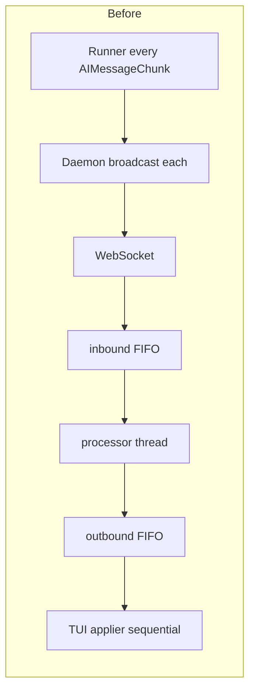
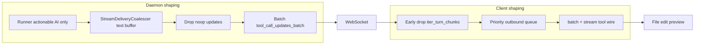

# IG-427: Stream Event Volume and FIFO Latency Reduction

**Status**: Completed  
**Started**: 2026-05-22  
**Completed**: 2026-05-22  
**Related**: IG-426 (partial server batching), IG-416 (tool-call realtime display), IG-422 (CLI runtime module)

---

## Summary

Reduce per-turn WebSocket event volume and post-goal client drain latency so the TUI mounts file-edit previews on tool wire events instead of after thousands of queued text chunks. Measured polish-README turn: **3081 chunks** (3063 `messages`), **~179s wall** with **~58s** between server goal completion and client `turn done`.

**Targets**

| Metric | Before (measured) | Target |
|--------|-------------------|--------|
| Events per turn | ~3081 | &lt;500 |
| Post-goal client drain | ~58s | &lt;5s |
| File-edit preview timing | After goal idle | On `soothe.stream.tool_call.update` / batch |

---

## Problem statement

### Observed timeline (loop `019e4e7f`, polish README)

| Time | Event |
|------|--------|
| 15:05:41 | Server `edit_file` |
| 15:05:51 | Goal complete |
| 15:06:50 | Client turn done (**179s wall**, **3081 chunks**) |

The agent finished in ~10s; the client spent ~58s draining a FIFO backlog before the UI caught up.

### Root causes

1. **Per-token forwarding** — Runner forwarded every `AIMessageChunk`; daemon broadcast each → ~17× amplification vs visible text deltas.
2. **No-op `updates` mode** — LangGraph state tuples shipped to the client; TUI never renders them but they still traverse reader → processor → applier queues.
3. **Duplicate tool wire** — Daemon emitted `tool_call_updates_batch` **and** full `messages` with the same tool metadata; CLI only handled `soothe.stream.tool_call.update` (not batch).
4. **Strict FIFO applier** — `TurnEventPipeline` used a single outbound queue; file preview mounted only when its chunk was dequeued after thousands of text chunks.
5. **IG-426 partial** — `StreamDeliveryCoalescer` coalesced only `goal_completion`, not plain assistant text.



---

## Solution architecture



---

## Phase 1: Daemon — coalesce plain assistant text

**File**: `packages/soothe-daemon/src/soothe_daemon/query/stream_delivery.py`

Extended `StreamDeliveryCoalescer`:

| Buffer key | Behavior | Flush triggers |
|------------|----------|----------------|
| Per-namespace text | Append plain AI `content` / text blocks | `chunk_position == "last"`, tool boundary, `ToolMessage`, any `custom`, interval timer |
| `goal_completion` | Existing IG-426 behavior | Unchanged |

Rules:

- Never coalesce `ToolMessage` or AI with `tool_calls` / `tool_call_chunks`.
- Flush pending text before passing tool metadata.
- Emit one wire message with merged content on flush.

**Config** (`agent_loop.output_streaming`):

- `streaming_interval_ms` (200ms default) — coalesce window.
- `message_coalesce_enabled: true` — rollback toggle.

Synced in `config/config.template.yml` and `config/config.dev.yml`; model field in `packages/soothe/src/soothe/config/models.py`.

**Tests**: `packages/soothe-daemon/tests/unit/daemon/test_stream_delivery.py` (7 tests).

---

## Phase 2: Daemon — filter and dedupe before WebSocket

**File**: `packages/soothe-daemon/src/soothe_daemon/query/engine.py`

### 2a. Drop noop `updates`

In coalescer `ingest`: drop `mode == "updates"` unless `__interrupt__` is present (LangGraph interrupt).

### 2b. Deduplicate tool-call wire

When `extract_tool_call_updates_from_wire_message` yields updates:

1. Broadcast single `tool_call_updates_batch` custom event.
2. Strip `tool_calls` / `tool_call_chunks` from the coalesced `messages` wire via `strip_tool_metadata_for_batch()`.
3. Skip empty stripped messages.

Keep executor-emitted `soothe.stream.tool_call.update` for late-arg streaming (Kimi/registry).

**SDK**: `TOOL_CALL_UPDATES_BATCH = "tool_call_updates_batch"` in `packages/soothe-sdk/src/soothe_sdk/ux/stream_tool_wire.py`.

---

## Phase 3: Runner — drop empty AI chunks

**File**: `packages/soothe/src/soothe/core/runner/_runner_agentic.py`

- `_ai_chunk_has_actionable_payload()` — non-empty text, tool metadata, or loop `phase`.
- `_is_ai_messages_stream_chunk()` — only forwards actionable AI chunks (still forwards `ToolMessage` and tool-bearing AI).

**Tests**: `packages/soothe/tests/unit/core/test_agentic_tool_stream_forward.py`.

---

## Phase 4: Client — early filter (defense in depth)

**Files**:

- `packages/soothe-cli/src/soothe_cli/runtime/wire/chunk_filter.py`
- `packages/soothe-cli/src/soothe_cli/runtime/wire/message_text.py` — **CLI-local** text extraction (no `soothe` core import)
- `packages/soothe-cli/src/soothe_cli/runtime/transport/session.py` — `iter_turn_chunks` early drop
- `packages/soothe-cli/src/soothe_cli/runtime/turn/prepare.py` — `skip=True` for noop chunks
- `packages/soothe-cli/src/soothe_cli/runtime/state/session_stats.py` — `filtered_early` counter

**Package boundary**: `soothe-cli` depends only on `soothe-sdk` (+ langchain messages for typing). Text helpers live under `soothe_cli.runtime.wire.message_text`; must not import `soothe.foundation` or `soothe.core`.

**Tests**: `packages/soothe-cli/tests/unit/runtime/wire/test_chunk_filter.py`.

---

## Phase 5: Client — priority outbound queue

**File**: `packages/soothe-cli/src/soothe_cli/runtime/turn/pipeline.py`

Replaced single FIFO `asyncio.Queue` with `asyncio.PriorityQueue`:

| Priority | Chunk types |
|----------|-------------|
| HIGH (0) | `soothe.stream.tool_call.update`, `tool_call_updates_batch`, agent-loop step events, errors |
| NORMAL (1) | `ToolMessage`, AI with tool metadata |
| LOW (2) | Text-only AI |

`PreparedTurnChunk.priority` set in `prepare.py`. Sequence tie-breaker preserves stable order within same priority.

Queue sizes increased modestly: inbound 1024, outbound 512 (after volume reduction).

**Tests**: `packages/soothe-cli/tests/unit/tui/test_turn_event_pipeline.py` — `test_priority_queue_applies_high_before_low`.

---

## Phase 6: Client — `tool_call_updates_batch` handler

**File**: `packages/soothe-cli/src/soothe_cli/tui/textual_adapter.py`

On `TOOL_CALL_UPDATES_BATCH`, loop `apply_tool_call_wire_update` for each entry in `updates` — mounts file-change preview on `edit_file` / `write_file` without waiting for backlog.

---

## Phase 7: SDK contract (TypeScript / Go)

| Client | Constant |
|--------|----------|
| Python SDK | `TOOL_CALL_UPDATES_BATCH` in `stream_tool_wire.py` |
| TypeScript | `EventToolCallUpdatesBatch` in `client/typescript/src/events.ts`, exported from `index.ts` |
| Go | `EventToolCallUpdatesBatch` in `client/go/events.go` |

External clients should mount file UI on stream tool events immediately, not after text drain.

---

## Files changed (complete list)

| Area | Files |
|------|--------|
| Daemon coalesce + filter | `stream_delivery.py`, `engine.py` |
| Runner | `_runner_agentic.py` |
| SDK | `stream_tool_wire.py`, `config/models.py` |
| CLI runtime | `chunk_filter.py`, `message_text.py`, `pipeline.py`, `prepare.py`, `session.py`, `session_stats.py` |
| CLI TUI | `textual_adapter.py` |
| Config | `config.template.yml`, `config.dev.yml` |
| Client TS/Go | `events.ts`, `index.ts`, `events.go` |
| Tests | `test_stream_delivery.py`, `test_agentic_tool_stream_forward.py`, `test_turn_event_pipeline.py`, `test_chunk_filter.py` |

---

## Verification

```bash
# Package-scoped unit tests
cd packages/soothe-daemon && uv run pytest tests/unit/daemon/test_stream_delivery.py -q
cd packages/soothe && uv run pytest tests/unit/core/test_agentic_tool_stream_forward.py -q
cd packages/soothe-cli && uv run pytest tests/unit/tui/test_turn_event_pipeline.py \
  tests/unit/runtime/wire/test_chunk_filter.py -q

# Full gate
./scripts/verify_finally.sh
```

**Manual**: `SOOTHE_LOG_LEVEL=DEBUG soothe "polish readme..."` — confirm `Turn event stats` shows far fewer total chunks, `filtered_early` &gt; 0, file preview visible before `status: idle`.

---

## Risks and mitigations

| Risk | Mitigation |
|------|------------|
| Coalescing breaks tool-arg streaming | Never merge tool chunks; flush on tool boundaries; keep `soothe.stream.tool_call.update` path |
| Stale partial text in UI | Honor `chunk_position=last`; merged chunk is one larger delta |
| Priority starvation of text | Priority queue uses sequence counter; LOW still drains after HIGH burst |
| External clients expect per-token chunks | Daemon-side only; document larger deltas for SDK consumers |
| CLI imports soothe core | Local `message_text.py` helpers; only `soothe-sdk` + `langchain_core` |

---

## Relationship to IG-426

IG-426 delivered: batched tool updates at broadcast, smart heartbeat, conditional markdown re-render, parallel namespace flush.

IG-427 completes the plan: **general text coalescing**, **updates filter**, **runner empty-chunk filter**, **client early filter + priority pipeline + batch handler**, and **package-boundary-safe CLI helpers**.

**Out of scope (follow-up)**: Full batching window for all `custom` protocol events; in-process (non-daemon) TUI path still benefits from runner filter only.

---

## Status log

| Date | Note |
|------|------|
| 2026-05-22 | Implemented all phases; fixed CLI `soothe.core` import regression via `message_text.py` |
| 2026-05-22 | Unit tests green for daemon, soothe runner, CLI pipeline + chunk_filter |
| 2026-05-22 | **TUI freeze fix**: `TurnEventPipeline._put_outbound` used `run_coroutine_threadsafe().result()` and deadlocked the applier; replaced with `queue.PriorityQueue` bridge. Early filter unwraps enveloped wire dicts via `flatten_enveloped_message_dict`. Daemon skip-after-strip uses flat body text check. |
