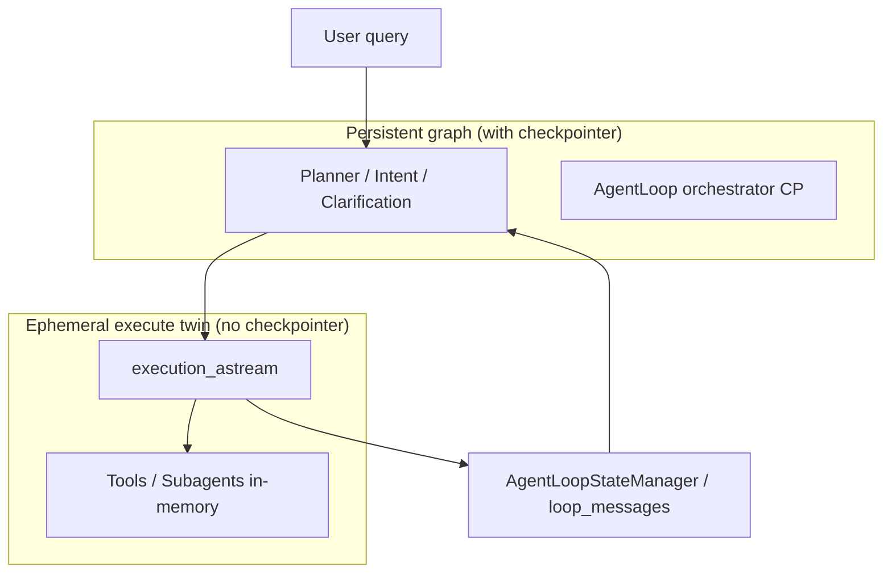

# IG-477: Docker Memory Leak — Root Cause and Production Fix

## Summary

Production queries (`soothe --no-tui -p "list dir of current workspace"`) caused cgroup OOM at 4 GiB with linear RSS growth (~400 MiB/2s) during agentic execute. The root cause is **LangGraph checkpointer channel history** loaded on every `astream` tick when the CoreAgent graph is compiled with a checkpointer. The production fix is an **ephemeral execute graph** (twin compiled without checkpointer) plus supporting daemon backpressure and execute-stream hygiene.

**Validation target (met):** effective cgroup peak **< 2 GiB**, `RestartCount=0`, query exit 0.

---

## Symptom Timeline

| Phase | RSS pattern | Notes |
|-------|-------------|-------|
| Idle daemon | ~196–215 MiB | Stable |
| Agentic list-dir | +~400 MiB/2s → 4 GiB OOM | `say hello` (quiz) stable ~214 MiB |
| Post-OOM | RestartCount=1 | Query sometimes exit 0 after restart |

`docker stats` (1s poll) **under-reported** peaks by ~45%; in-query cgroup `memory.peak` (0.25s) showed true peaks ~3.9–4.1 GiB when stats showed ~2.2 GiB.

---

## Investigation Methodology

### Phase 1 — Daemon bridge hypothesis (HP-004)

Bounded `threading.Queue` / `asyncio.Queue` (maxsize=100), semaphore backpressure on `ResponsePusher`, bisected stream paths (thread_logger, broadcast, coalescer). **All variants still OOM'd** with checkpointer enabled.

### Phase 2 — Checkpointer backend (HP-007)

Compared Postgres vs `InMemorySaver`. **Both OOM'd** (~3.4–4 GiB). Backend choice is not the driver.

### Phase 3 — Stream mode and graph API (HP-003, HP-010)

- Removed `updates` from execute `stream_mode` (each update carried full state snapshot).
- Tried `ainvoke` instead of `astream`. **Still OOM'd** with checkpointer.

### Phase 4 — Tool and middleware isolation (HP-008–HP-013)

- `block_all_tools`, tool output caps, max tool calls, skip planner/intent, empty workspace, `streaming=False`, `MALLOC_ARENA_MAX=1`, malloc_trim, subagent caps. **Partial RSS reduction at best; still OOM** with checkpointer.

### Phase 5 — Bare LLM probe (HP-014)

Direct LLM HTTP without AgentLoop: **stable ~321 MiB**. DashScope HTTP is not the main leak.

### Phase 6 — Measurement correction (HP-016)

Added parallel cgroup sampler in `query_memory_loop_test.sh`. Promoted `aclose()` on Act tool-budget early exit (no env gate).

### Phase 7 — Root cause confirmation (HP-017)

Python memray at 8 GiB limit with checkpointer:

| Allocator hot path | Share |
|--------------------|-------|
| `aget_delta_channel_history` / `get_delta_channel_history` | >99% |
| `_execute_step_collecting_events` | caller |

| Config | cgroup peak | Restart |
|--------|-------------|---------|
| With checkpointer | ~4–8 GiB | 1 |
| `SOOTHE_HP017_NO_CHECKPOINTER=1` (global, no CP at compile) | ~224–245 MiB | 0 |

**Conclusion:** graphs **compiled with** a checkpointer replay channel history per stream tick. Runtime `graph.checkpointer = None` on a CP-compiled graph is **insufficient** (HP-018 v1 failed at ~3.6 GiB).

### Phase 8 — Production fix (HP-018)

1. **Twin execute graph** — `AgentBuilder` compiles a second `create_deep_agent(..., checkpointer=None)` when the main graph has persistence.
2. **Execute routing** — `Executor` uses `CoreAgent.execution_astream` / `execution_aget_state` (not the persistent graph).
3. **Skip fork copy** — `ThreadForkManager` skips RFC-223 checkpoint copy for execute steps (fresh `__step_*` thread IDs; state carried via graph input + in-memory run).
4. **Interrupt detection** — after stream ends, read interrupts via `aget_state` instead of `updates` stream mode.

**HP-018 validation (3/3, Postgres CP enabled):**

| Run | Effective peak | Restart |
|-----|----------------|---------|
| 1 | 233 MiB | 0 |
| 2 | 235 MiB | 0 |
| 3 | 234 MiB | 0 |

---

## Ruled Out (Cumulative)

| Hypothesis | Result |
|------------|--------|
| Unbounded daemon response queues alone | Necessary but not sufficient |
| Postgres vs InMemorySaver | Not root cause |
| `updates` stream_mode | Contributor; not sole cause |
| Subagent tasks / workspace size | Not primary |
| LLM HTTP streaming | Not primary (bare LLM stable) |
| Tool output size alone | `block_all_tools` still OOM with CP |
| jemalloc | Lowers sampled RSS ~40%; cgroup still hit limit without HP-018 |

---

## Production Changes (Final)

### Core fix — ephemeral execute graph (HP-018)

| File | Change |
|------|--------|
| `ephemeral_execute_stream.py` | Feature gate (default on) |
| `_builder.py` | Build execute twin without checkpointer |
| `_core.py` | `execution_graph`, `execution_astream`, `execution_aget_state` |
| `executor.py` | Route ACT streaming through execution graph; `durability="exit"`; no `updates` in stream_mode; interrupt via `aget_state` |
| `thread_fork_manager.py` | Skip checkpoint copy when ephemeral execute enabled |

### Important optimizations (kept)

| Area | Change | Why |
|------|--------|-----|
| `response_bridge.py` | Semaphore backpressure on worker chunk delivery | Blocks worker when main loop falls behind; prevents unbounded in-flight chunks |
| `thread_runner.py` / `pool_runner.py` | Bounded queues (maxsize=100) + put timeout | Prevents queue growth |
| `query/engine.py` | Bounded `full_response` (~100KB) | Prevents unbounded text accumulation |
| `session.py` | Client `event_queue` maxsize 10000 | Bounded per-client queue (kept at original value) |
| `executor.py` | `aclose()` graph stream on Act tool-budget cap | Releases LangGraph stream iterator promptly |
| `synthesis.py` | Goal-completion synthesis via `llm.astream` directly | Avoids CoreAgent graph + CP during synthesis |
| `schemas.py` | Clear `invoked_skill_bodies` / `cached_mcp_resources` in `clear_goal_state` | Prevents cross-goal dict accumulation |
| `goal_completion.py` | `gc.collect()` after goal (existing) | Retained |
| `Dockerfile.local` | `libjemalloc2` optional preload | ~40% lower sampled RSS; not sufficient alone |

### Removed (investigation-only)

All `SOOTHE_HP*` / `SOOTHE_DAEMON_HP*` env toggles, memray wiring, malloc_trim helpers, HP-004 stream bypass, HP-010 invoke path, HP-014 planner/intent stubs, HP-012 tool block overrides, `max_model_calls` middleware, and temporary scripts under `scripts/hp*`.

---

## Architecture After Fix



- **Planner / loop / clarification** retain Postgres (or SQLite) checkpointer for durability and `interrupt()` persistence.
- **Execute ACT streaming** uses the CP-free twin; results land in `LoopState` ledgers and `StepResult`, not LangGraph execute-thread checkpoints.

---

## Verification

```bash
# Build and run daemon (4g cgroup)
docker build -f packages/soothe-daemon/Dockerfile.local -t soothed:0.6.3-local .
cd deploy && docker compose up -d

# Memory goal: peak < 2 GiB, RestartCount=0, exit 0
soothe --no-tui -p "list dir of current workspace"

# Full gate
./scripts/verify_finally.sh
```

Monitor cgroup inside container during query:

```bash
docker exec deploy-soothed-1 sh -c 'cat /sys/fs/cgroup/memory.peak'
```

---

## Known Follow-ups

- **Synthesis evidence projection:** daemon logs show `ls` tool output during execute, but goal-completion report occasionally says "output not captured". Separate from memory leak; track under synthesis/ledger projection.
- **Dual graph init cost:** ~+37ms second `create_deep_agent` at startup when checkpointer is configured. Acceptable for production; consider lazy compile if startup latency becomes an issue.

---

## Status

- [x] Root cause identified (checkpointer channel history during execute streaming)
- [x] Production fix (ephemeral execute twin graph)
- [x] Daemon backpressure and bounded accumulation
- [x] 3× Docker validation: peak ~233 MiB, restart 0
- [x] Investigation artifacts removed; HP env toggles stripped
