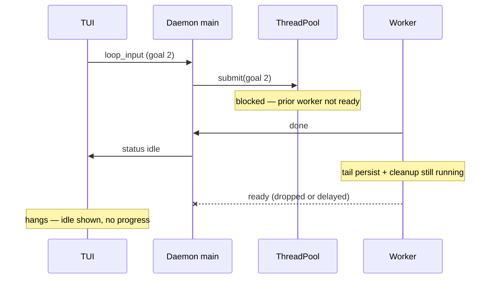

# IG-549: Loop Worker Lifecycle & Goal-Boundary Persistence Hardening

**RFC**: [RFC-225](../specs/RFC-225-loop-continuity-and-goal-record-enrichment.md), [RFC-413](../specs/RFC-413-server-owned-display-card-ledger.md), [RFC-450](../specs/RFC-450-daemon-communication-protocol.md), [RFC-631](../specs/RFC-631-goal-display-snapshots.md)  
**Created**: 2026-07-05  
**Status**: P0–P3 implemented (P3.15 bridge module; full status schema unification deferred)  
**Related**: [IG-509](IG-509-loop-7cba-hang-analysis.md), [IG-533](IG-533-goal-completion-tui-worker-lifecycle-fixes.md), [IG-534](IG-534-daemon-tui-performance-isolation.md), [IG-548](IG-548-goal-display-snapshots.md)  
**Incident loops**: `5fa4` (`019f3123-f5ec-7bd0-92ea-cfdae6c65fa4`), chitchat `412105` (`019f316d-f914-7003-9d9f-897839412105`, worker PID `2105`)  
**Logs**: `~/.soothe/logs/soothe.log`, `~/.soothe/data/loops/<loop_id>/runner.log`

---

## Executive Summary

Two user-visible failures exposed the same structural gap: **the daemon reports “idle / done” before worker-side teardown and goal-boundary persistence finish**, and **clients treat stream end as turn complete before the worker is actually reusable**.

| Symptom | User sees | Daemon reality |
|---------|-----------|----------------|
| Second goal never starts (loop `5fa4`) | First goal completes; follow-up input hangs indefinitely | Worker marked idle on `done`; still in post-run cleanup (`cancel_orphan_loop_tasks`, tail `finalize_goal`); goal 2 queued but never dequeued |
| “Writing…” spinner ~21s on `"how are u"` (loop `412105`) | Response text visible; spinner stuck | Server finished in ~5s; `ResponsePusher` dropped new `ready` worker signal → `ThreadPool.submit()` blocked forever |

A cross-cutting architecture review identified three parallel status models, “respond first, persist later” at goal boundaries, and per-request full runner teardown defeating `reuse_runner`. This IG tracks remediation in four priority bands: **P0 correctness**, **P1 durability/resume**, **P2 efficiency**, **P3 simplification**.

---

## Problem Summary

### Incident A — Loop `5fa4`: second goal hangs

**User flow**: Goal 0 completes; user submits goal 1; TUI shows no progress.

**Root cause chain**:

1. Goal completion follows **respond-first, persist-later**: `completed` wire event → background tail task (`ce.save()` + `finalize_goal`).
2. Worker emits `done` and main thread broadcasts **`status: idle`** while tail persistence still runs.
3. Tail `finalize_goal` can restart checkpoint/async workers after `StrangeLoopStateManager.close()` began.
4. `cancel_orphan_loop_tasks` blocks on those workers → worker stuck in teardown.
5. Thread pool sees worker as **idle** (already released on `done`) but worker is **not ready** for the next `submit()`.

**Immediate patch (pre-P0)**: `await_goal_completion_tail_persistence()` before `close()` in `strange_loop.py` — closes the specific hole but not the systemic idle-before-ready race.

### Incident B — Loop `412105`: chitchat “Writing…” 21s

**User flow**: `"how are u"` → friendly answer streams → **Writing…** for ~21s.

**Server-side timeline (~5s total)**:

| Phase | Duration |
|-------|----------|
| Intent-classify LLM | ~2.3s |
| Skillify cold prefetch | ~0.9s |
| Response LLM | ~1.4s |

**Root cause**: P0 worker lifecycle change introduced `ready` after cleanup, but `ResponsePusher` did not forward `ready` → main thread never unblocked `ThreadPool.submit()` wait. Log signature:

```
ResponsePusher: unknown worker msg_type=ready
```

Secondary latency (not the spinner): `"how are u"` missed greeting heuristics; trivial path still ran intent LLM + skill prefetch.

---

## Design Context

### Three status vocabularies (recovery complexity)

| Layer | Vocabulary | Authoritative for |
|-------|------------|-----------------|
| ContextEngine | `pending` → `active` → `completed` | Steps, ledger, DAG |
| Checkpoint goal index | `running` → `completed` | Per-goal metrics, duration |
| Loop checkpoint | `idle` / `running` / … | Loop-level lifecycle |

No single source of truth; resume and cancel logic must reconcile all three.

### Goal-boundary persistence model

```
plan_assess (done) → goal_completion
  → record_iteration + clear in-memory state
  → ce.finalize_goal (memory)
  → emit completed (user sees answer)
  → background tail: ce.save() + finalize_goal(checkpoint)
  → (optional) freeze_goal_display snapshot
  → worker cleanup → ready
```

**Design tension**: wire latency vs durability vs worker reuse. Prior design optimized wire latency; hangs came from treating **`done`** as equivalent to **worker ready**.

### Worker lifecycle (thread / process pool)

```
submit(request)
  → worker runs StrangeLoop
  → stream chunks
  → emit done          ← client may see idle here (too early)
  → runner cleanup / prepare_for_request
  → emit ready         ← pool may accept next request only here
```

### Failure mode (systemic)



---

## Fix Program

### Phase P0 — Worker lifecycle & cancel plumbing ✅

| # | Change | Status | Files |
|---|--------|--------|-------|
| P0.1 | Emit `ready` only **after** post-run cleanup | **Done** | `soothe_daemon/runner/thread_runner.py`, `pool_runner.py` |
| P0.2 | Forward `ready` through `ResponsePusher` (fixes 21s spinner) | **Done** | `soothe_daemon/runner/response_bridge.py` |
| P0.3 | Pool waits for `ready` before releasing worker | **Done** | `thread_runner.py` (`_await_worker_ready`) |
| P0.4 | Wire cancel → shared execution pool | **Done** | `query/engine.py`, `runner/factory.py` |
| P0.5 | SQLite RFC-225 status guard (no external status clobber) | **Done** | `sloop/state/persistence/sqlite_backend.py` |
| P0.6 | `force_flush()` at goal boundary | **Done** | `sloop/state/sloop_manager.py` |
| P0.7 | Await tail persistence drain before `close()` | **Done** | `strange_loop.py`, `runtime_context.py`, `goal_completion.py` |

**Exit criteria**

- [x] Multi-goal loop: goal 2 dequeues after goal 1 without manual restart
- [x] Chitchat turn: no stuck “Writing…” after response complete
- [x] Unit test: `test_response_push_bridge.py` covers `ready` forwarding

---

### Phase P1 — Durability & resume hardening ✅

| # | Change | Status | Files |
|---|--------|--------|-------|
| P1.1 | Await `freeze_goal_display()` before `status: idle` | **Done** | `query/engine.py` |
| P1.2 | Chain tail persistence tasks (no cancel of prior goal) | **Done** | `goal_completion.py` |
| P1.3 | Atomic snapshot index allocation | **Done** | `display_store.py`, `loop_card_manager.py` |
| P1.4 | Remove dead `_goal_snapshot_count_sync` | **Done** | `query/engine.py` |

**Exit criteria**

- [x] Resume/history does not race ahead of final goal card snapshot
- [x] Rapid follow-up goals: prior tail finalize completes before next
- [x] Tests: tail chain, auto-index, tail-drain (6/6 passing)

---

### Phase P2 — Throughput & chitchat latency ✅

| # | Change | Status | Expected savings (chitchat) | Files |
|---|--------|--------|-----------------------------|-------|
| P2.1 | Casual greeting heuristics (`how are u`, `what's up`, …) | **Done** | ~2.3s (skip intent LLM) | `intake_heuristics.py`, `classifier.py` |
| P2.2 | Skip Skillify prefetch on `minimal` routing | **Done** | ~0.9s + embedding I/O | `middleware/skill_activation.py` |
| P2.3 | `prepare_for_request()` when `reuse_runner=True` | **Done** | faster goal-to-goal | `thread_runner.py`, `pool_runner.py` |
| P2.4 | CE `defer_save()` — one persist per iteration boundary | **Done** | fewer mid-iteration SQLite writes | `context/engine.py`, orchestrator nodes |

**Not in scope (deferred)**:

| # | Opportunity | Notes |
|---|-------------|-------|
| 11 | Consolidate PG pools | `PersistenceManager`, `shared_pool.py` |
| 12 | Incremental card ledger append | `loop_card_ledger.py` |
| 13 | Thread pool dispatch metrics | Parity with subprocess collector |
| 14 | Stuck-thread detection | Port subprocess heartbeat to threads |

**Exit criteria**

- [x] `"how are u"` matches heuristic trivial path
- [x] Skill middleware skips prefetch when `task_complexity=minimal`
- [x] Tests: intake heuristics, skill skip, CE defer_save coalescing, worker reuse

---

### Phase P3 — Simplification / tech debt ✅ (partial)

| # | Change | Status | Files |
|---|--------|--------|-------|
| P3.15 | Status vocabulary bridge module + recovery helper | **Done** | `state/status_vocabulary.py`, `sloop_manager.py` |
| P3.16 | Wire `increment_iteration` at `record_iteration` boundary | **Done** | `record_iteration.py`, `context/engine.py` |
| P3.17 | Skip duplicate `record_iteration` on terminal bootstrap | **Done** | `goal_completion.py` |
| P3.18 | Surface tail persist failures as WARNING + failure list | **Done** | `goal_completion.py` |

**Deferred (future RFC)**

| # | Opportunity | Notes |
|---|-------------|-------|
| 15b | Full status schema unification | Replace bridge with single vocabulary in checkpoint + CE models |

**Exit criteria**

- [x] Terminal bootstrap path records iteration once (not twice)
- [x] CE `iteration_count` advances with checkpoint iteration
- [x] Tail CE/checkpoint failures visible at WARNING in logs
- [x] Explicit CE ↔ goal-index status maps with unit tests

---

## File Map

```
packages/soothe-daemon/src/soothe_daemon/
├── runner/
│   ├── thread_runner.py          # P0 ready-after-cleanup; P2 prepare_for_request
│   ├── pool_runner.py            # P0/P2 parity
│   ├── response_bridge.py        # P0 forward ready
│   └── factory.py                # P0 get_shared_execution_pool
├── query/engine.py               # P0 cancel wiring; P1 snapshot barrier before idle
└── display/
    ├── loop_card_manager.py      # P1 freeze_goal_display + atomic index
    └── loop_card_ledger.py       # (IG-548 P2 trim — separate track)

packages/soothe/src/soothe/
├── foundation/
│   ├── context/engine.py         # P2 defer_save / flush at boundary
│   └── sloop/
│       ├── intention/
│       │   ├── intake_heuristics.py   # P2 casual greetings
│       │   └── classifier.py          # heuristic before LLM
│       ├── orchestrator/nodes/
│       │   └── goal_completion.py     # P0 tail drain; P1 chain
│       ├── engine/strange_loop.py     # P0 await tail before close
│       └── state/
│           ├── sloop_manager.py       # P0 force_flush at boundary
│           └── persistence/sqlite_backend.py  # P0 status guard
├── middleware/skill_activation.py     # P2 skip prefetch on minimal
├── backends/persistence/display_store.py  # P1 insert_goal_snapshot_with_auto_index
└── runner/__init__.py                 # prepare_for_request (IG-506)
```

---

## Tests

| Area | Test file |
|------|-----------|
| `ready` signal forwarding | `soothe-daemon/tests/unit/runner/test_response_push_bridge.py` |
| Worker reuse cleanup | `soothe-daemon/tests/unit/runner/test_worker_runner_reuse.py` |
| Cancel → execution pool | `soothe-daemon/tests/unit/query/test_cancel_orchestrator_pool.py` |
| Tail persistence chain / drain | `soothe/tests/unit/core/loop/orchestrator/test_goal_completion_tail_drain.py` |
| Atomic snapshot index | `soothe/tests/unit/backends/persistence/test_goal_snapshot_auto_index.py` |
| Greeting heuristics | `soothe/tests/unit/core/intention/test_intake_heuristics.py` |
| Skill prefetch skip | `soothe/tests/unit/skills/test_skill_activation_middleware.py` |
| CE defer_save | `soothe/tests/unit/context/test_engine_completeness.py` |
| SQLite status guard | `soothe/tests/unit/core/loop/state/test_clobbered_status_recovery.py` |

---

## Verification Checklist

1. **Multi-goal**: Goal 0 complete → submit goal 1 → executes without hang.
2. **Chitchat**: `"how are u"` → answer visible → spinner clears within ~1s of last chunk.
3. **Chitchat latency** (after restart): server-side <3s typical (heuristic + no skill prefetch).
4. **Resume**: Reattach loop with completed goals → snapshots present before idle (P1).
5. **Regression**: `./scripts/verify_finally.sh` green.
6. **Deploy**: `soothed restart` required after pulling P0–P2 changes.

---

## Rollout Notes

| Order | Phase | Risk | Operator action |
|-------|-------|------|-----------------|
| 1 | P0 | **High** — fixes hangs and spinner | Restart daemon immediately |
| 2 | P1 | Medium — snapshot/idle ordering | Restart daemon |
| 3 | P2 | Low — latency only | Restart daemon |
| 4 | P3 | Medium — schema/behavior | Separate IG when scheduled |

**Known gotchas**

- Full `tests/unit/runner/` + `tests/unit/query/` suite can hang (~5 min); use focused tests above during iteration.
- Importing `goal_completion` alone may hit circular import; run with `test_goal_completion_deferred_persistence.py` first in the batch.
- `ResponsePusher: unknown worker msg_type=ready` in logs → daemon running pre-P0.2 build; restart required.

---

## Open Questions

1. Should **`status: idle`** be emitted only after `ready` (not after `done`) on all paths?
2. Should tail persist failures promote from DEBUG to WARNING + client-visible degrade signal (P3.18)?
3. Process pool vs thread pool — standardize one mode to simplify ready/done semantics?
4. Merge P3 status unification with RFC-225 checkpoint schema evolution or separate RFC?

---

## References

- [IG-509](IG-509-loop-7cba-hang-analysis.md) — worker hang, grep fallback, no request timeout
- [IG-533](IG-533-goal-completion-tui-worker-lifecycle-fixes.md) — goal_completion delivery & `/clear` cancel
- [IG-534](IG-534-daemon-tui-performance-isolation.md) — drain-before-idle, backpressure
- [IG-548](IG-548-goal-display-snapshots.md) — goal-bound display snapshots (parallel P0/P1 track)
- RFC-225 §6 — goal record enrichment and loop continuity
- RFC-450 §9.4 — `complete` / stream terminate ordering
- RFC-631 — immutable goal display snapshots at freeze
