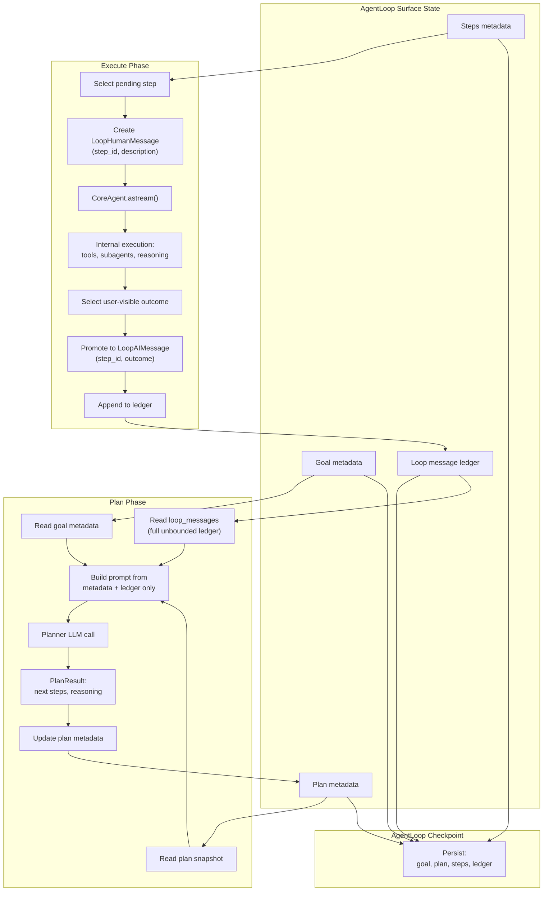

# RFC-214: AgentLoop Loop Message Surface and Plan Context

**RFC**: 214
**Title**: AgentLoop Loop Message Surface and Plan Context
**Status**: Draft
**Kind**: Architecture Design
**Created**: 2026-05-03
**Dependencies**: RFC-201 (AgentLoop Plan–Execute), RFC-100 (CoreAgent Runtime), RFC-206 (Prompt Architecture), RFC-207 (Thread & Goal Context), RFC-203 (AgentLoop State & Memory), RFC-215 (AgentLoop Persistence), RFC-218 (Checkpoint Tree), RFC-216 (Multi-Thread Lifecycle)
**Related**: RFC-211 (Tool Result Shaping), RFC-213 (AgentLoop Reasoning Quality), RFC-217 (Goal Context Injection), RFC-614 (Streaming Messaging)

---

## Abstract

AgentLoop orchestration currently maintains context through multiple parallel encoding paths: raw step evidence, XML excerpts, and LangGraph message replay. This creates duplication, drift, and ambiguous step outcomes.

This RFC introduces a **unified message ledger model** where:

- Each Execute step produces **one human turn** (`LoopHumanMessage` with step description)
- Each completed step produces **one assistant turn** (`LoopAIMessage` as the promoted outcome)
- The ledger becomes the **single authoritative context** for Plan phase reasoning
- Checkpoints persist the full ledger, enabling reconstruction without LangGraph state

This eliminates redundant encodings and establishes a clear contract between Execute and Plan phases.

---


## Motivation

### Current Problem: Fragmented Context

The Plan phase receives context from multiple disjoint sources:

- `PromptBuilder` assembling goal and evidence fragments
- `LoopState.step_results` storing raw execution outputs (legacy `CONCRETE EVIDENCE`)
- `plan_conversation_excerpts` with XML-wrapped excerpts (legacy `<PRIOR_CONVERSATION>`)
- `StateManager.derive_plan_conversation` reconstructing conversations from execution history
- LangGraph `messages` channel containing full transcripts with tool traffic

Execute persists traces into Pydantic records (`ReasonStepRecord`, `ActWaveRecord`, `StepExecutionRecord`) while CoreAgent maintains full LangGraph transcripts. This fragmentation causes:

**1. Duplication and Drift**

The same subagent output appears in multiple encodings:

- Act checkpoint strings
- Plan “concrete evidence” blocks
- `<PRIOR_CONVERSATION>` XML fragments
- CoreAgent `messages` channel

Each encoding path can diverge, creating inconsistent views of the same execution history.

**2. Ambiguous Step Identity**

Step outcomes are not first-class objects:

- Orchestration uses aggregated `AIMessage` / delegate-final heuristics
- No explicit `LoopAIMessage` tied to `step_id`
- Outcome extraction relies on string manipulation, not structured records

**3. Checkpoint Fidelity Issues**

Loop-typed messages must round-trip through LangGraph serde:

- Allowlist drift can deserialize messages as plain `dict` payloads
- Loss of type information breaks the “Loop message” invariant
- Rehydration requires reconstruction heuristics

**4. Prompt Cost Inefficiency**

Plan prompts grow with redundant encodings:

- Multiple representations of the same content
- No bounded, curated context window
- Token costs increase without improving reasoning quality

### Solution: Single Authoritative Ledger

This RFC establishes a **single message ledger** on the AgentLoop surface. Planners reason over **what the loop officially said and observed**—not reconstructed execution artifacts.

---

## Guiding Principles

### Core Invariants

**1. Ledger Records All Orchestration Turns**

The ledger captures all orchestration-visible conversation:
- Execute phase: step execution turns (human inputs, AI outcomes)
- Plan phase: planning turns (human prompts, AI decisions)
- Special flows: synthesis, thread checks, goal completion
- Each turn marked with `phase` for filtering

Batched execution records N message pairs in ledger, keyed by `step_id`.

**2. Ledger as Authoritative Plan Context**

No separate “synthetic transcript” for Plan phase:
- Plan reads directly from the message ledger
- No duplicate encoding paths
- No legacy reconstruction heuristics

**3. CoreAgent Transcript as Implementation Detail**

LangGraph checkpoints remain for:
- Tool execution and resume capability
- Debugging and analytics

But AgentLoop orchestration does NOT require:
- Replaying full tool subgraphs for Plan reasoning
- Reading LangGraph `messages` channel for context

**4. Final State Design, No Migration Paths**

This RFC specifies the target state directly:
- No backward compatibility requirements
- No dual-write phases
- No deprecated code paths
- Legacy fields removed entirely

Implementation may require incremental rollout, but design assumes final state.

---

## Target Design

### 1. AgentLoop Surface State Model

The AgentLoop surface maintains four logical partitions:

| Partition | Contents | Purpose |
|-----------|----------|---------|
| **Goal** | `goal_id`, `goal_text`, status, iteration counters, thread id(s) | Goal lifecycle tracking per RFC-216 |
| **Plan** | Latest plan metadata: status, progress, confidence, reasoning, `next_action`, `plan_action`, structured `AgentDecision` | Current execution strategy |
| **Steps** | Ordered `StepAction` metadata: `id`, `description`, hints (`tools`, `subagent`, `expected_output`, `dependencies`), lifecycle status | Execution queue state |
| **Loop Ledger** | Ordered list of **adjacent Human-AI message pairs** (`LoopHumanMessage` / `LoopAIMessage`) | Orchestration-visible conversation history |

**Loop Ledger Structure:**

The ledger contains ONLY orchestration-visible messages in **adjacent pairs**:
- Each `LoopHumanMessage` immediately followed by its `LoopAIMessage`
- Both messages in pair share same `step_id` (for Execute phase)
- Both messages in pair share same `iteration` (for Plan phase)
- Order: step A pair → step B pair → step C pair (for batches)
- NO tool messages, NO internal reasoning traces
- NO subgraph traffic, NO intermediate states

This adjacent pairing enables efficient ledger traversal and preserves conversation flow.

### 2. Execute Phase Contract

**Batch Execution Model:**

AgentLoop may execute multiple steps in one CoreAgent invocation (“wave”) for latency efficiency. The ledger records each step's turn individually.

**Input to CoreAgent (Batch):**

AgentLoop sends N `LoopHumanMessage` instances, one per step:
```python
# Batched input for steps A, B, C
messages = [
    LoopHumanMessage(
        content=”Step A: Query database for user records”,
        thread_id=”<user_thread>”,
        iteration=<current_iteration>,
        goal_summary=”<goal_text>”,
        phase=”execute_step”,
        step_id=”step_a_uuid”
    ),
    LoopHumanMessage(
        content=”Step B: Analyze query results”,
        thread_id=”<user_thread>”,
        iteration=<current_iteration>,
        goal_summary=”<goal_text>”,
        phase=”execute_step”,
        step_id=”step_b_uuid”
    ),
    LoopHumanMessage(
        content=”Step C: Generate summary report”,
        thread_id=”<user_thread>”,
        iteration=<current_iteration>,
        goal_summary=”<goal_text>”,
        phase=”execute_step”,
        step_id=”step_c_uuid”
    )
]
```

**CoreAgent Execution:**

CoreAgent processes the batch, potentially interleaving tool calls, subagent delegations, and reasoning across all steps. The execution stream may contain:
- Multiple `AIMessage` chunks (intermediate reasoning)
- `ToolMessage` instances (tool outputs)
- `AIMessage` final responses per step

**Output Processing and Ledger Recording:**

When batch execution completes, AgentLoop:

1. Collects all `AIMessage` instances from the stream
2. Identifies the **final `AIMessage`** for each step as the user-visible outcome
3. Promotes each final `AIMessage` to a `LoopAIMessage` keyed by `step_id`
4. Records N `(LoopHumanMessage, LoopAIMessage)` pairs in ledger

**Message Selection Rule:**

**The final `AIMessage` in the stream is the step outcome.**

```python
# Executor extracts outcomes
ai_messages = [msg for msg in stream if isinstance(msg, AIMessage)]

# For each step, final AIMessage is the outcome
# (Assuming execution completes steps in order A → B → C)
step_outcomes = {
    “step_a_uuid”: ai_messages[-3],  # Final message for step A
    “step_b_uuid”: ai_messages[-2],  # Final message for step B
    “step_c_uuid”: ai_messages[-1],  # Final message for step C
}

# Promote to ledger
for step_id, ai_msg in step_outcomes.items():
    ledger.append(LoopAIMessage(
        content=ai_msg.content,
        step_id=step_id,
        iteration=<current_iteration>,
        phase=”execute_step”,
        tokens=ai_msg.tokens
    ))
```

**Alternative: Explicit Step Outcome Markers**

If execution order is non-sequential or steps interleave complexly, CoreAgent may explicitly mark outcomes:

```python
# CoreAgent adds metadata marker
AIMessage(
    content=”Step A complete: found 150 records”,
    metadata={“step_id”: “step_a_uuid”, “is_outcome”: True}
)

# AgentLoop selects by marker
step_outcomes = {
    msg.metadata[“step_id”]: msg
    for msg in ai_messages
    if msg.metadata.get(“is_outcome”)
}
```

**Default:** Use final `AIMessage` rule (simpler). Add explicit markers only if execution semantics require.

**Partial Failure Handling:**

If batch execution fails mid-stream (e.g., step B crashes):
- Steps A (completed): ledger records `(LoopHuman_A, LoopAI_A)`
- Step B (failed): ledger records `(LoopHuman_B, LoopAI_B_error)` with error content
- Step C (not started): ledger records `(LoopHuman_C, LoopAI_C_skipped)` or omitted

Exact failure semantics depend on RFC-218 checkpoint tree behavior.

**Ledger Structure After Batch:**

```python
# Ledger contains N adjacent pairs, each keyed by step_id
loop_messages = [
    # Step A pair (adjacent: Human then AI)
    LoopHumanMessage(..., step_id=”step_a_uuid”),
    LoopAIMessage(..., step_id=”step_a_uuid”),

    # Step B pair (adjacent: Human then AI)
    LoopHumanMessage(..., step_id=”step_b_uuid”),
    LoopAIMessage(..., step_id=”step_b_uuid”),

    # Step C pair (adjacent: Human then AI)
    LoopHumanMessage(..., step_id=”step_c_uuid”),
    LoopAIMessage(..., step_id=”step_c_uuid”),
]
```

**Key Invariant:** Each step's Human-AI messages are **paired and adjacent** in the ledger:
- `LoopHumanMessage` immediately followed by `LoopAIMessage`
- Both share same `step_id`
- Order preserved: step A pair, then step B pair, then step C pair

This adjacency enables efficient ledger traversal and conversation reconstruction.

### 3. Plan Phase Ledger Integration

**Plan Turns in Ledger:**

Plan phase turns are recorded in the same ledger as Execute phase, marked with `phase="plan"`:

```python
# Plan turn (internal orchestration)
LoopHumanMessage(
    content="Plan next steps for goal: analyze user data",
    iteration=10,
    phase="plan",
    thread_id="<orchestration_thread>"  # Not user-visible thread
)

LoopAIMessage(
    content="Next actions:\n1. Query database\n2. Analyze results\n3. Generate report",
    iteration=10,
    phase="plan",
    tokens=500
)
```

**Ledger Filtering by Phase:**

Audit UX and analytics tools can filter/sort by `phase`:
- `phase="execute_step"`: User-visible step executions
- `phase="plan"`: Internal planning turns
- `phase="goal_completion"`: Goal synthesis/summary
- `phase="thread_check"`: Thread relevance checks

**Example Ledger with Multiple Phases:**

```python
loop_messages = [
    # Iteration 10: Plan
    LoopHumanMessage(phase="plan", iteration=10, ...),
    LoopAIMessage(phase="plan", iteration=10, ...),

    # Iteration 10: Execute steps A, B, C (batched)
    LoopHumanMessage(phase="execute_step", iteration=10, step_id="A"),
    LoopAIMessage(phase="execute_step", iteration=10, step_id="A"),
    LoopHumanMessage(phase="execute_step", iteration=10, step_id="B"),
    LoopAIMessage(phase="execute_step", iteration=10, step_id="B"),
    LoopHumanMessage(phase="execute_step", iteration=10, step_id="C"),
    LoopAIMessage(phase="execute_step", iteration=10, step_id="C"),

    # Iteration 11: Plan
    LoopHumanMessage(phase="plan", iteration=11, ...),
    LoopAIMessage(phase="plan", iteration=11, ...),

    # Goal completion
    LoopAIMessage(phase="goal_completion", iteration=11, content="Goal achieved: ..."),
]
```

**Plan Phase Context Assembly:**

Plan builds LLM request from ledger **without phase filtering** (reads full history):

```python
# Plan reads entire ledger (all phases)
ledger = checkpoint.loop_messages

# Format ledger as conversation history
conversation_history = format_ledger_as_conversation(ledger)
# Example output:
# <AGENTLOOP_HISTORY>
# [Plan Iteration 10] Human: Plan next steps...
# [Plan Iteration 10] Assistant: Next actions: 1. Query database...
# [Execute Step A] Human: Query database for user records
# [Execute Step A] Assistant: Found 150 records matching criteria
# [Execute Step B] Human: Analyze query results
# [Execute Step B] Assistant: Analysis complete: 3 key patterns detected
# ...
# </AGENTLOOP_HISTORY>

# Build prompt from ledger + metadata
plan_context = build_plan_prompt(
    goal=checkpoint.goal,
    plan_snapshot=checkpoint.plan,
    agentloop_history=conversation_history  # replaces CONCRETE EVIDENCE + PRIOR_CONVERSATION
)
```

**Prompt Structure (Target):**

```python
# Target Plan prompt structure
prompt = f"""
{system_fragments}  # RFC-206: capabilities, workspace, policies

{goal_text}

{plan_snapshot}

{agentloop_history}

Plan next actions based on AgentLoop execution history...
"""
```

**Legacy Prompt Structure (Removed):**

```python
# Legacy Plan prompt structure (NO LONGER USED)
prompt = f"""
{system_fragments}

{goal_text}

CONCRETE EVIDENCE:
{evidence_strings}  # REMOVED: duplicate tool outputs

{working_memory}    # REMOVED: separate from execution history

<PRIOR_CONVERSATION>
{plan_conversation_excerpts}  # REMOVED: reconstructed XML

{previous_assessment}

Plan next actions...
"""
```

**Why Include Plan in Ledger:**

1. **Complete orchestration transcript**: All AgentLoop reasoning captured
2. **Simpler persistence**: One ledger field, not multiple
3. **Audit visibility**: Plan reasoning traceable, not hidden
4. **Debugging**: Full context available for analysis

Plan turns are NOT user-thread turns (internal orchestration), but recorded for completeness.

### 4. Checkpoint Persistence

**AgentLoop checkpoints** (SQLite / PostgreSQL per RFC-215) persist:

**Metadata Fields:**
- Loop status, thread health metrics
- Goal metadata: `goal_id`, `goal_text`, status, iteration counters
- Plan metadata: latest plan state, reasoning, next actions
- Step metadata: ordered `StepAction` records with lifecycle status

**Loop Ledger Field:**
```python
loop_messages: list[LoopHumanMessage | LoopAIMessage]  # Ordered, unbounded, adjacent pairs
```

**Persistence Requirements:**
1. Serialized using LangGraph serde (canonical allowlist path)
2. Round-trip must preserve types, NOT deserialize as `dict`
3. Ledger is append-only during execution (no retroactive edits)
4. **Adjacent Human-AI pairs**: Each Human message followed by its AI response
5. **Unbounded growth**: No truncation, no summarization

**Why Unbounded Ledger:**

1. **Complete history**: All orchestration turns preserved
2. **No lossy compression**: Summarization risks losing critical context
3. **Audit fidelity**: Full transcript available for analysis
4. **Simpler model**: No complex truncation policies
5. **Adjacent pairs**: Natural conversation flow, easy traversal

Plan phase reads entire ledger (with efficient iteration markers). Storage concerns addressed via:
- Efficient serialization (avoid duplication with LangGraph checkpoints)
- Checkpoint rotation policy (per RFC-215, archive old checkpoints)
- Ledger is orchestration-level (compact compared to full LangGraph transcript)

**Plan Phase Context Assembly:**

Plan builds LLM request from:

**Static Fragments (RFC-206):**
- System capabilities, workspace context, policy rules
- Tool/subagent registries, constraint definitions

**Dynamic Fragments:**
- **Current goal text** and status
- **Plan snapshot** (latest reasoning, next actions)
- **Full loop message ledger** formatted as AgentLoop history (no truncation)

**AgentLoop History Format:**

The ledger is formatted as structured conversation history, replacing legacy `CONCRETE EVIDENCE`, `WORKING_MEMORY`, and `<PRIOR_CONVERSATION>` sections:

```python
def format_ledger_as_conversation(ledger: list[LoopMessage]) -> str:
    """Format AgentLoop ledger as conversation history."""
    lines = []

    for i, msg in enumerate(ledger):
        if isinstance(msg, LoopHumanMessage):
            # Format based on phase
            if msg.phase == "plan":
                lines.append(f"[Plan Iteration {msg.iteration}] Human: {msg.content}")
            elif msg.phase == "execute_step":
                lines.append(f"[Execute {msg.step_id}] Human: {msg.content}")
            elif msg.phase == "goal_completion":
                lines.append(f"[Goal Completion] Human: {msg.content}")
        elif isinstance(msg, LoopAIMessage):
            # Matching AI response (adjacent to Human)
            if msg.phase == "plan":
                lines.append(f"[Plan Iteration {msg.iteration}] Assistant: {msg.content}")
            elif msg.phase == "execute_step":
                lines.append(f"[Execute {msg.step_id}] Assistant: {msg.content}")
            elif msg.phase == "goal_completion":
                lines.append(f"[Goal Completion] Assistant: {msg.content}")

    return "<AGENTLOOP_HISTORY>\n" + "\n".join(lines) + "\n</AGENTLOOP_HISTORY>"
```

**NOT permitted:**
- `derive_plan_conversation` reconstructions
- Duplicate evidence string blocks (`CONCRETE EVIDENCE`)
- Working memory sections (`WORKING_MEMORY`)
- Reading LangGraph `messages` channel
- Legacy `<PRIOR_CONVERSATION>` XML excerpts

### 5. LangGraph Checkpoints (Implementation Detail)

**CoreAgent State Persistence:**

LangGraph checkpoints continue to persist:
- Full `messages` channel (human, AI, tool, subgraph traffic)
- `files` channel for file operations
- Other graph channels for resume capability

**This RFC does NOT require:**
- Removing LangGraph checkpoints
- Changing CoreAgent runtime behavior
- Modifying tool execution semantics

**This RFC DOES require:**
- **AgentLoop Plan** must NOT depend on reading LangGraph state
- Ledger provides sufficient context for planning
- LangGraph checkpoints remain for debugging/resume only

**Why this separation matters:**

1. **Orchestration independence**: Plan reasoning works without LangGraph internals
2. **Checkpoint portability**: AgentLoop state is self-contained
3. **Debugging isolation**: LangGraph remains valuable for execution debugging
4. **Future flexibility**: Could swap CoreAgent runtime without affecting Plan

---

## Gap Analysis (Current Implementation)

**Status**: Gaps identified as of draft date (2026-05-03). Line references may shift during refactors.

These gaps describe current implementation issues that will be resolved when implementing the target design. No backward compatibility or migration paths required.

---

### G1: Batched Execution Not Properly Recorded in Ledger

**Current Behavior:**

Sequential wave execution (`executor.py`):
```python
combined_description = “\n\n”.join(step.description for step in pending_steps)
LoopHumanMessage(content=combined_description, phase=”execute_wave”)
```

**Problem:**
- One aggregated `LoopHumanMessage` for multiple steps
- One aggregated assistant response
- No per-step `step_id` pairing in ledger
- Ledger cannot reconstruct individual step turns

**Target Fix:**
- Send N `LoopHumanMessage` instances (one per step) in batch
- Extract N final `AIMessage` outcomes per step
- Record N `(LoopHumanMessage, LoopAIMessage)` pairs keyed by `step_id`

**Files Affected:** `executor.py`, `agent_loop.py`

---

### G2: Step Outcomes Not Stored as LoopAIMessage

**Current Behavior:**

Executor collects `list[BaseMessage]` for metrics:
```python
# executor.py
messages = list(stream_messages)  # Generic AIMessage / AIMessageChunk
assistant_text = _assemble_assistant_text_from_stream_messages(messages)
```

`StateManager.record_iteration` persists:
```python
StepExecutionRecord.output = StepResult.to_evidence_string()  # String blob
```

**Problem:**
- No first-class `LoopAIMessage` in persisted state
- Outcomes are string blobs, not structured messages
- No `step_id` linkage in outcome records
- Ledger concept missing from persistence schema

**Target Fix:**
- Extract final `AIMessage` per step
- Promote to `LoopAIMessage` with `step_id`
- Persist in `loop_messages` ledger field
- Remove `StepExecutionRecord.output` string blobs

**Files Affected:** `executor.py`, `state_manager.py`, `checkpoint.py`

---

### G3: Plan Context Assembled from Multiple Parallel Sources

**Current Behavior:**

`PromptBuilder._build_human_message` concatenates:
```python
# builder.py (legacy)
content = [
    goal_text,
    “CONCRETE EVIDENCE:\n” + state.step_results.to_evidence_string(),
    working_memory,
    “<PRIOR_CONVERSATION>\n” + plan_conversation_excerpts,
    previous_assessment
]
```

`plan_conversation_excerpts` sources:
```python
# state_manager.py
derive_plan_conversation()  # XML-wrapped <assistant> blocks from Act history
```

**Problem:**
- Multiple encoding paths for same content
- Evidence strings duplicate tool output
- Working memory separate from execution history
- `derive_plan_conversation` reconstructs from Act history strings
- No single authoritative context source

**Target Fix:**
```python
# builder.py (target)
content = [
    goal_text,
    plan_snapshot,  # Current plan state
    format_ledger_as_conversation(loop_messages),  # AgentLoop history
]
```

- Plan reads directly from `loop_messages` ledger (formatted as conversation)
- Remove `derive_plan_conversation` entirely
- Remove `CONCRETE EVIDENCE` string duplication
- Remove `working_memory` section (merged into ledger)
- Remove `<PRIOR_CONVERSATION>` XML excerpts
- Single source: metadata + ledger

**Files Affected:** `builder.py`, `state_manager.py`, `agent_loop.py`, `prompt_builder.py`

---

### G4: AgentLoop Checkpoint Schema Missing Message Ledger

**Current Behavior:**

`GoalExecutionRecord` schema (`checkpoint.py`):
```python
class GoalExecutionRecord:
    reason_history: list[ReasonStepRecord]  # Analytics structure
    act_history: list[ActWaveRecord]        # Analytics structure
    # NO loop_messages field
```

**Problem:**
- Checkpoints store trace-oriented analytics data
- No message-oriented ledger field
- Cannot reconstruct orchestration history

**Target Fix:**
```python
class GoalExecutionRecord:
    loop_messages: list[LoopHumanMessage | LoopAIMessage]  # NEW: primary field
    # Remove legacy fields:
    # reason_history: REMOVED
    # act_history: REMOVED
```

**Files Affected:** `checkpoint.py`, `persistence/backends/`

---

### G5: CoreAgent Checkpoint Dependency in Plan

**Current Behavior:**

LangGraph checkpoints (`soothe_checkpoints.db`):
```sql
-- messages channel contains full transcript
channel_values['messages'] = [HumanMessage, AIMessage, ToolMessage, ...]
```

Plan indirectly depends on overlapping content:
- Evidence strings mirror tool output in LangGraph messages
- `derive_plan_conversation` may reference LangGraph state

**Problem:**
- Plan has implicit dependency on LangGraph state
- Duplicate content across checkpoints
- Target design requires Plan independence

**Target Fix:**
- Plan reads only from AgentLoop ledger
- LangGraph checkpoints remain for CoreAgent resume/debug only
- Remove Plan's dependency on LangGraph `messages` channel

**Files Affected:** `prompt_builder.py`, `state_manager.py`

---

### G6: Serde Allowlist Path Mismatch

**Current Behavior:**

`create_soothe_serde` allowlist (`soothe_sdk/utils/serde.py`):
```python
allowlist=[
    (“soothe.cognition.agent_loop.messages”, “LoopHumanMessage”),
    # Wrong path!
]
```

Actual implementation location:
```python
# soothe/cognition/agent_loop/utils/messages.py
class LoopHumanMessage(BaseMessage):
    ...
```

**Problem:**
- Allowlist path doesn't match implementation path
- Deserialization blocks custom class
- Messages deserialize as `dict` placeholders
- Breaks ledger type fidelity

**Target Fix:**
```python
# Fix allowlist path
allowlist=[
    (“soothe.cognition.agent_loop.utils.messages”, “LoopHumanMessage”),
    (“soothe.cognition.agent_loop.utils.messages”, “LoopAIMessage”),
]

# Or canonical re-export:
# soothe/cognition/agent_loop/messages.py
from .utils.messages import LoopHumanMessage, LoopAIMessage
```

**Files Affected:** `soothe_sdk/utils/serde.py`, message module locations

---

### G7: Plan Phase Turns Not in Ledger

**Current Behavior:**

`build_plan_messages` returns:
```python
# builder.py
return [HumanMessage(content=plan_prompt)]  # Generic type
```

**Problem:**
- Plan turns are not `LoopHumanMessage` / `LoopAIMessage`
- Plan reasoning not captured in ledger
- Incomplete orchestration transcript

**Target Fix:**
- Create `LoopHumanMessage(phase=”plan”)` for Plan prompts
- Create `LoopAIMessage(phase=”plan”)` for Plan responses
- Include Plan turns in ledger (internal orchestration, not user-visible)

**Files Affected:** `builder.py`, `prompt_builder.py`

---

### G8: Special Flows Outside Ledger Model

**Current Behavior:**

Special execution paths:
- `synthesis.py`: goal completion with isolated `thread_id`
- Thread relevance checks: ad-hoc `LoopHumanMessage` content
- Parallel branches: separate checkpoints without ledger linkage

**Problem:**
- Special flows use isolated thread IDs
- Ad-hoc message content outside standard model
- Shadow transcripts without ledger integration

**Target Fix:**
- Synthesis flows: `LoopAIMessage(phase=”goal_completion”)`
- Thread checks: `LoopHumanMessage(phase=”thread_check”)`
- Parallel branches: branch IDs in message metadata (RFC-218)
- All orchestration turns in ledger

**Files Affected:** `synthesis.py`, thread management utilities

---

## Target Data Flow



**Key Invariants:**

1. **Execute**: Each step produces ONE `(LoopHumanMessage, LoopAIMessage)` pair
2. **Ledger**: Append-only during execution, never retroactively edited
3. **Plan**: Reads ONLY from surface state (goal, plan, ledger), never from LangGraph
4. **Checkpoint**: Complete loop state in AgentLoop checkpoint, LangGraph is supplementary

---

## Implementation Requirements

### Implementation Order

**1. Critical Foundation (Blocking All Other Work)**

- Fix serde allowlist (G6): correct module paths
- Add `loop_messages` field to checkpoint schema (G4)
- Ensure round-trip serialization preserves types

**2. Core Ledger Mechanism**

- Implement batch execution message extraction (G1)
- Create `LoopAIMessage` promotion logic with `step_id` (G2)
- Implement ledger append logic in executor

**3. Plan Phase Integration**

- Create Plan phase `LoopHumanMessage` / `LoopAIMessage` (G7)
- Switch Plan to read from ledger (G3)
- Remove `derive_plan_conversation` and legacy evidence paths

**4. Special Flow Integration (G8)**

- Add synthesis phase messages
- Add thread check phase messages
- Add branch identifiers for parallel execution (RFC-218)

**5. Remove Legacy Code**

- Remove `reason_history`, `act_history` fields (G4)
- Remove `StepExecutionRecord.output` string blobs (G2)
- Remove `derive_plan_conversation` function (G3)
- Remove Plan dependency on LangGraph `messages` (G5)

### Testing Strategy

**Unit Tests:**
- Ledger serialization/deserialization
- Message extraction from batch execution
- Step outcome pairing by `step_id`
- Phase filtering (execute_step, plan, goal_completion)

**Integration Tests:**
- Plan reconstruction from ledger alone (no LangGraph)
- Checkpoint round-trip with ledger
- Batch execution with ledger recording
- Special flow integration

**Performance Tests:**
- Measure ledger growth rate (realistic goal scenarios)
- Measure checkpoint size (ledger vs legacy)
- Measure Plan prompt token counts (ledger vs evidence strings)
- Measure batch execution latency (baseline comparison)

**Functional Parity Tests:**
- Plan decisions identical with ledger vs legacy (before removal)
- Goal completion behavior unchanged
- User-visible outcomes preserved

### No Backward Compatibility Requirements

This RFC specifies final state design:
- No dual-write phases
- No config flags for legacy paths
- No migration period
- No deprecated code retention

Legacy fields and functions are removed entirely. Implementation may proceed incrementally for safety, but design assumes target state.

---

## Implementation Considerations

### RFC-218 Interaction: Checkpoint Tree and Retry Branches

**Branch Identifiers in Ledger:**

When execution branches (retry, parallel attempts), each branch's ledger entries carry branch metadata:

```python
LoopAIMessage(
    content=”Step A failed, retrying...”,
    step_id=”step_a_uuid”,
    iteration=10,
    phase=”execute_step”,
    metadata={“branch_id”: “retry_1”, “parent_checkpoint”: “cp_123”}
)
```

**Parallel Execution Branches:**

If steps execute in parallel (RFC-218 tree), each branch maintains its own ledger segment:

```python
# Main thread ledger
loop_messages = [
    LoopHumanMessage(step_id=”A”), LoopAIMessage(step_id=”A”),
]

# Branch 1 (parallel attempt B)
branch_1_ledger = [
    LoopHumanMessage(step_id=”B”, metadata={“branch”: “parallel_1”}),
    LoopAIMessage(step_id=”B”, metadata={“branch”: “parallel_1”}),
]

# Merge on completion
loop_messages.extend(branch_1_ledger)
```

**Retry Failure Handling:**

If batched execution fails mid-stream:
- Completed steps: ledger records full pairs
- Failed step: ledger records pair with error outcome
- Unstarted steps: ledger records skip messages OR omitted (configurable)

Decision: Record all attempted steps, mark failed/skipped clearly.

---

### Message Selection Edge Cases

**Default Rule:** Final `AIMessage` is step outcome.

**Edge Case 1: Multiple Final AIMessages**

If execution produces ambiguous final messages (e.g., multiple candidate outcomes):

```python
# Use explicit marker
AIMessage(
    content=”Final result: X”,
    metadata={“step_id”: “step_a”, “is_outcome”: True}
)
```

**Edge Case 2: No AIMessage in Stream**

If execution produces only tool output (no AI summary):
- Ledger records `LoopAIMessage` with synthesized outcome
- Content: aggregated tool results or error marker

**Edge Case 3: Interleaved Execution**

If batched execution interleaves steps non-sequentially:
- Executor must track which `AIMessage` corresponds to which `step_id`
- Use explicit markers (`metadata[“step_id”]`) throughout stream

Recommendation: Default rule suffices for 95% of cases. Add explicit markers only when execution semantics require.

---

### Performance Characteristics

**Ledger Growth Rate:**

Estimated for typical goal:
- 10 iterations, 3 steps per iteration = 60 messages (30 human + 30 AI)
- Plus Plan turns: 10 iterations = 20 messages (10 human + 10 AI)
- Total: ~80 messages per goal

Average message size:
- Human: ~200 tokens (step description)
- AI: ~500 tokens (outcome)
- Total ledger: ~40k tokens per goal

**Checkpoint Size:**

Ledger serialization (JSON):
- ~80 messages × 1KB each = ~80KB per goal checkpoint
- Compare to LangGraph checkpoint: ~500KB-2MB (full transcript with tools)

Ledger is 10-20× smaller than LangGraph transcript (orchestration-level only).

**Plan Prompt Token Budget:**

Plan reads entire ledger (unbounded):
- Typical: ~40k tokens ledger + ~2k tokens metadata = ~42k tokens
- Compare to legacy: evidence strings + excerpts + LangGraph = ~80k+ tokens

Ledger reduces Plan prompt by ~50% (eliminates duplication).

**Memory Footprint:**

Ledger in memory during execution:
- Append-only, grows linearly
- ~80KB per goal (negligible)
- GC friendly (simple list structure)

No truncation needed for typical goals (hours/days runtime).

---

### Analytics and Monitoring Compatibility

**Legacy Structure Derivation:**

If existing analytics tools require `reason_history` / `act_history`:

```python
def derive_reason_history_from_ledger(ledger):
    “””Reconstruct analytics structure from ledger.”””
    return [
        ReasonStepRecord(
            step_id=msg.step_id,
            reasoning=msg.content,
            iteration=msg.iteration
        )
        for msg in ledger
        if msg.phase == “plan” and isinstance(msg, LoopAIMessage)
    ]

def derive_act_history_from_ledger(ledger):
    “””Reconstruct analytics structure from ledger.”””
    return [
        ActWaveRecord(
            step_id=msg.step_id,
            outcome=msg.content,
            iteration=msg.iteration
        )
        for msg in ledger
        if msg.phase == “execute_step” and isinstance(msg, LoopAIMessage)
    ]
```

Legacy structures become derived views, not primary storage.

**Monitoring Dashboard Queries:**

Filter ledger by phase:
```python
# User-visible step executions
execute_turns = [msg for msg in ledger if msg.phase == “execute_step”]

# Plan reasoning history
plan_turns = [msg for msg in ledger if msg.phase == “plan”]

# Goal completion summary
completion_turns = [msg for msg in ledger if msg.phase == “goal_completion”]
```

Audit UX can display filtered views or full transcript.

---

## Non-Goals

This RFC explicitly does NOT aim to:

**1. Replace LangGraph as CoreAgent Runtime**

LangGraph remains the execution runtime for:
- Tool invocation and subgraph management
- Streaming and checkpointing at CoreAgent level
- Resume capability for interrupted executions

The ledger model is an **orchestration-level abstraction**, not a replacement for LangGraph's execution semantics.

**2. Change User-Thread Streaming Wire Format**

This RFC concerns **internal orchestration state**, not the public API:
- RFC-614 handles streaming wire format changes
- User-facing message types remain stable
- Display/UX may consume ledger, but wire format is separate concern

**3. Analytics Structures Are Derived, Not Primary**

Legacy fields (`reason_history`, `act_history`) are **removed from persistence schema**:
- Analytics tools can derive them from ledger if needed
- Primary storage is ledger only
- Derived views are optional, not part of checkpoint schema

**4. Optimize Prompt Construction Algorithms**

This RFC specifies **what** Plan reads (ledger), not **how** to construct optimal prompts:
- Prompt template optimization is RFC-206's scope
- Token budget allocation is implementation detail
- Prompt formatting/structure is separate concern

**5. Address Subagent Output Quality**

RFC-213 handles reasoning quality:
- This RFC ensures consistent context propagation
- Does NOT improve LLM reasoning itself
- Ledger provides cleaner input, but reasoning quality is separate

**6. Change Tool Result Shaping**

RFC-211 handles tool output compression:
- Ledger may reference shaped results, but shaping is separate
- This RFC concerns message structure, not content compression

---

## Success Criteria

### Functional Requirements

**1. Plan Reconstruction Without LangGraph Dependency**

Test: Given a resumed AgentLoop checkpoint:
- Plan can reconstruct full context from ledger + metadata
- No need to read LangGraph `messages` channel
- No need for `derive_plan_conversation` heuristics

Verification:
```python
checkpoint = load_checkpoint(goal_id)
plan_context = build_plan_context(
    goal=checkpoint.goal,
    plan=checkpoint.plan,
    ledger=checkpoint.loop_messages  # ONLY source
)
# Plan succeeds without LangGraph access
```

**2. Deterministic Step-Outcome Pairing**

Test: Each completed step has unique ledger entry:
```python
for step in checkpoint.steps:
    human_msgs = [m for m in ledger if m.step_id == step.id and isinstance(m, LoopHumanMessage)]
    ai_msgs = [m for m in ledger if m.step_id == step.id and isinstance(m, LoopAIMessage)]
    assert len(human_msgs) == 1  # Exactly one human turn
    assert len(ai_msgs) == 1     # Exactly one AI outcome
```

Edge cases: retry branches per RFC-218 must still pair correctly.

**3. Serde Round-Trip Fidelity**

Test: Checkpoint serialization preserves types:
```python
checkpoint = GoalExecutionRecord(loop_messages=[...])
serialized = serde.dumps(checkpoint)
deserialized = serde.loads(serialized)

for msg in deserialized.loop_messages:
    assert isinstance(msg, (LoopHumanMessage, LoopAIMessage))
    assert not isinstance(msg, dict)  # No fallback
```

Allowlist fix (G6) must be verified.

---

### Performance Requirements

**4. Prompt Token Efficiency**

Metric: Plan prompt token counts with ledger-based context

Test on representative goal scenarios:
```python
# Measure ledger-based Plan prompt
ledger_prompt = build_plan_prompt_from_ledger(goal_id)
ledger_tokens = count_tokens(ledger_prompt)

# Benchmark against expected efficiency
# Typical: ~42k tokens for ledger + metadata
# Max acceptable: 50k tokens (with overhead)
assert ledger_tokens <= 50000
```

Justification: Single encoding path eliminates duplicate evidence strings, XML excerpts, and overlapping LangGraph message content. Ledger provides efficient context (orchestration-level only, no tool traffic).

**5. Checkpoint Size Efficiency**

Metric: Checkpoint storage footprint

Test on representative goal histories:
```python
# Measure ledger-based checkpoint size
checkpoint = GoalExecutionRecord(loop_messages=[...])
checkpoint_size = measure_checkpoint_size(checkpoint)

# Benchmark against expected size
# Typical: ~80KB per goal (80 messages × 1KB)
# Max acceptable: 150KB (with metadata overhead)
assert checkpoint_size <= 150000
```

Justification: Ledger replaces verbose evidence strings with structured messages. Orchestration-level ledger is 10-20× smaller than full LangGraph transcript.

---

### Quality Requirements

**6. Plan Decision Quality**

Test: Plan produces consistent decisions with ledger context

Functional quality test:
```python
# Run goal with ledger-based Plan
plan_result = run_plan_with_ledger(goal_id)

# Verify decision quality
assert plan_result.next_action in valid_actions
assert plan_result.confidence >= 0.7  # Reasonable confidence threshold
assert len(plan_result.steps) > 0  # Always produces actionable steps
```

Ensure ledger-based Plan maintains decision quality comparable to legacy implementation.

**7. Analytics Derivation Capability**

Test: Legacy analytics structures derivable from ledger

For monitoring/analytics tools:
```python
ledger = checkpoint.loop_messages

# Derive act_history equivalent
derived_act = derive_act_history_from_ledger(ledger)
assert len(derived_act) == count_execute_steps(ledger)

# Derive reason_history equivalent
derived_reason = derive_reason_history_from_ledger(ledger)
assert len(derived_reason) == count_plan_turns(ledger)
```

Ensures analytics tools can derive required views from ledger.

---

## Changelog

| Date | Author | Change |
|------|--------|--------|
| 2026-05-03 | — | Initial draft |
