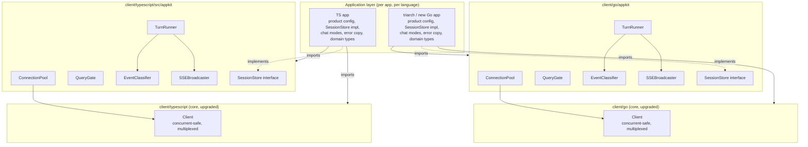

# RFC-629: Client Library — Core Upgrade and Appkit Architecture

**RFC**: 629
**Title**: Client Library — Core Upgrade and Appkit Architecture (Go + TypeScript)
**Status**: Draft
**Kind**: Architecture Design
**Created**: 2026-06-30
**Authors**: Xiaming Chen
**Dependencies**: RFC-450, RFC-614, RFC-403
**Related**: RFC-610 (SDK Module Structure), IG-525 (Go/TS Clients RFC-450)

## Abstract

`client/go` and `client/typescript` are basic protocol-1 (RFC-450) WebSocket wrappers. Real applications that consume them — currently `triarch/backend/internal/agent/` (Go), with a second Go app and a TypeScript app now starting — need substantially more: a panic-safe read loop, mid-session drop detection, managed reconnect + loop reattach + liveness probing, readiness retry, concurrent-safe request/subscription multiplexing, a per-session connection pool, single-flight query gating, cancel-before-context ordering, event→deliverable classification, and SSE fan-out. Triarch hand-rolls all of this and, notably, does **not** use the library's `Client` at all — it reimplements a `TriarchClient` on raw `gorilla/websocket` and imports only the library's protocol/message types, because the library lacked the transport/lifecycle features the application required.

This RFC defines a three-layer architecture that absorbs the generic half of triarch's adaptation layer into both client libraries:

- **Layer 0 (core `Client` upgrades)**: fold the transport/lifecycle gaps (panic-safe read loop, drop detection, `Reconnect`/`ReattachAndProbe`, readiness retry, concurrent multiplexing) down into the existing `Client`, so every application gets a safe, concurrent, reconnect-aware client for free.
- **Layer 1 (`appkit` package)**: a new sibling package in each client holding the reusable application-architecture layer — `ConnectionPool`, `QueryGate`, `TurnRunner`, `EventClassifier`, `SSEBroadcaster`, and a `SessionStore` interface — with product-specific decisions (deliverable phase sets, persistence, chat modes, error copy) kept in each application via configuration and interfaces.
- **Layer 2 (application)**: each application's own code — domain types, persistence implementation, product config, user-facing copy, legacy paths.

The boundary is drawn so that transport/protocol concerns live in the library, reusable application mechanics live in `appkit`, and product decisions stay in applications. This eliminates the repeated adaptation boilerplate across daemon-consuming applications in both Go and TypeScript while keeping the thin protocol clients free of one application's product opinions.

## Problem Statement

### Current state

Both `client/go` and `client/typescript` provide a flat single-package library: `Client` (connect/handshake/close), the protocol-1 envelope codec, RPC-by-id (`RequestResponse`), fire-and-forget `Send*` methods, NDJSON/event streaming, an optional heartbeat tracker, cold-start `ConnectWithRetries`, and a `BootstrapLoopSession` helper. They are documented "NOT safe for concurrent use," and `RequestResponse` *discards* non-matching events.

Triarch's `internal/agent` package (Go) consumes the daemon over WebSocket but bypasses `soothe.Client` entirely. It reimplements `TriarchClient` on `gorilla/websocket` and hand-rolls: a panic-safe read loop with a `Disconnected()` signal; a `loop_new`/`loop_reattach`/`subscribe`/readiness-retry handshake state machine with a `loop_get` liveness probe; a per-chat `SoothePoolManager` (connection pool, single-flight query gate, cancel-before-context, timeout turn loop); an event→deliverable/streaming/terminal classifier; and an SSE broadcaster. Only the library's protocol/message types and `WaitDaemonReady` are reused.

The TypeScript client (`client/typescript`) is at the same baseline the Go client was before this RFC: a single `Client` class with the protocol-1 codec, a resolver-queue read path, request/subscribe helpers, and `bootstrapLoopSession`/`connectWithRetries`. It lacks the transport/lifecycle features (drop detection, reconnect, reattach-and-probe, concurrent multiplexing) and has no `appkit` equivalent — any TypeScript application consuming the daemon must rebuild the pool/query/turn/classification/SSE layer itself, exactly as triarch did in Go.

### Problems

1. **Transport/lifecycle gaps in the core.** Both libraries lack the features that forced triarch to fork: no drop detection, no managed reconnect/reattach/probe, no readiness retry beyond the handshake, no concurrent-safe multiplexing. Any real application must rebuild these — in Go *and* in TypeScript.
2. **Repeated application boilerplate.** A second Go application and a TypeScript application have started and are repeating the same adaptation layer — pool, query gate, turn loop, event classification, SSE fan-out.
3. **Divergence.** Triarch's hand-rolled Go equivalents (`TriarchClient`, `bootstrap*ThreadSession`, `wait*`) have drifted from the library's `Client`/`BootstrapLoopSession`/`Wait*` helpers and will continue to drift. The TypeScript client risks the same drift if its own application rolls a parallel layer.
4. **Premature coupling risk.** Absorbing triarch's *product* decisions (Postgres schema, chat modes, deliverable namespaces, user-facing error copy) into either library would couple the thin protocol client to one application's product and prevent reuse.
5. **Cross-language drift.** The Go and TypeScript clients implement the same protocol but currently share no architectural vocabulary. An application written in TypeScript has no analogue of the Go appkit and must invent one, diverging in event classification, query gating, and turn semantics from the Go applications that consume the same daemon.

### Design Goals

1. **Eliminate transport boilerplate** — applications import a safe, concurrent, reconnect-aware `Client` instead of rebuilding one, in both languages.
2. **Eliminate application boilerplate** — a reusable `appkit` package in each client covers pool/query/turn/classification/SSE.
3. **Keep product decisions in applications** — deliverable phase sets, persistence, chat modes, and error copy are expressed via configuration and interfaces, not hardcoded in the library.
4. **Preserve the existing core API** — `Client`/`Send*`/`Request*` signatures stay; upgrades are additive.
5. **Conform to RFC-450** — the multiplexer routing rule, reconnect/reattach flow, and readiness retry must match the protocol's correlation, lifecycle, and heartbeat semantics.
6. **Cross-language parity** — the Go and TypeScript `appkit` packages expose the same component vocabulary and the same classification/gating semantics, so an application porting between languages finds the same shape.

## Guiding Principles

1. **Transport in the library, mechanics in `appkit`, product in the app.** Three layers, each with one clear purpose and a well-defined boundary.
2. **Protocol-conformant, not protocol-inventing.** Every core routing/lifecycle decision keys on RFC-450's actual `(type, id)` correlation and readiness/heartbeat rules; no invented frames or method names.
3. **Configurable product decisions.** Where a reusable component touches a product concern (deliverable phases, persistence, SSE keys), it takes configuration or an interface rather than baking in a default.
4. **Additive core, new sibling package.** No breaking changes to the existing `Client` API; `appkit` is a new import path, opt-in.
5. **YAGNI on app-architecture.** Extract only what is provably shared (triarch + the new apps); leave one-off logic in the application that owns it.
6. **Same shape, language-idiomatic code.** The Go and TypeScript `appkit` packages share component names and semantics but are written idiomatically — Go uses channels and `context.Context`; TypeScript uses `EventEmitter`, `AsyncGenerator`, and `AbortSignal`.

## Component Overview



## Component Responsibilities

### Core `Client` (Layer 0, upgraded)

**Purpose**: Own the WebSocket transport and protocol-1 lifecycle for a single connection; provide safe, concurrent, reconnect-aware RPC and streaming.

**Capabilities** (additive to the existing surface):
- Panic-safe read loop (recovers from read panics under concurrent `Close`).
- Drop detection — a signal closed exactly once on connection drop; carries clean-vs-unclean distinction.
- `Reconnect` — re-dial and re-handshake (`connection_init`/`connection_ack`), bounded-retry on transient `readiness_state`.
- `ReattachAndProbe(loopID)` — post-reconnect `loop_reattach` + re-`subscribe` (`method:"loop_events"`) + optional `loop_get` probe; returns a `StaleLoopError` on stale loops.
- Readiness retry folded into the handshake (transient `readiness_state` and Warn-severity error codes).
- Concurrent-safe multiplexing: pending-request and pending-subscription tables; the reader routes inbound frames by `(type, id)`.

**Interfaces**:
- Provides: the existing `Client` API (unchanged signatures) plus the drop signal, `Reconnect`, and `ReattachAndProbe`.
- Requires: RFC-450 protocol-1 daemon endpoint.

### `appkit` (Layer 1, new)

**Purpose**: Provide the reusable application-architecture layer that every daemon-consuming application needs, parameterized by application product decisions.

**Capabilities**:
- `ConnectionPool` — acquire/release/health-check/reuse per logical session, delegating bootstrap/reattach to the core `Client`.
- `QueryGate` — single-flight per-session query gate (`ErrQueryBusy`) with cancel-before-context ordering.
- `TurnRunner` — timeout-bounded turn loop: send `loop_input`, consume the multiplexed stream, classify events, resolve deliverable, persist/broadcast.
- `EventClassifier` — map streamed frames to deliverable/streaming/terminal outcomes, keyed on `(namespace, mode, phase)` with a configurable `DeliverablePhases` set.
- `SSEBroadcaster` — string-keyed pub/sub fan-out.
- `SessionStore` interface — the persistence seam (loop-id mapping, message append, last-used/reset tracking).

**Interfaces**:
- Provides: `ConnectionPool`, `QueryGate`, `TurnRunner`, `EventClassifier`, `SSEBroadcaster`, `SessionStore`.
- Requires: a core `Client` (or factory), an application-supplied `SessionStore` implementation, and application product config (`DeliverablePhases`, SSE event vocabulary).

### Application layer (Layer 2, per app)

**Purpose**: Own product-specific decisions and domain integration.

**Capabilities** (not absorbed):
- Domain types (e.g., triarch's `gen.*`), persistence implementation (triarch's Postgres `ChatRegistryStore`), chat modes, studio activities, user-facing error copy, legacy task paths, workspace-scope conventions.
- Product config: `DeliverablePhases` set, SSE event vocabulary, session-type taxonomy.

## Data Flow

### Flow 1: A query turn (after absorption)

1. Application calls `TurnRunner.Execute(ctx, sessionID, message, attachments, opts)`.
2. `ConnectionPool.Acquire(ctx, sessionID, workspaceID, userID)` reuses an active slot, or bootstraps (`loop_new` + `subscribe` with `method:"loop_events"`) / reattaches (`loop_reattach` + `subscribe` + `ReattachAndProbe`) via the core `Client`.
3. `QueryGate.Acquire(sessionID)` enforces single-flight; returns `ErrQueryBusy` if a query is already running.
4. `TurnRunner` builds the `loop_input` map and calls `Client.SendMessage` (fire-and-forget notification, or request with a receipt).
5. `TurnRunner` selects on the multiplexed event stream and the timeout. For each inbound frame, `EventClassifier.Classify` keys on `(namespace, mode, phase)`:
   - `next` with `mode:"messages"` → accumulate / stream the assistant chunk.
   - `complete` (or `error`) → terminal.
6. On a deliverable: `SessionStore.Persist` + `SSEBroadcaster.Broadcast`.
7. `QueryGate.Release(sessionID)`.

### Flow 2: Connection drop mid-session

1. The core `Client` reader detects a drop (read/write error, peer close, or missed `pong` per RFC-450 §8.3) and fires the drop signal.
2. `ConnectionPool` marks the slot stale; the next `Acquire` for that session calls `Reconnect` + `ReattachAndProbe`.
3. If `ReattachAndProbe` returns `StaleLoopError`, `Acquire` falls back to a fresh `loop_new` bootstrap.

### Flow 3: Cooperative cancel

1. `QueryGate.Cancel(sessionID)` sends `command_request{command:"cancel"}` to the daemon on a detached 10s-timeout context/signal (so caller cancel cannot block the wire send).
2. The local query context/signal is then cancelled; the turn loop exits; `QueryGate` marks the query failed and broadcasts.

## Architectural Constraints

1. **Multiplexer routing keys on `(type, id)`, not "has id."** Per RFC-450 §5.2/§5.5: `response`/`error` carry the request's `id` → RPC waiter; `next`/`complete` carry the *subscription's* `id` → subscription-stream waiter; `receipt_response` is keyed by `receipt` (§5.7); `ping`/`pong`/`connection_ack` are id-less lifecycle frames. Routing by `id` presence alone would misroute subscription streams to the RPC table.
2. **`response` precedes `next` per turn.** RFC-450 §9.3 guarantees the daemon sends the `response` before any `next` stream events for a turn; the RPC waiter is therefore satisfied before stream events begin, which is consistent with the single-flight gate.
3. **No invented frames or method names.** Use `connection_init`/`connection_ack` (not `daemon_ready`), `subscribe` + `method:"loop_events"` (not `loop_subscribe`), `unsubscribe`/`disconnect` (not `loop_detach`), `loop_new`/`loop_reattach`/`loop_get`/`loop_input` as defined. There is no `event_batch` wire frame ("batch" is a `stream_delivery` mode) and no `final_report` wire frame (it is a namespace/component name).
4. **Deliverable classification keys on `(namespace, mode, phase)`.** Per RFC-614/RFC-403: streamed chunks are `type:"next"` with `payload.mode="messages"` + `phase`; stream termination is `type:"complete"`/`error`. IG-317 removed `soothe.output.*` assistant bodies, so classification by the `output.*` namespace alone would miss real deliverables.
5. **Per-connection handshake.** Each pooled connection independently completes `connection_init`/`connection_ack` (RFC-450 §8.2 rule 1); the protocol has no notion of pooling — pooling is a client-side concern.
6. **Additive core API.** Existing `Client`/`Send*`/`Request*` signatures are preserved; the existing test suite must remain green.
7. **Product decisions stay pluggable.** `SessionStore` is an interface; `DeliverablePhases` is configuration; the SSE broadcaster is string-keyed. The library does not import any application's domain types.
8. **Cross-language parity of appkit semantics.** The Go and TypeScript `appkit` packages must classify events, gate queries, and run turns with the same semantics so a ported application behaves identically against the same daemon. Language-idiomatic mechanics differ; the *contract* does not.

## Layer Architecture

### Layer 0: Core `Client` (transport/lifecycle)

**Responsibility**: WebSocket transport, protocol-1 handshake, envelope codec, RPC, streaming, control-frame handling, heartbeat, reconnect/reattach, concurrent multiplexing.

**Contains (Go)**: the existing `client/go` files (`client.go`, `protocol.go`, `request.go`, `send_methods.go`, `session.go`, `heartbeat.go`, `config.go`, `errors.go`, `events.go`, `verbosity.go`, `job.go`, `helpers.go`), upgraded in place, plus `multiplexer.go`.

**Contains (TypeScript)**: the existing `client/typescript/src` files (`client.ts`, `protocol.ts`, `errors.ts`, `config.ts`, `events.ts`, `verbosity.ts`, `session.ts`, `helpers.ts`), upgraded in place, plus `multiplexer.ts`.

### Layer 1: `appkit` (application mechanics)

**Responsibility**: per-session connection pooling, single-flight query gating, turn execution, event classification, SSE fan-out, persistence seam.

**Contains (Go)**: `client/go/appkit/` (`pool.go`, `query_gate.go`, `turn_runner.go`, `classifier.go`, `thinking_step.go`, `broadcaster.go`, `session_store.go`, `client.go`, `doc.go`).

**Contains (TypeScript)**: `client/typescript/src/appkit/` (`pool.ts`, `query_gate.ts`, `turn_runner.ts`, `classifier.ts`, `thinking_step.ts`, `broadcaster.ts`, `session_store.ts`, `client.ts`, `index.ts`).

### Layer 2: Application (product)

**Responsibility**: domain types, persistence implementation, product config, user-facing copy, legacy paths.

**Contains**: each application's own code (e.g., triarch's `internal/agent/` minus the absorbed generic half; the TypeScript application's own code).

## Language-Specific Adaptations

The Go and TypeScript clients implement the same Layer 0/Layer 1 contract with language-idiomatic mechanics:

| Concern | Go | TypeScript |
|---|---|---|
| Drop signal | `Disconnected() <-chan DisconnectCause` (buffered-1 channel closed once) | `EventEmitter` `'disconnected'` event emitted once with a `DisconnectCause` |
| Cancellation | `context.Context` + `context.WithTimeout` | `AbortSignal` / `AbortController` + timeout param |
| Mutual exclusion | `sync.Mutex` / `sync.RWMutex` | private fields + single-threaded event loop + `Promise` chaining |
| Event stream | `ReceiveMessages(ctx) (<-chan interface{}, error)` | `receiveMessages(signal?): AsyncGenerator<DecodedMessage>` |
| Concurrent reads | `gorilla/websocket` forbids concurrent readers → `readerActive` atomic gates `RequestResponse` onto the mux | `ws` single socket; the resolver queue + multiplexer cooperate so RPC waits and stream reads do not starve each other |
| Time durations | `time.Duration` | `number` (milliseconds) |
| Pending-call tables | `map[string]*pendingCall` + `sync.Once` unregister | `Map<string, PendingCall>` + explicit unregister closures |
| Single-flight gate | `map[string]context.CancelFunc` | `Map<string, AbortController>` |
| SSE subscriber channel | `chan SSEEvent` (buffered cap 100, drop-on-full via `select`/`default`) | callback list + per-subscriber bounded queue (drop-on-full) |

The contract — "route by `(type, id)`," "response before next," "cancel daemon before local context," "classify by `(namespace, mode, phase)`," "persist + broadcast on deliverable" — is identical across both.

## Abstract Schemas

### Pending-frame routing table (core `Client`)

```
InboundFrame {
  type: "response" | "error" | "next" | "complete" | "receipt_response" | "ping" | "pong" | "connection_ack"
  id: string?        // request id for response/error; subscription id for next/complete
  receipt: string?   // for receipt_response
  payload: any?
}

Route(frame):
  match (frame.type, frame.id):
    ("response"|"error", rid)        → pendingRequests[rid]
    ("next"|"complete", sid)         → pendingSubscriptions[sid]
    ("receipt_response", _)          → receiptWaiters[frame.receipt]
    ("ping", _)                      → send pong
    ("pong"|"connection_ack", _)    → lifecycle handler
```

### `EventClassifier` configuration (appkit)

```
ClassifierConfig {
  deliverablePhases: Set<Phase>     // app-defined, e.g. {quiz, goal_completion, direct_model}
  thinkingStepEvents: Set<Namespace>?  // optional app override
  minDeliverableRunes: int          // default 8
}

ChatEventResult {
  content: string
  thinkingStep: string
  terminal: Continue | DeliverableComplete | FailedComplete
  completionEvent: string?
  err: Error?
}
```

### `SessionStore` interface (appkit)

```
SessionStore {
  GetSession(sessionID) → SessionEntry?
  CreateSession(workspaceID, sessionID, loopID, sessionType) → error
  UpdateLastUsed(sessionID) → error
  IncrementResetCount(sessionID) → error
  GetLoopIDForSession(sessionID) → (loopID string, ok bool)
  AppendMessage(sessionID, message) → error
}
```

## Integration Points

### RFC-450 daemon

**Integration Type**: WebSocket (protocol-1 envelopes).

**Data Exchange**: `connection_init`/`connection_ack` handshake; `request`/`response`/`error` RPC; `subscribe`/`next`/`complete` streaming; `ping`/`pong` heartbeat; `notification` fire-and-forget (`loop_input`, `disconnect`); `unsubscribe` operation-level detach.

### Application persistence

**Integration Type**: `SessionStore` interface (implemented per app).

**Data Exchange**: session↔loop-id mapping, appended messages, last-used/reset metadata.

### Application SSE consumers

**Integration Type**: `SSEBroadcaster` string-keyed pub/sub.

**Data Exchange**: app-defined SSE event vocabulary (`status_change`, `progress`, `delta`, `complete`, `query_error`, etc.) on a per-session channel.

## Migration and Sequencing

This is substantial work, sequenced to manage risk. The Go client is ahead; the TypeScript client follows the same order.

### Go client

1. **Core `Client` upgrades** — panic-safe read loop, drop signal, `Reconnect`/`ReattachAndProbe`, readiness retry, multiplexer. Land additively; keep the existing test suite green. *(Done 2026-06-30.)*
2. **`appkit` package** — extract `ConnectionPool`/`QueryGate`/`TurnRunner`/`EventClassifier`/`SSEBroadcaster`/`SessionStore` from triarch, de-domain-ify. *(Done 2026-06-30.)*
3. **Triarch migration** — delete `TriarchClient`, `bootstrap*ThreadSession`, `wait*`; reimplement `pool_manager`/`event_processor` on `appkit`. *(Blocked on a client-library publish.)*
4. **New Go application on `appkit` from day one** — the forcing function that proves the abstraction.

### TypeScript client

1. **Core `Client` upgrades** — drop signal (`'disconnected'` event), `Reconnect`/`ReattachAndProbe`, readiness retry, multiplexer. Land additively; keep the existing test suite green. *(In progress — IG-531.)*
2. **`appkit` package** — port the Go `appkit` semantics to TypeScript idiomatically: `ConnectionPool`/`QueryGate`/`TurnRunner`/`EventClassifier`/`SSEBroadcaster`/`SessionStore`, de-domain-ified. *(In progress — IG-531.)*
3. **TypeScript application migration** — when a TS app consuming the daemon exists, migrate its hand-rolled layer onto `appkit`, mirroring the triarch migration. *(Blocked on that app existing.)*
4. **New TypeScript application on `appkit` from day one** — the forcing function.

Sequencing is core-first in each language because `appkit` depends on a safe, concurrent, reconnect-aware `Client`.

## Open Questions

- **Multiplexer contract precision.** The exact behavior when a response arrives with no pending waiter (e.g., a late response after timeout) must be specified — likely log-and-drop, with a metric. To be resolved in the implementation guides.
- **`BootstrapLoopSession` reconciliation.** The library's existing `BootstrapLoopSession` and triarch's `bootstrap*ThreadSession` differ; the implementation must reconcile `BootstrapLoopSession` as the library's owned entry point and `ReattachAndProbe` as the resume path, both used by `ConnectionPool.Acquire`. The TypeScript `bootstrapLoopSession` plays the same role.
- **Thinking-step configurability.** Promoting `ExtractThinkingStep`'s event allowlist to configuration is proposed; confirm the new applications actually need different thinking-step events before adding the knob.
- **`AgentQueryError` promotion.** Confirm the new applications want the user-facing/detail split before promoting the type to `appkit`; otherwise leave it application-local.
- **TypeScript concurrent-read model.** Unlike gorilla/websocket, the `ws` library does not forbid concurrent reads, but the resolver-queue + multiplexer design must still avoid double-consumption of a single frame and must not let a continuous subscription stream starve an RPC wait. Confirm the design holds under the TS test suite.

## Related Documents

- [RFC Standard](./rfc-standard.md)
- [RFC Index](./rfc-index.md)
- [RFC-000](./RFC-000-system-conceptual-design.md) - Conceptual Design
- [RFC-450](./RFC-450-daemon-communication-protocol.md) - Daemon Communication Protocol (protocol-1)
- [RFC-614](./RFC-614-unified-streaming-messaging.md) - Unified Daemon → Client Streaming Messaging
- [RFC-610](./RFC-610-sdk-module-structure-refactoring.md) - SDK Module Structure Refactoring
- [IG-527](../impl/IG-527-go-client-appkit.md) - Go Client Core Upgrade and Appkit Implementation
- [IG-531](../impl/IG-531-typescript-client-appkit.md) - TypeScript Client Core Upgrade and Appkit Implementation

---

*Generated by Platonic Coding (brainstorm → RFC formalization).*
