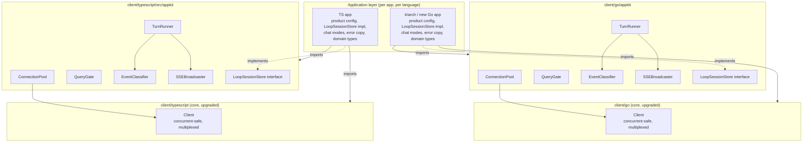

# RFC-629: Client Library — Core Upgrade and Appkit Architecture

**RFC**: 629
**Title**: Client Library — Core Upgrade and Appkit Architecture (Python + Go + TypeScript + Rust)
**Status**: Draft
**Kind**: Architecture Design
**Created**: 2026-06-30
**Updated**: 2026-07-29
**Authors**: Xiaming Chen
**Dependencies**: RFC-450, RFC-614, RFC-403
**Related**: RFC-610 (SDK Module Structure), IG-525 (Go/TS Clients RFC-450), IG-612 (Python client), IG-619 (cross-client API parity), IG-620 (Rust client)

## Abstract

Four language clients talk to soothe-daemon over protocol-1 (RFC-450): `client/python` (`soothe-client-python`), `client/go`, `client/typescript`, and `client/rust` (`soothe-client`). Real applications need more than a thin WebSocket wrapper: panic-safe read loops, drop detection, reconnect + loop reattach + liveness probing, readiness retry, concurrent RPC/subscription multiplexing, per-session pooling, single-flight query gating, cancel-before-context ordering, event→deliverable classification, SSE fan-out, dual-socket turn streaming (`DaemonSession`), ephemeral one-shot RPCs (`CommandClient`), and stream `delivery_ack` for daemon drain gating.

**Python 0.10.x is the reference implementation** for user-facing API tiers, constrained public export surface, turn-session semantics, and production transport behaviors (priority inbound backpressure, `delivery_ack`). Go, TypeScript, and Rust must match that contract with language-idiomatic code (IG-619, IG-620).

This RFC defines a three-layer architecture shared by all four clients:

- **Layer 0 (core transport)**: WebSocket + protocol-1 lifecycle — `WebSocketClient` / `Client`, reconnect/reattach, multiplexing, heartbeat, `delivery_ack`.
- **Layer 1 (`appkit`)**: reusable application mechanics — `DaemonSession`, `ConnectionPool`, `QueryGate`, `TurnRunner`, `EventClassifier`, `SSEBroadcaster`, `LoopSessionStore`.
- **Layer 2 (application)**: product decisions — deliverable phases, persistence, chat modes, error copy.

A fourth **ephemeral RPC** entry point (`CommandClient` / `AsyncCommandClient`) sits beside Layer 0 for jobs/cron/autopilot one-shots that must not share a streaming socket.

## Problem Statement

### Current state

Both `client/go` and `client/typescript` provide a flat single-package library: `Client` (connect/handshake/close), the protocol-1 envelope codec, RPC-by-id (`RequestResponse`), fire-and-forget `Send*` methods, NDJSON/event streaming, an optional heartbeat tracker, cold-start `ConnectWithRetries`, and a `BootstrapLoopSession` helper. They are documented "NOT safe for concurrent use," and `RequestResponse` *discards* non-matching events.

Triarch's `internal/agent` package (Go) consumes the daemon over WebSocket but bypasses `soothe.Client` entirely. It reimplements `TriarchClient` on `gorilla/websocket` and hand-rolls: a panic-safe read loop with a `Disconnected()` signal; a `loop_new`/`loop_reattach`/`subscribe`/readiness-retry handshake state machine with a `loop_get` liveness probe; a per-chat `SoothePoolManager` (connection pool, single-flight query gate, cancel-before-context, timeout turn loop); an event→deliverable/streaming/terminal classifier; and an SSE broadcaster. Only the library's protocol/message types and `WaitDaemonReady` are reused.

The TypeScript client (`client/typescript`) is at the same baseline the Go client was before this RFC: a single `Client` class with the protocol-1 codec, a resolver-queue read path, request/subscribe helpers, and `bootstrapLoopSession`/`connectWithRetries`. It lacks the transport/lifecycle features (drop detection, reconnect, reattach-and-probe, concurrent multiplexing) and has no `appkit` equivalent — any TypeScript application consuming the daemon must rebuild the pool/query/turn/classification/SSE layer itself, exactly as triarch did in Go.

### Problems

1. **Transport/lifecycle gaps in the core.** Both libraries lack the features that forced triarch to fork: no drop detection, no managed reconnect/reattach/probe, no readiness retry beyond the handshake, no concurrent-safe multiplexing. Any real application must rebuild these — in Go *and* in TypeScript.
2. **Repeated application boilerplate.** A second Go application and a TypeScript application have started and are repeating the same adaptation layer — pool, query gate, turn loop, event classification, SSE fan-out.
3. **Divergence.** Triarch's hand-rolled Go equivalents (`TriarchClient`, `bootstrap*ThreadSession`, `wait*`) have drifted from the library's `Client`/`BootstrapLoopSession`/`Wait*` helpers and will continue to drift. The TypeScript client risks the same drift if its own application rolls a parallel layer.
4. **Premature coupling risk.** Absorbing triarch's *product* decisions (Postgres schema, chat modes, deliverable namespaces, user-facing error copy) into either library would couple the thin protocol client to one application's product and prevent reuse.
5. **Cross-language drift.** The Go and TypeScript clients implement the same protocol but currently share no architectural vocabulary. An application written in TypeScript has no analogue of the Go appkit and must invent one, diverging in event classification, query gating, and turn semantics from the Go applications that consume the same daemon.

### Design Goals

1. **Eliminate transport boilerplate** — applications import a safe, concurrent, reconnect-aware core client instead of rebuilding one, in all three languages.
2. **Eliminate application boilerplate** — a reusable `appkit` package covers `DaemonSession`, pool/query/turn/classification/SSE.
3. **Keep product decisions in applications** — deliverable phase sets, persistence, chat modes, and error copy are expressed via configuration and interfaces, not hardcoded in the library.
4. **Preserve additive core APIs** — existing `Client`/`Send*`/`Request*` signatures stay where present; new entry points (`DaemonSession`, `CommandClient`) are additive.
5. **Conform to RFC-450** — multiplexer routing, reconnect/reattach, readiness retry, and `delivery_ack` must match protocol correlation and stream-drain semantics.
6. **Cross-language parity** — Python, Go, and TypeScript expose the same API tiers and the same classification/gating/turn semantics; Python is the reference for contract tests and docs.
7. **Constrained public surface** — root exports favor the happy path; wire param models and demoted internals are submodule-only (Python `__all__` / TS export allowlist / Go documented tiers).

## User-Facing API Tiers

Every client documents and implements these four entry points with matching semantics:

| Need | Entry point | Notes |
|------|-------------|-------|
| One conversation, stream turns | `appkit.DaemonSession` | Dual-socket: stream + RPC sidecar; `SendTurn` / `IterTurnChunks`; `EnsureConnected` |
| Jobs / cron / autopilot one-shots | `CommandClient` (+ async variant in Python/TS) | Ephemeral connect → handshake → one RPC → close |
| Raw protocol / custom RPCs | `WebSocketClient` (Python) / `Client` (Go, TS) | Long-lived transport; advanced |
| Multi-user HTTP backend | `ConnectionPool` + `TurnRunner` | Session-scoped pool; product supplies `LoopSessionStore` |

Wire request param models (Python `protocol_params`) stay off the root export. Advanced stream helpers (`unwrap_next`, pipeline batchers, `ManagedClient`) are importable from submodules but demoted from the primary public list.

## Guiding Principles

1. **Transport in the library, mechanics in `appkit`, product in the app.** Three layers, each with one clear purpose and a well-defined boundary.
2. **Protocol-conformant, not protocol-inventing.** Every core routing/lifecycle decision keys on RFC-450's actual `(type, id)` correlation and readiness/heartbeat rules; no invented frames or method names.
3. **Configurable product decisions.** Where a reusable component touches a product concern (deliverable phases, persistence, SSE keys), it takes configuration or an interface rather than baking in a default.
4. **Additive core, new sibling package.** No breaking changes to the existing `Client` API; `appkit` is a new import path, opt-in.
5. **YAGNI on app-architecture.** Extract only what is provably shared (triarch + the new apps); leave one-off logic in the application that owns it.
6. **Same shape, language-idiomatic code.** The Go and TypeScript `appkit` packages share component names and semantics but are written idiomatically — Go uses channels and `context.Context`; TypeScript uses `EventEmitter`, `AsyncGenerator`, and `AbortSignal`.

## Component Overview



## Component Responsibilities

### Core `Client` (Layer 0, upgraded)

**Purpose**: Own the WebSocket transport and protocol-1 lifecycle for a single connection; provide safe, concurrent, reconnect-aware RPC and streaming.

**Capabilities** (additive to the existing surface):
- Panic-safe read loop (recovers from read panics under concurrent `Close`).
- Drop detection — a signal closed exactly once on connection drop; carries clean-vs-unclean distinction.
- `Reconnect` — re-dial and re-handshake (`connection_init`/`connection_ack`), bounded-retry on transient `readiness_state`.
- `ReattachAndProbe(loopID)` — post-reconnect `loop_reattach` + re-`subscribe` (`method:"loop_events"`) + optional `loop_get` probe; returns a `StaleLoopError` on stale loops.
- Readiness retry folded into the handshake (transient `readiness_state` and Warn-severity error codes).
- Concurrent-safe multiplexing: pending-request and pending-subscription tables; the reader routes inbound frames by `(type, id)`.
- `delivery_ack` — on terminal stream frames, notify the daemon with monotonic per-loop `seq` so drain gating stays correct under load (Python reference behavior).
- Production transport (Python reference; Go/TS converge via IG-619): bounded inbound queue with priority-aware drop, stream-degraded callback, negotiated heartbeat, max frame size aligned with daemon default (10 MiB).

**Interfaces**:
- Provides: the existing core API plus drop signal, `Reconnect`, `ReattachAndProbe`, `delivery_ack`, peel-stale helpers used by `DaemonSession`.
- Requires: RFC-450 protocol-1 daemon endpoint.
- Naming: Python uses `WebSocketClient`; Go and TypeScript use `Client` for the same Layer 0 role.

### `appkit` (Layer 1)

**Purpose**: Provide the reusable application-architecture layer that every daemon-consuming application needs, parameterized by application product decisions.

**Capabilities**:
- `DaemonSession` — dual-socket loop session for CLI/TUI-style apps: subscribed stream socket + RPC sidecar; `Connect` / `SendTurn` / `IterTurnChunks` / `EnsureConnected` / history-cards helpers. Primary happy-path entry for one conversation.
- `ConnectionPool` — acquire/release/health-check/reuse per logical session, delegating bootstrap/reattach to the core client.
- `QueryGate` — single-flight per-session query gate (`ErrQueryBusy`) with cancel-before-context ordering.
- `TurnRunner` — timeout-bounded pool turn loop: send `loop_input`, consume the multiplexed stream, persist/broadcast. **Turn end follows the `DaemonSession.IterTurnChunks` contract** (`TurnBoundary`: gated `soothe.stream.end` / `status.idle` / `stopped`). Phase deliverables may early-complete for UX but are not the sole terminator.
- `EventClassifier` — map streamed frames to content deltas, thinking steps, and optional phase early-complete, keyed on `(namespace, mode, phase)` with a configurable `DeliverablePhases` set.
- `SSEBroadcaster` — string-keyed pub/sub fan-out.
- `LoopSessionStore` interface — the persistence seam (loop-id mapping, message append, last-used/reset tracking).

**Interfaces**:
- Provides: `DaemonSession`, `ConnectionPool`, `QueryGate`, `TurnRunner`, `EventClassifier`, `SSEBroadcaster`, `LoopSessionStore`.
- Requires: a core client (or factory), an application-supplied `LoopSessionStore` when using the pool, and application product config (`DeliverablePhases`, SSE event vocabulary).

### `CommandClient` (ephemeral RPC)

**Purpose**: One-shot jobs/cron/autopilot RPCs without holding a streaming subscription.

**Capabilities**: Open WebSocket → `connection_init` handshake → single correlated `request`/`response` → close. Sync and async wrappers as language-appropriate.

**Constraint**: Blocking job helpers on the long-lived `Client` MUST NOT double-send (fire-and-forget `Send*` then a second `RequestResponse`). Prefer `CommandClient`, or a single `RequestResponse`.

### Application layer (Layer 2, per app)

**Purpose**: Own product-specific decisions and domain integration.

**Capabilities** (not absorbed):
- Domain types (e.g., triarch's `gen.*`), persistence implementation (triarch's Postgres `ChatRegistryStore`), chat modes, studio activities, user-facing error copy, legacy task paths, workspace-scope conventions.
- Product config: `DeliverablePhases` set, SSE event vocabulary, session-type taxonomy.

## Data Flow

### Flow 1: A query turn (after absorption)

1. Application calls `TurnRunner.Execute(ctx, sessionID, message, attachments, opts)`.
2. `ConnectionPool.Acquire(ctx, sessionID, workspaceID, userID)` reuses an active slot, or bootstraps (`loop_new` + `subscribe` with `method:"loop_events"`) / reattaches (`loop_reattach` + `subscribe` + `ReattachAndProbe`) via the core `Client`.
3. `QueryGate.Acquire(sessionID)` enforces single-flight; returns `ErrQueryBusy` if a query is already running.
4. `TurnRunner` builds the `loop_input` map and calls `Client.SendMessage` (fire-and-forget notification, or request with a receipt).
5. `TurnRunner` selects on the multiplexed event stream and the timeout. For each inbound frame:
   - `TurnBoundary.Feed` applies DaemonSession end rules (authoritative turn end).
   - `EventClassifier.Classify` accumulates deltas / thinking steps; deliverable phases may early-complete for UX.
   - Boundary end with substantive accumulated text → persist + SSE complete (same as CLI when `iter_turn_chunks` returns).
6. On complete: `LoopSessionStore.Persist` + `SSEBroadcaster.Broadcast`.
7. `QueryGate.Release(sessionID)`.

### Flow 2: Connection drop mid-session

1. The core `Client` reader detects a drop (read/write error, peer close, or missed `pong` per RFC-450 §8.3) and fires the drop signal.
2. `ConnectionPool` marks the slot stale; the next `Acquire` for that session calls `Reconnect` + `ReattachAndProbe`.
3. If `ReattachAndProbe` returns `StaleLoopError`, `Acquire` falls back to a fresh `loop_new` bootstrap.

### Flow 3: Cooperative cancel

1. `QueryGate.Cancel(sessionID)` sends `command_request{command:"cancel"}` to the daemon on a detached 10s-timeout context/signal (so caller cancel cannot block the wire send).
2. The local query context/signal is then cancelled; the turn loop exits; `QueryGate` marks the query failed and broadcasts.

## Architectural Constraints

1. **Multiplexer routing keys on `(type, id)`, not "has id."** Per RFC-450 §5.2/§5.5: `response`/`error` carry the request's `id` → RPC waiter; `next`/`complete` carry the *subscription's* `id` → subscription-stream waiter; `receipt_response` is keyed by `receipt` (§5.7); `ping`/`pong`/`connection_ack` are id-less lifecycle frames. Routing by `id` presence alone would misroute subscription streams to the RPC table.
2. **`response` precedes `next` per turn.** RFC-450 §9.3 guarantees the daemon sends the `response` before any `next` stream events for a turn; the RPC waiter is therefore satisfied before stream events begin, which is consistent with the single-flight gate.
3. **No invented frames or method names.** Use `connection_init`/`connection_ack` (not `daemon_ready`), `subscribe` + `method:"loop_events"` (not `loop_subscribe`), `unsubscribe`/`disconnect` (not `loop_detach`), `loop_new`/`loop_reattach`/`loop_get`/`loop_input` as defined. There is no `event_batch` wire frame ("batch" is a `stream_delivery` mode) and no `final_report` wire frame (it is a namespace/component name).
4. **Deliverable classification keys on `(namespace, mode, phase)`.** Per RFC-614/RFC-403: streamed chunks are `type:"next"` with `payload.mode="messages"` + `phase`; stream termination is `type:"complete"`/`error`. IG-317 removed `soothe.output.*` assistant bodies, so classification by the `output.*` namespace alone would miss real deliverables.
5. **Per-connection handshake.** Each pooled connection independently completes `connection_init`/`connection_ack` (RFC-450 §8.2 rule 1); the protocol has no notion of pooling — pooling is a client-side concern.
6. **Additive core API.** Existing `Client`/`Send*`/`Request*` signatures are preserved; the existing test suite must remain green.
7. **Product decisions stay pluggable.** `LoopSessionStore` is an interface; `DeliverablePhases` is configuration; the SSE broadcaster is string-keyed. The library does not import any application's domain types.
8. **Cross-language parity of appkit semantics.** Python, Go, and TypeScript `appkit` packages must classify events, gate queries, stream turns (`DaemonSession`), and run pool turns with the same semantics. Language-idiomatic mechanics differ; the *contract* does not. Python is the reference for disputed behavior.
9. **Constrained public exports.** Root / package entrypoints export the API tiers above; wire factories, demoted pipeline helpers, and legacy aliases are submodule-only or unexported. Each language locks the contract with a public-API test where the language supports it.

## Layer Architecture

### Layer 0: Core transport (lifecycle)

**Responsibility**: WebSocket transport, protocol-1 handshake, envelope codec, RPC, streaming, control-frame handling, heartbeat, reconnect/reattach, concurrent multiplexing, `delivery_ack`.

**Contains (Python)**: `client/python/src/soothe_client/` (`websocket.py`, `session.py`, `helpers.py`, `command_client.py`, `protocol_params.py`, `errors.py`, `stream_terminal.py`, `turn_boundary.py`, …).

**Contains (Go)**: `client/go/` (`client.go`, `protocol.go`, `request.go`, `send_methods.go`, `session.go`, `heartbeat.go`, `config.go`, `errors.go`, `events.go`, `verbosity.go`, `job.go`, `helpers.go`, `command_client.go`, `stream_terminal.go`, `multiplexer.go`).

**Contains (TypeScript)**: `client/typescript/src/` (`client.ts`, `protocol.ts`, `errors.ts`, `config.ts`, `events.ts`, `verbosity.ts`, `session.ts`, `helpers.ts`, `command_client.ts`, `stream_terminal.ts`, `multiplexer.ts`).

### Layer 1: `appkit` (application mechanics)

**Responsibility**: dual-socket turn sessions, per-session connection pooling, single-flight query gating, turn execution, event classification, SSE fan-out, persistence seam.

**Contains (Python)**: `client/python/src/soothe_client/appkit/` (`daemon_session.py`, `pool.py`, `query_gate.py`, `turn_runner.py`, `classifier.py`, …).

**Contains (Go)**: `client/go/appkit/` (`daemon_session.go`, `pool.go`, `query_gate.go`, `turn_runner.go`, `classifier.go`, `thinking_step.go`, `broadcaster.go`, `loop_session_store.go`, `client.go`, `doc.go`).

**Contains (TypeScript)**: `client/typescript/src/appkit/` (`daemon_session.ts`, `pool.ts`, `query_gate.ts`, `turn_runner.ts`, `classifier.ts`, `thinking_step.ts`, `broadcaster.ts`, `loop_session_store.ts`, `client.ts`, `index.ts`).

### Layer 2: Application (product)

**Responsibility**: domain types, persistence implementation, product config, user-facing copy, legacy paths.

**Contains**: each application's own code (e.g., triarch's `internal/agent/` minus the absorbed generic half; the TypeScript application's own code).

## Language-Specific Adaptations

All three clients implement the same Layer 0/Layer 1 contract with language-idiomatic mechanics:

| Concern | Python | Go | TypeScript |
|---|---|---|---|
| Core type | `WebSocketClient` | `Client` | `Client` |
| Drop signal | `wait_disconnected` / cause callback | `Disconnected() <-chan DisconnectCause` | `EventEmitter` `'disconnected'` |
| Cancellation | `asyncio` timeouts / cancel | `context.Context` | `AbortSignal` + timeout ms |
| Event stream | `read_event` / async iterators | `ReceiveMessages` / `ReadEvent` | `receiveMessages` / `readEvent` |
| Dual-socket turns | `DaemonSession` | `appkit.DaemonSession` | `appkit.DaemonSession` |
| One-shot RPC | `AsyncCommandClient` / `CommandClient` | `CommandClient` | `CommandClient` |
| Time units | seconds (`float`) | `time.Duration` | milliseconds (`number`) |
| Public surface | `__all__` + `test_public_api` | documented tiers + unexported helpers | root export allowlist + contract test |

The contract — "route by `(type, id)`," "response before next," "cancel daemon before local context," "classify by `(namespace, mode, phase)`," "`delivery_ack` on terminals," "persist + broadcast on deliverable" — is identical across all three.

## Abstract Schemas

### Pending-frame routing table (core `Client`)

```
InboundFrame {
  type: "response" | "error" | "next" | "complete" | "receipt_response" | "ping" | "pong" | "connection_ack"
  id: string?        // request id for response/error; subscription id for next/complete
  receipt: string?   // for receipt_response
  payload: any?
}

Route(frame):
  match (frame.type, frame.id):
    ("response"|"error", rid)        → pendingRequests[rid]
    ("next"|"complete", sid)         → pendingSubscriptions[sid]
    ("receipt_response", _)          → receiptWaiters[frame.receipt]
    ("ping", _)                      → send pong
    ("pong"|"connection_ack", _)    → lifecycle handler
```

### `EventClassifier` configuration (appkit)

```
ClassifierConfig {
  deliverablePhases: Set<Phase>     // app-defined, e.g. {quiz, goal_completion, direct_model}
  thinkingStepEvents: Set<Namespace>?  // optional app override
  minDeliverableRunes: int          // default 8
}

ChatEventResult {
  content: string
  thinkingStep: string
  terminal: Continue | DeliverableComplete | FailedComplete
  completionEvent: string?
  err: Error?
}
```

### `LoopSessionStore` interface (appkit)

```
LoopSessionStore {
  GetSession(sessionID) → LoopSessionEntry?
  CreateSession(workspaceID, sessionID, loopID, sessionType) → error
  UpdateLastUsed(sessionID) → error
  IncrementResetCount(sessionID) → error
  GetLoopIDForSession(sessionID) → (loopID string, ok bool)
  AppendMessage(sessionID, message) → error
}
```

## Integration Points

### RFC-450 daemon

**Integration Type**: WebSocket (protocol-1 envelopes).

**Data Exchange**: `connection_init`/`connection_ack` handshake; `request`/`response`/`error` RPC; `subscribe`/`next`/`complete` streaming; `ping`/`pong` heartbeat; `notification` fire-and-forget (`loop_input`, `disconnect`); `unsubscribe` operation-level detach.

### Application persistence

**Integration Type**: `LoopSessionStore` interface (implemented per app).

**Data Exchange**: session↔loop-id mapping, appended messages, last-used/reset metadata.

### Application SSE consumers

**Integration Type**: `SSEBroadcaster` string-keyed pub/sub.

**Data Exchange**: app-defined SSE event vocabulary (`status_change`, `progress`, `delta`, `complete`, `query_error`, etc.) on a per-session channel.

## Migration and Sequencing

### Completed baselines

| Language | Layer 0 | Appkit (pool/turn/classifier) | `DaemonSession` | `CommandClient` | Reference status |
|----------|---------|-------------------------------|-----------------|-----------------|------------------|
| Python | Done (IG-612) | Done | Done | Done | **Reference (0.10.x)** |
| Go | Done (2026-06-30) | Done | IG-619 | IG-619 | Converging |
| TypeScript | Done (IG-531/660) | Done | Done (IG-617) | IG-619 | Converging |

### Active: cross-client API parity (IG-619)

1. Spec + vocabulary (this RFC update + namings).
2. Go: `DaemonSession`, `delivery_ack`, job single-RPC fix, `CommandClient`.
3. TypeScript: wire `delivery_ack`, `CommandClient`, slim root exports + public-API test, version sync.
4. Follow-up: priority inbound backpressure + degraded hooks on Go/TS; shared example ladder.

### Product migrations

- Triarch / airway thin onto Go `appkit` (including `DaemonSession` where appropriate).
- Desktop / TS apps onto slimmed `@mirasoth/soothe-client` exports.

## Open Questions

- **Multiplexer contract precision.** The exact behavior when a response arrives with no pending waiter (e.g., a late response after timeout) must be specified — likely log-and-drop, with a metric. To be resolved in the implementation guides.
- **`BootstrapLoopSession` reconciliation.** The library's existing `BootstrapLoopSession` and triarch's `bootstrap*ThreadSession` differ; the implementation must reconcile `BootstrapLoopSession` as the library's owned entry point and `ReattachAndProbe` as the resume path, both used by `ConnectionPool.Acquire`. The TypeScript `bootstrapLoopSession` plays the same role.
- **Thinking-step configurability.** Promoting `ExtractThinkingStep`'s event allowlist to configuration is proposed; confirm the new applications actually need different thinking-step events before adding the knob.
- **`AgentQueryError` promotion.** Confirm the new applications want the user-facing/detail split before promoting the type to `appkit`; otherwise leave it application-local.
- **TypeScript concurrent-read model.** Unlike gorilla/websocket, the `ws` library does not forbid concurrent reads, but the resolver-queue + multiplexer design must still avoid double-consumption of a single frame and must not let a continuous subscription stream starve an RPC wait. Confirm the design holds under the TS test suite.

## Related Documents

- [RFC Standard](./rfc-standard.md)
- [RFC Index](./rfc-index.md)
- [RFC-000](./RFC-000-system-conceptual-design.md) - Conceptual Design
- [RFC-450](./RFC-450-daemon-communication-protocol.md) - Daemon Communication Protocol (protocol-1)
- [RFC-614](./RFC-614-unified-streaming-messaging.md) - Unified Daemon → Client Streaming Messaging
- [RFC-610](./RFC-610-sdk-module-structure-refactoring.md) - SDK Module Structure Refactoring
- [IG-612](../impl/IG-612-python-client-layer0-extract.md) - Python client extract (reference)
- [IG-617](../impl/IG-617-typescript-client-production-parity.md) - TypeScript production parity
- [IG-619](../impl/IG-619-cross-client-api-parity.md) - Cross-client API parity (active)
- [IG-527](../archive/impl/IG-527-go-client-appkit.md) - Go Client Core Upgrade and Appkit (archived)
- [IG-531](../archive/impl/IG-531-typescript-client-appkit.md) - TypeScript Client Appkit (archived)

---

*Updated 2026-07-29 for Python reference + three-language API tiers (IG-619); `LoopSessionStore` naming (GPE-05).*
