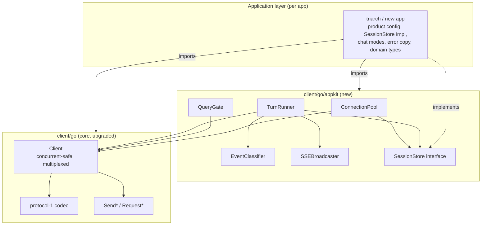

# RFC-629: Go Client Library — Core Upgrade and Appkit Architecture

**RFC**: 629
**Title**: Go Client Library — Core Upgrade and Appkit Architecture
**Status**: Draft
**Kind**: Architecture Design
**Created**: 2026-06-30
**Authors**: Xiaming Chen
**Dependencies**: RFC-450, RFC-614, RFC-403
**Related**: RFC-610 (SDK Module Structure), IG-525 (Go/TS Clients RFC-450)

## Abstract

`client/go` is a basic protocol-1 (RFC-450) WebSocket wrapper. Real applications that consume it — currently `triarch/backend/internal/agent/`, with a second Go app now starting — need substantially more: a panic-safe read loop, mid-session drop detection, managed reconnect + loop reattach + liveness probing, readiness retry, concurrent-safe request/subscription multiplexing, a per-session connection pool, single-flight query gating, cancel-before-context ordering, event→deliverable classification, and SSE fan-out. Triarch hand-rolls all of this and, notably, does **not** use the library's `Client` at all — it reimplements a `TriarchClient` on raw `gorilla/websocket` and imports only the library's protocol/message types, because the library lacked the transport/lifecycle features the application required.

This RFC defines a two-layer architecture that absorbs the generic half of triarch's adaptation layer into the library:

- **Layer 0 (core `Client` upgrades)**: fold the transport/lifecycle gaps (panic-safe read loop, `Disconnected()` signal, `Reconnect`/`ReattachAndProbe`, readiness retry, concurrent multiplexing) down into the existing `Client`, so every application gets a safe, concurrent, reconnect-aware client for free.
- **Layer 1 (`client/go/appkit` package)**: a new sibling package holding the reusable application-architecture layer — `ConnectionPool`, `QueryGate`, `TurnRunner`, `EventClassifier`, `SSEBroadcaster`, and a `SessionStore` interface — with product-specific decisions (deliverable phase sets, persistence, chat modes, error copy) kept in each application via configuration and interfaces.

The boundary is drawn so that transport/protocol concerns live in the library, reusable application mechanics live in `appkit`, and product decisions stay in applications. This eliminates the repeated adaptation boilerplate across Go daemon clients while keeping the thin protocol client free of one application's product opinions.

## Problem Statement

### Current state

`client/go` provides a flat single-package library: `Client` (connect/handshake/close), the protocol-1 envelope codec, RPC-by-id (`RequestResponse`), fire-and-forget `Send*` methods, NDJSON/event streaming, an optional heartbeat tracker, cold-start `ConnectWithRetries`, and a `BootstrapLoopSession` helper. It is documented "NOT safe for concurrent use," and `RequestResponse` *discards* non-matching events.

Triarch's `internal/agent` package consumes the daemon over WebSocket but bypasses `soothe.Client` entirely. It reimplements `TriarchClient` on `gorilla/websocket` and hand-rolls: a panic-safe read loop with a `Disconnected()` signal; a `loop_new`/`loop_reattach`/`subscribe`/readiness-retry handshake state machine with a `loop_get` liveness probe; a per-chat `SoothePoolManager` (connection pool, single-flight query gate, cancel-before-context, timeout turn loop); an event→deliverable/streaming/terminal classifier; and an SSE broadcaster. Only the library's protocol/message types and `WaitDaemonReady` are reused.

### Problems

1. **Transport/lifecycle gaps in the core.** The library lacks the features that forced triarch to fork: no panic-safe read loop, no mid-session drop detection, no managed reconnect/reattach/probe, no readiness retry, no concurrent-safe multiplexing. Any real application must rebuild these.
2. **Repeated application boilerplate.** A second Go application has started and is repeating the same adaptation layer — pool, query gate, turn loop, event classification, SSE fan-out.
3. **Divergence.** Triarch's hand-rolled equivalents (`TriarchClient`, `bootstrap*ThreadSession`, `wait*`) have drifted from the library's `Client`/`BootstrapLoopSession`/`Wait*` helpers and will continue to drift.
4. **Premature coupling risk.** Absorbing triarch's *product* decisions (Postgres schema, chat modes, deliverable namespaces, user-facing error copy) into the library would couple the thin protocol client to one application's product and prevent reuse.

### Design Goals

1. **Eliminate transport boilerplate** — applications import a safe, concurrent, reconnect-aware `Client` instead of rebuilding one.
2. **Eliminate application boilerplate** — a reusable `appkit` package covers pool/query/turn/classification/SSE.
3. **Keep product decisions in applications** — deliverable phase sets, persistence, chat modes, and error copy are expressed via configuration and interfaces, not hardcoded in the library.
4. **Preserve the existing core API** — `Client`/`Send*`/`Request*` signatures stay; upgrades are additive.
5. **Conform to RFC-450** — the multiplexer routing rule, reconnect/reattach flow, and readiness retry must match the protocol's correlation, lifecycle, and heartbeat semantics.

## Guiding Principles

1. **Transport in the library, mechanics in `appkit`, product in the app.** Three layers, each with one clear purpose and a well-defined boundary.
2. **Protocol-conformant, not protocol-inventing.** Every core routing/lifecycle decision keys on RFC-450's actual `(type, id)` correlation and readiness/heartbeat rules; no invented frames or method names.
3. **Configurable product decisions.** Where a reusable component touches a product concern (deliverable phases, persistence, SSE keys), it takes configuration or an interface rather than baking in a default.
4. **Additive core, new sibling package.** No breaking changes to the existing `Client` API; `appkit` is a new import path, opt-in.
5. **YAGNI on app-architecture.** Extract only what is provably shared (triarch + the new app); leave one-off logic in the application that owns it.

## Component Overview



## Component Responsibilities

### Core `Client` (Layer 0, upgraded)

**Purpose**: Own the WebSocket transport and protocol-1 lifecycle for a single connection; provide safe, concurrent, reconnect-aware RPC and streaming.

**Capabilities** (additive to the existing surface):
- Panic-safe read loop in `ReceiveMessages` (recovers from bufio panics under concurrent `Close`).
- `Disconnected() <-chan struct{}` — closed once on connection drop; carries clean-vs-unclean distinction.
- `Reconnect(ctx)` — re-dial and re-handshake (`connection_init`/`connection_ack`), bounded-retry on transient `readiness_state`.
- `ReattachAndProbe(ctx, loopID)` — post-reconnect `loop_reattach` + re-`subscribe` (`method:"loop_events"`) + optional `loop_get` probe; returns `*StaleLoopError` on stale loops.
- Readiness retry folded into the handshake (transient `readiness_state` and Warn-severity error codes).
- Concurrent-safe multiplexing: pending-request and pending-subscription tables; the reader routes inbound frames by `(type, id)`.

**Interfaces**:
- Provides: the existing `Client` API (unchanged signatures) plus `Disconnected()`, `Reconnect(ctx)`, `ReattachAndProbe(ctx, loopID)`.
- Requires: RFC-450 protocol-1 daemon endpoint.

### `client/go/appkit` (Layer 1, new)

**Purpose**: Provide the reusable application-architecture layer that every daemon-consuming Go application needs, parameterized by application product decisions.

**Capabilities**:
- `ConnectionPool` — acquire/release/health-check/reuse per logical session, delegating bootstrap/reattach to the core `Client`.
- `QueryGate` — single-flight per-session query gate (`ErrQueryBusy`) with cancel-before-context ordering.
- `TurnRunner` — timeout-bounded turn loop: send `loop_input`, consume the multiplexed stream, classify events, resolve deliverable, persist/broadcast.
- `EventClassifier` — map streamed frames to deliverable/streaming/terminal outcomes, keyed on `(namespace, mode, phase)` with a configurable `DeliverablePhases` set.
- `SSEBroadcaster` — string-keyed pub/sub fan-out.
- `SessionStore` interface — the persistence seam (loop-id mapping, message append, last-used/reset tracking).

**Interfaces**:
- Provides: `ConnectionPool`, `QueryGate`, `TurnRunner`, `EventClassifier`, `SSEBroadcaster`, `SessionStore`.
- Requires: a core `Client` (or factory), an application-supplied `SessionStore` implementation, and application product config (`DeliverablePhases`, SSE event vocabulary).

### Application layer (Layer 2, per app)

**Purpose**: Own product-specific decisions and domain integration.

**Capabilities** (not absorbed):
- Domain types (e.g., triarch's `gen.*`), persistence implementation (triarch's Postgres `ChatRegistryStore`), chat modes, studio activities, user-facing error copy, legacy task paths, workspace-scope conventions.
- Product config: `DeliverablePhases` set, SSE event vocabulary, session-type taxonomy.

## Data Flow

### Flow 1: A query turn (after absorption)

1. Application calls `TurnRunner.Execute(ctx, sessionID, message, attachments, opts)`.
2. `ConnectionPool.Acquire(ctx, sessionID, workspaceID, userID)` reuses an active slot, or bootstraps (`loop_new` + `subscribe` with `method:"loop_events"`) / reattaches (`loop_reattach` + `subscribe` + `ReattachAndProbe`) via the core `Client`.
3. `QueryGate.Acquire(sessionID)` enforces single-flight; returns `ErrQueryBusy` if a query is already running.
4. `TurnRunner` builds the `loop_input` map and calls `Client.SendMessage` (fire-and-forget notification, or request with a receipt).
5. `TurnRunner` selects on the multiplexed event stream and `timeoutCtx.Done()`. For each inbound frame, `EventClassifier.Classify` keys on `(namespace, mode, phase)`:
   - `next` with `mode:"messages"` → accumulate / stream the assistant chunk.
   - `complete` (or `error`) → terminal.
6. On a deliverable: `SessionStore.Persist` + `SSEBroadcaster.Broadcast`.
7. `QueryGate.Release(sessionID)`.

### Flow 2: Connection drop mid-session

1. The core `Client` reader detects a drop (read/write error, peer close, or missed `pong` per RFC-450 §8.3) and closes `Disconnected()`.
2. `ConnectionPool` marks the slot stale; the next `Acquire` for that session calls `Reconnect` + `ReattachAndProbe`.
3. If `ReattachAndProbe` returns `*StaleLoopError`, `Acquire` falls back to a fresh `loop_new` bootstrap.

### Flow 3: Cooperative cancel

1. `QueryGate.Cancel(sessionID)` sends `command_request{command:"cancel"}` to the daemon on a detached 10s-timeout context (so caller cancel cannot block the wire send).
2. The local query context is then cancelled; the turn loop exits; `QueryGate` marks the query failed and broadcasts.

## Architectural Constraints

1. **Multiplexer routing keys on `(type, id)`, not "has id."** Per RFC-450 §5.2/§5.5: `response`/`error` carry the request's `id` → RPC waiter; `next`/`complete` carry the *subscription's* `id` → subscription-stream waiter; `receipt_response` is keyed by `receipt` (§5.7); `ping`/`pong`/`connection_ack` are id-less lifecycle frames. Routing by `id` presence alone would misroute subscription streams to the RPC table.
2. **`response` precedes `next` per turn.** RFC-450 §9.3 guarantees the daemon sends the `response` before any `next` stream events for a turn; the RPC waiter is therefore satisfied before stream events begin, which is consistent with the single-flight gate.
3. **No invented frames or method names.** Use `connection_init`/`connection_ack` (not `daemon_ready`), `subscribe` + `method:"loop_events"` (not `loop_subscribe`), `unsubscribe`/`disconnect` (not `loop_detach`), `loop_new`/`loop_reattach`/`loop_get`/`loop_input` as defined. There is no `event_batch` wire frame ("batch" is a `stream_delivery` mode) and no `final_report` wire frame (it is a namespace/component name).
4. **Deliverable classification keys on `(namespace, mode, phase)`.** Per RFC-614/RFC-403: streamed chunks are `type:"next"` with `payload.mode="messages"` + `phase`; stream termination is `type:"complete"`/`error`. IG-317 removed `soothe.output.*` assistant bodies, so classification by the `output.*` namespace alone would miss real deliverables.
5. **Per-connection handshake.** Each pooled connection independently completes `connection_init`/`connection_ack` (RFC-450 §8.2 rule 1); the protocol has no notion of pooling — pooling is a client-side concern.
6. **Additive core API.** Existing `Client`/`Send*`/`Request*` signatures are preserved; the existing test suite must remain green.
7. **Product decisions stay pluggable.** `SessionStore` is an interface; `DeliverablePhases` is configuration; the SSE broadcaster is string-keyed. The library does not import any application's domain types.

## Layer Architecture

### Layer 0: Core `Client` (transport/lifecycle)

**Responsibility**: WebSocket transport, protocol-1 handshake, envelope codec, RPC, streaming, control-frame handling, heartbeat, reconnect/reattach, concurrent multiplexing.

**Contains**: the existing `client/go` files (`client.go`, `protocol.go`, `request.go`, `send_methods.go`, `session.go`, `heartbeat.go`, `config.go`, `errors.go`, `events.go`, `verbosity.go`, `job.go`, `helpers.go`), upgraded in place.

### Layer 1: `client/go/appkit` (application mechanics)

**Responsibility**: per-session connection pooling, single-flight query gating, turn execution, event classification, SSE fan-out, persistence seam.

**Contains**: new files under `client/go/appkit/` (`pool.go`, `query_gate.go`, `turn_runner.go`, `classifier.go`, `broadcaster.go`, `session_store.go`).

### Layer 2: Application (product)

**Responsibility**: domain types, persistence implementation, product config, user-facing copy, legacy paths.

**Contains**: each application's own code (e.g., triarch's `internal/agent/` minus the absorbed generic half).

## Abstract Schemas

### Pending-frame routing table (core `Client`)

```
InboundFrame {
  type: "response" | "error" | "next" | "complete" | "receipt_response" | "ping" | "pong" | "connection_ack"
  id: string?        // request id for response/error; subscription id for next/complete
  receipt: string?   // for receipt_response
  payload: any?
}

Route(frame):
  match (frame.type, frame.id):
    ("response"|"error", rid)        → pendingRequests[rid]
    ("next"|"complete", sid)         → pendingSubscriptions[sid]
    ("receipt_response", _)          → receiptWaiters[frame.receipt]
    ("ping", _)                      → send pong
    ("pong"|_"connection_ack", _)   → lifecycle handler
```

### `EventClassifier` configuration (appkit)

```
ClassifierConfig {
  deliverablePhases: Set<Phase>     // app-defined, e.g. {quiz, goal_completion, direct_model}
  thinkingStepEvents: Set<Namespace>?  // optional app override
}

ChatEventResult {
  content: string
  thinkingStep: string
  terminal: Continue | DeliverableComplete | FailedComplete
  completionEvent: string?
  err: error?
}
```

### `SessionStore` interface (appkit)

```
SessionStore {
  GetSession(sessionID) → SessionEntry?
  CreateSession(workspaceID, sessionID, loopID, sessionType) → error
  UpdateLastUsed(sessionID) → error
  IncrementResetCount(sessionID) → error
  GetLoopIDForSession(sessionID) → (loopID string, ok bool)
  AppendMessage(sessionID, role, content, metadata) → error
}
```

## Integration Points

### RFC-450 daemon

**Integration Type**: WebSocket (protocol-1 envelopes).

**Data Exchange**: `connection_init`/`connection_ack` handshake; `request`/`response`/`error` RPC; `subscribe`/`next`/`complete` streaming; `ping`/`pong` heartbeat; `notification` fire-and-forget (`loop_input`, `disconnect`); `unsubscribe` operation-level detach.

### Application persistence

**Integration Type**: `SessionStore` interface (implemented per app).

**Data Exchange**: session↔loop-id mapping, appended messages, last-used/reset metadata.

### Application SSE consumers

**Integration Type**: `SSEBroadcaster` string-keyed pub/sub.

**Data Exchange**: app-defined SSE event vocabulary (`status_change`, `progress`, `delta`, `complete`, `query_error`, etc.) on a per-session channel.

## Migration and Sequencing

This is substantial work, sequenced to manage risk:

1. **Core `Client` upgrades** — panic-safe read loop, `Disconnected()`, `Reconnect`/`ReattachAndProbe`, readiness retry, multiplexer. Land additively; keep the existing test suite green. The multiplexer is the highest-risk piece and lands with a concurrent-RPC regression test (two in-flight RPCs, out-of-order responses, both resolve; unsolicited frames still flow on `ReceiveMessages`).
2. **`appkit` package** — extract `ConnectionPool`/`QueryGate`/`TurnRunner`/`EventClassifier`/`SSEBroadcaster`/`SessionStore` from triarch, de-domain-ify (rekey SSE to string, make `DeliverablePhases` configurable, abstract persistence behind `SessionStore`).
3. **Triarch migration** — delete `TriarchClient`, `bootstrap*ThreadSession`, `wait*`; reimplement `pool_manager`/`event_processor` on `appkit`; keep `executor.go`, `gen.*`, Postgres store, chat modes, error copy. Triarch's agent-package tests must stay green.
4. **New application on `appkit` from day one** — the forcing function that proves the abstraction; divergences inform whether a piece belongs in `appkit` or the application.

Sequencing is core-first because `appkit` depends on a safe, concurrent, reconnect-aware `Client`.

## Open Questions

- **Multiplexer contract precision.** The exact behavior when a response arrives with no pending waiter (e.g., a late response after timeout) must be specified — likely log-and-drop, with a metric. To be resolved in the implementation guide.
- **`BootstrapLoopSession` reconciliation.** The library's existing `BootstrapLoopSession` and triarch's `bootstrap*ThreadSession` differ; the implementation must reconcile `BootstrapLoopSession` as the library's owned entry point and `ReattachAndProbe` as the resume path, both used by `ConnectionPool.Acquire`.
- **Thinking-step configurability.** Promoting `ExtractThinkingStep`'s event allowlist to configuration is proposed; confirm the new application actually needs different thinking-step events before adding the knob.
- **`AgentQueryError` promotion.** Confirm the new application wants the user-facing/detail split before promoting the type to `appkit`; otherwise leave it application-local.

## Related Documents

- [RFC Standard](./rfc-standard.md)
- [RFC Index](./rfc-index.md)
- [RFC-000](./RFC-000-system-conceptual-design.md) - Conceptual Design
- [RFC-450](./RFC-450-daemon-communication-protocol.md) - Daemon Communication Protocol (protocol-1)
- [RFC-614](./RFC-614-unified-streaming-messaging.md) - Unified Daemon → Client Streaming Messaging
- [RFC-610](./RFC-610-sdk-module-structure-refactoring.md) - SDK Module Structure Refactoring
- Design draft: `docs/drafts/2026-06-30-go-client-appkit-absorption-design.md`

---

*Generated by Platonic Coding (brainstorm → RFC formalization).*
