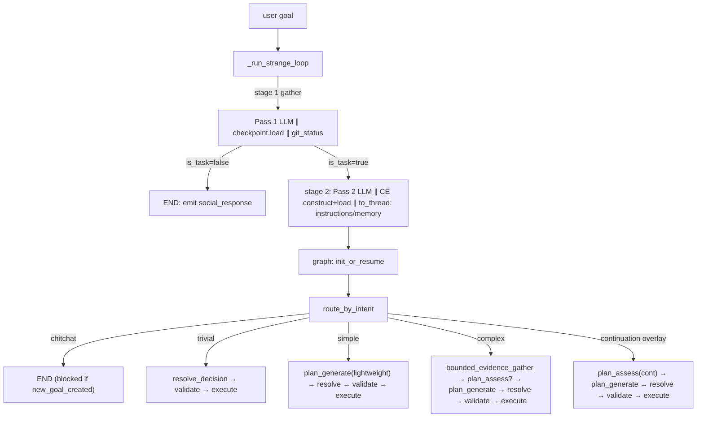

# RFC-630: Start-Phase LLM Intake and Branch Routing

**RFC**: 630
**Title**: Start-Phase LLM Intake and Branch Routing
**Status**: Draft
**Kind**: Architecture Design
**Authors**: Xiaming Chen
**Created**: 2026-06-30
**Last Updated**: 2026-07-07
**Depends on**: RFC-220, RFC-225, RFC-226, RFC-503
**Extends**: RFC-225 (intent classification taxonomy), RFC-220 (orchestrator topology)
**Supersedes**: The `_is_likely_agentic` heuristic bypass and `simple_bypass` string-prefix detection introduced by IG-518
**Related**: RFC-214 (loop-message surface), RFC-604 (reason-phase robustness), RFC-624 (Context Engine)

---

## 1. Abstract

The start-phase pipeline — from user goal arrival to the first task submitted to CoreAgent — uses a **two-pass intake architecture** that cleanly separates social/task classification from scope classification. Pass 1 decides whether the user goal is a social interaction (greeting, thanks, small talk) or a work request; Pass 2 (if work) classifies scope as trivial, simple, or complex. This separation resolves the semantic blind spot where acknowledgment+pivot phrasing ("Ok, now apply the fix") misroutes to social fast-path.

Both passes run structured LLM calls on the fast model. Pass 1 runs `asyncio.gather`-ed with checkpoint load and git status in stage 1; Pass 2 runs after stage 1 completes (only if Pass 1 returns `is_task=true`). A `route_by_intent` conditional edge after `init_or_resume` dispatches to four branches. A P0 hard routing guard blocks social-path when daemon has created a new goal record. The legacy binary intent classifier, its heuristic bypass (`_is_likely_agentic`), and the `simple_bypass` string-prefix detector are removed outright.

---

## 2. Scope and Non-Goals

### 2.1 Scope

This RFC defines:

- A **two-pass intake architecture**: Pass 1 (social vs task) → Pass 2 (scope: trivial|simple|complex).
- Pass 1 prompt, schema, and context exclusion (no prior projection).
- Pass 2 prompt, schema, and context inclusion (prior projection for reference resolution).
- A `route_by_intent` conditional edge after `init_or_resume` driving four branches.
- A P0 hard routing guard: block social-path when `loop_state.new_goal_created`.
- Complexity-tiered planning: `trivial` skips `plan_generate`; `simple` runs lightweight; `complex` runs full spine.
- The trivial-branch plan shape: goal-as-step-action, no synthetic reasoning message.
- Derived fields: `intake_label` and `has_deliverable` computed at routing.

### 2.2 Non-Goals

- Speculative first-task emission before the full plan completes (future "aggressive" variant).
- Plan-token streaming to the user as a draft.
- Embedding-based pre-filter of intent.
- Post-execution failure-intent keyword fast-path as primary classifier (migrated to LLM-first in IG-567; keyword path remains offline fallback).
- Changes to the wire protocol, event envelopes, or daemon transport.
- Changes to the continuation discriminator (`RFC-226`) or clarification relay (`RFC-622`) — both preserved unchanged.
- A feature flag or staged rollout — two-pass replaces one-pass outright.
- Fine-tuning pipeline for intake classification (future work).

---

## 3. Motivation

### 3.1 Semantic blind spot in one-pass taxonomy

The original one-pass design used a 4-class label: `chitchat|trivial|simple|complex`. The `chitchat` label conflated **interaction type** (social) with **scope** (no deliverable):

```
chitchat = "greeting/thanks/casual small talk" + "no work"
```

This created an overlap zone where acknowledgment+pivot phrasing misroutes:

| User GOAL | One-pass misroute | Correct classification |
|-----------|-------------------|------------------------|
| `Ok, now apply the signature change` | "Ok" → social → `chitchat` | Acknowledgment pivot → work (complex) |

This is a **systemic blind spot**, not a rare edge case. Any phrasing with social acknowledgment prefix + pivot phrase + terse engineering reference falls into the same trap.

### 3.2 Context dominance amplifies the blind spot

Prior-goal projection (IG-540) biases toward "wrap-up" tone on continuation loops. When user says "Ok, about the signature change" after a completed goal, the model sees prior completion + "Ok" and overweights "user is confirming" vs "user is pivoting to new request."

### 3.3 Unintelligent heuristic judgment (removed)

`IntentClassifier._is_likely_agentic` forced any query over 80 characters, 15 words, or 2 newlines to agentic path before LLM consultation. The `simple_bypass` string-prefix match recognized synthetic plans by prefix. Both are removed — LLM decides content, structural state decides routing constraints.

### 3.4 The resolution: Two-pass separation

Pass 1 asks a single clean question: "Is this social or work?" No scope, no prior context, no bias. Pass 2 (if work) asks: "How much scope?" with full context for reference resolution. The decision boundaries are distinct; the blind spot is architecturally removed.

---

## 4. Guiding Principles

1. **Separate decisions at the source.** Social vs task and trivial vs simple vs complex are different questions; different passes ask them.
2. **LLM over heuristic for content judgment.** Decisions about what the goal *means* are made by LLM, not string length or prefix matching.
3. **Partition context appropriately.** Pass 1 sees no prior projection (clean boundary); Pass 2 sees full projection (reference resolution).
4. **Fail safe.** Pass 1 uncertain → treat as task; Pass 2 uncertain → complex. Routing guard blocks social on structural contradiction.
5. **Preserve what works.** Fresh-loop skip (IG-476), continuation overlay (RFC-226), clarification relay (RFC-622) unchanged.

---

## 5. Component Overview



---

## 6. Component Responsibilities

### 6.1 Pass 1 Classifier (IntakePass1)

**Purpose**: Binary decision — is this a social interaction or a work request?

**Capabilities**:
- Returns `{is_task: bool, confidence, social_response?, reasoning}`.
- Social response included when `is_task=false` for fast-path END.
- No prior context projection — clean decision boundary.
- Ultra-lean prompt (~120 tokens).

**Interfaces**:
- Provides: `IntakePass1Classifier.classify(query) -> IntakePass1Result`.
- Requires: fast chat model.

**Prompt**:

```xml
<INTAKE_PASS1>
Classify: social interaction or work request?

SOCIAL: greeting, thanks, identity question, small talk, standalone acknowledgment ("ok", "sure" alone).
WORK: references code/files/APIs/tests; requests action; acknowledgment + pivot ("ok, now...", "about the X...", "next: Y").

Rules:
- Names technical entity → WORK
- Pivot phrase after acknowledgment → WORK
- Uncertain → WORK

JSON only:
{"is_task":bool,"confidence":"high"|"medium"|"low","social_response":"string|null","reasoning":"≤15 words"}

social_response required when is_task=false. Match user's language/tone. Identity: "I'm Soothe, created by Dr. Xiaming Chen."

Examples:
"hi" → is_task:false, social_response:"Hi! How can I help?"
"thanks!" → is_task:false, social_response:"You're welcome!"
"ok, now apply the fix" → is_task:true
"about the refactor — finish it" → is_task:true
"alright, so the tests..." → is_task:true
</INTAKE_PASS1>
```

### 6.2 Pass 2 Classifier (IntakePass2)

**Purpose**: Scope classification for work requests — trivial, simple, or complex.

**Capabilities**:
- Returns `{scope: trivial|simple|complex, goal_description, reasoning}`.
- Prior-goal projection included for reference resolution.
- Prompt streamlined to 3-label (no `chitchat` option).

**Interfaces**:
- Provides: `IntakePass2Classifier.classify(query, prior_projection) -> IntakePass2Result`.
- Requires: fast chat model, prior projection from IG-540.

**Prompt**:

```xml
<INTAKE_PASS2>
Classify work scope: trivial, simple, or complex?

trivial: one obvious action, no planning (e.g., single file read, simple query, math).
simple: one focused deliverable, light planning (e.g., single function fix, add one test).
complex: multi-step, multi-file, architecture, migration, multi-phase.

Rules:
- Multiple files/components → complex
- Architecture/system change → complex
- Uncertain → complex

JSON only:
{"scope":"trivial"|"simple"|"complex","goal_description":"imperative summary","reasoning":"≤15 words"}

goal_description: normalize as action statement, match user's language, preserve code/paths/IDs.

Examples:
"list the files in src/" → scope:trivial
"fix the type error in auth.py" → scope:simple
"refactor SessionStore across all callers" → scope:complex
"add tests for the new API endpoint" → scope:simple
"migrate the auth system to OAuth2" → scope:complex
</INTAKE_PASS2>
```

**Context packaging**:

```
[System]     Pass 2 prompt (above)
[Context]    PRIOR_GOAL_SUMMARY (from IG-540 projection)
[Human]      CURRENT_GOAL: <verbatim user text>
             TASK: classify scope only
```

### 6.3 `route_by_intent`

**Purpose**: Branch dispatch after `init_or_resume`, with routing guard.

**Capabilities**:
- Pure function over `(state, ctx)` — testable without LLM.
- Checks routing guard first: `new_goal_created` blocks social-path.
- Matches intake_label derived from Pass 1 + Pass 2.

**Routing guard (P0 hard constraint)**:

```python
if loop_state.new_goal_created and intake_label == "chitchat":
    intake_label = "complex"  # structural override
    log.warning("chitchat blocked by new-goal constraint, forcing complex")
```

**Interfaces**:
- Provides: conditional-edge target string for `init_or_resume`.
- Requires: `LoopGraphState.intake_label`, `ctx.loop_state.new_goal_created`.

### 6.4 `node_init_or_resume` (extended)

**Purpose**: Surface intake results onto graph state; inject minimal plan for trivial.

**Capabilities**:
- Derives `intake_label` from Pass 1 + Pass 2 results.
- Derives `has_deliverable` at routing.
- For `trivial`: builds minimal 1-step plan into `ctx.scratch`.

### 6.5 `plan_phase.generate_lightweight`

**Purpose**: Cheaper plan call for `simple` branch.

**Capabilities**:
- Reuses structured-output path with reduced context window.
- Same schema as full plan; smaller prompt.

### 6.6 `_run_strange_loop` (restructured)

**Purpose**: Orchestrate two-stage parallel pre-graph gather with two-pass intake.

**Capabilities**:
- Stage 1: `asyncio.gather(pass1, checkpoint.load, git_status)`.
- If `is_task=true`: Stage 2: `asyncio.gather(pass2, ce.load, to_thread(file_reads))`.
- If `is_task=false` and structural loop-control bypass applies (RFC-225 §5.5): coerce to task; proceed to Stage 2 and checkpoint recovery.
- If `is_task=false` otherwise: END immediately with `social_response` (no goal finalize on running checkpoints).

---

## 7. Data Flow

### 7.1 Pre-graph (parallelized)

**Stage 1:**
```
asyncio.gather(
    pass1_llm_call,
    state_manager.load(),
    get_git_status()
)
```

If `pass1.is_task == false`:
- If `should_bypass_pass1_social_fast_path(checkpoint, goal)` (RFC-225 §5.5): treat as task; proceed to Stage 2 and checkpoint recovery.
- Else: emit `social_response` to user; END (chitchat fast-path). Chitchat MUST NOT finalize goals on `checkpoint.status == "running"` (RFC-225 §5.5).

If `pass1.is_task == true`:
- Proceed to Stage 2

**Stage 2:**
```
asyncio.gather(
    pass2_llm_call(prior_projection),
    ce_backend_construct + ce.load + create_goal/activate_goal,
    asyncio.to_thread(load_instructions, load_memory)
)
```

### 7.2 Graph (branch routing)

1. `init_or_resume` derives `intake_label` and `has_deliverable`.
2. Routing guard checks `new_goal_created`.
3. `route_by_intent` dispatches:
   - `chitchat` → END (social fast-path)
   - `trivial` → `resolve_decision` → `validate` → `execute`
   - `simple` → `plan_generate(lightweight)` → `resolve` → `validate` → `execute`
   - `complex` → `bounded_evidence_gather` → `plan_assess?` → `plan_generate` → `resolve` → `validate` → `execute`
   - continuation overlay → `plan_assess` (RFC-226) → `plan_generate` → ...

---

## 8. Abstract Schemas

### 8.1 IntakePass1Result

```
IntakePass1Result {
  is_task: bool
  confidence: "high" | "medium" | "low"
  social_response: string | null   // required when is_task=false
  reasoning: string                // ≤15 words
}
```

### 8.2 IntakePass2Result

```
IntakePass2Result {
  scope: "trivial" | "simple" | "complex"
  goal_description: string         // imperative summary
  reasoning: string                // ≤15 words
  multi_phase: bool
  wire_subagent: string | null
  requires_tool_use: bool          // IG-569: external/live data needs tools
}
```

`requires_tool_use` is set by Pass 2 when answering needs tool execution or
external/live data (weather, web lookup, file contents). Pure reasoning/math
sets `false`. The field propagates to trivial `StepAction.requires_tool_use`
for the execute deliverable gate.

### 8.3 Derived fields at routing

```
intake_label = "chitchat" if not is_task else scope
has_deliverable = is_task and scope != "trivial"
```

### 8.4 LoopGraphState

```
LoopGraphState += {
  intake_label: "chitchat" | "trivial" | "simple" | "complex"
  is_task: bool
  scope: "trivial" | "simple" | "complex" | null
}
```

### 8.5 Trivial-branch plan shape

```
PlanResult {
  status: "execute"
  next_action: <goal_description>
  plan_reasoning: null
  expected_output: TRIVIAL_DIRECT_EXPECTED_OUTPUT  // soft direct-answer hint
  steps: [ {
    description: <goal_description>
    requires_tool_use: <from Pass 2>
  } ]
}
```

### 8.6 Execute step deliverable gate (IG-569)

Trivial execute steps no longer require a `## Result` markdown block. Retry is
governed by a **Step Deliverable Gate**:

1. **Structural** — `requires_tool_use` + tool counts, successful RFC-211 outcomes,
   minimum final assistant text length (`execute_min_answer_chars`).
2. **Fast LLM assess** — optional when structural checks are inconclusive
   (`execute_deliverable_assess`: auto | always | never).

On retry, the executor injects a **failure-mode-specific** nudge (not a generic
tool prompt) and **replaces** the prior pass output (no concatenation). Goal
completion remains free-form via `ledger_direct` / synthesis.

---

## 9. Architectural Constraints

1. **Pass 1 has no prior context.** The social/task decision depends only on GOAL text; prior projection would bias toward wrap-up.
2. **Pass 2 has full prior context.** Scope classification needs reference resolution ("apply it") and continuation depth.
3. **Routing guard is hard constraint.** `new_goal_created` blocks social-path regardless of Pass 1 result — structural override.
4. **Fail-safe toward task.** Pass 1 `confidence=low` → treat as task; Pass 2 uncertain → `complex`.
5. **No retry on Pass 1.** Fail-safe immediately to Pass 2; Pass 2 routes appropriately regardless.
6. **Continuation is structural.** Pass 1/2 never decide continuation; derived from checkpoint (RFC-226 overlay). Loop-control phrases bypass Pass 1 social routing before END (RFC-225 §5.5).
7. **Clarification is emergent.** No pre-classified clarification branch; planner routes when it cannot plan.
8. **Chitchat is non-terminal on running loops.** Social fast-path MUST NOT finalize an active goal; only idle checkpoints may be closed via chitchat finalize (RFC-225 §5.5).

---

## 10. Branch Wiring

```
init_or_resume --(route_by_intent)--> {
  END                      // chitchat (blocked if new_goal_created)
  resolve_decision         // trivial (synth plan in scratch)
  plan_generate            // simple
  bounded_evidence_gather  // complex
  plan_assess              // continuation overlay
}
```

---

## 11. Error Handling

- **Pass 1 failure** — treat as task, proceed to Pass 2.
- **Pass 2 failure** — fallback `scope = complex`; full pipeline runs.
- **IO gather failure** — partial failures degrade gracefully (return_exceptions=True).
- **Mislabel risk** — `trivial` mislabeled `complex` pays extra plan call (latency, no correctness loss). `complex` mislabeled `trivial` produces 1-step plan; post-execution `plan_assess` catches on next iteration.
- **Routing guard activation** — log warning; forced `complex` route.

---

## 12. Migration

- **Direct replacement** — two-pass replaces one-pass in same change.
- **Removed** — legacy `IntentClassificationLLMResult`, `classify_intent`, `_is_likely_agentic`, `simple_bypass` prefix/detector, `chitchat` row in intake prompt.
- **No wire-protocol change** — `IntentClassifiedEvent` derived from combined results.

---

## 13. Testing

- **Pass 1 unit tests** — pivot patterns, technical entity references, pure social, fail-safe cases.
- **Pass 2 unit tests** — scope golden-set, continuation context, reference resolution.
- **Routing unit tests** — guard truth table, derived field computation.
- **Parallelization tests** — assert Pass 1 ∥ checkpoint ∥ git_status concurrent.
- **Branch integration tests** — visited node sequence per branch.
- **Latency regression test** — task query within budget (<200ms added).
- **Mislabel recovery test** — trivial on multi-step goal → replans on iteration 2.

---

## 14. Latency Impact

| Query type | Passes | Latency |
|------------|--------|---------|
| Social | Pass 1 only | Same as one-pass (one LLM call) |
| Task | Pass 1 + Pass 2 | ~100-200ms added |

Budget: relaxed (<300ms acceptable). Pass 1 ultra-lean (~50-80 tokens input, ~120 token prompt).

---

## 15. Success Criteria

| Criterion | Target |
|-----------|--------|
| Pivot patterns (e47d-like) | Pass 1 → `is_task=true`, never social |
| Pure social regression | 100% remain social on eval set |
| False social-path rate | Near-zero |
| Added latency on task | <200ms median |
| Routing guard activation | <1% (structural contradiction rare) |

---

## 16. Open Questions

1. **Pass 2 prompt tuning** — Confirm scope definitions match planner tier expectations.
2. **Prior projection truncation** — Optimal summary length before Pass 2 quality degrades?
3. **Pass 2 retry policy** — Single retry on low confidence, or fail-safe immediately?

---

## 17. Related Documents

- [RFC-220](./RFC-220-langgraph-agent-loop-orchestrator.md) — LangGraph Agent Loop Orchestrator
- [RFC-225](./RFC-225-loop-continuity-and-goal-record-enrichment.md) — Loop Continuity (continuation overlay)
- [RFC-226](./RFC-226-continuation-aware-plan-assess.md) — Continuation-Aware plan_assess
- [RFC-503](./RFC-503-loop-first-user-experience.md) — First-message latency
- Design draft: `docs/drafts/2026-07-06-two-pass-intake-classification.md`
- Rejected one-pass draft: `docs/drafts/2026-07-06-one-pass-intent-classify-optimization.md`