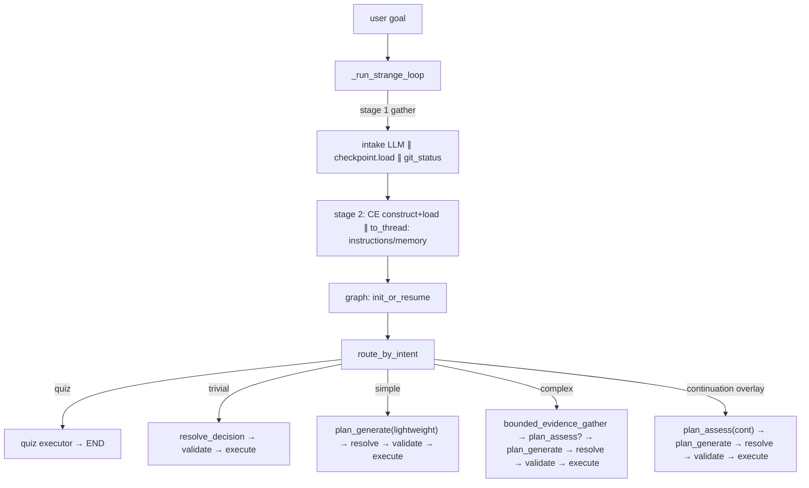

# RFC-630: Start-Phase LLM Intake and Branch Routing

**RFC**: 630
**Title**: Start-Phase LLM Intake and Branch Routing
**Status**: Draft
**Kind**: Architecture Design
**Authors**: Xiaming Chen
**Created**: 2026-06-30
**Last Updated**: 2026-06-30
**Depends on**: RFC-220, RFC-225, RFC-226, RFC-503
**Extends**: RFC-225 (intent classification taxonomy), RFC-220 (orchestrator topology)
**Supersedes**: The `_is_likely_agentic` heuristic bypass and `simple_bypass` string-prefix detection introduced by IG-518
**Related**: RFC-214 (loop-message surface), RFC-604 (reason-phase robustness), RFC-624 (Context Engine)

---

## 1. Abstract

The start-phase pipeline — from user goal arrival to the first task submitted to CoreAgent — mixes keyword/rule heuristics with LLM calls arranged sequentially. `IntentClassifier._is_likely_agentic` forces any query over 80 characters, 15 words, or 2 newlines down the agentic path without consulting the LLM, mis-routing long trivia as agentic; `simple_bypass` recognizes a synthetic plan by a `startswith` string prefix. Meanwhile, on a fresh first message the intent-classification LLM call, the pre-graph IO cluster (checkpoint load, ContextEngine load, instruction/memory file reads, git status), and the plan-generation LLM call all run strictly sequentially, none parallelized.

This RFC replaces the binary intent classifier and its heuristic bypass with a single **intake LLM** call returning a lean 4-class label (`quiz | trivial | simple | complex`), runs that call `asyncio.gather`-ed with the pre-graph IO cluster so the LLM round-trip is hidden behind IO that must run anyway, and adds a `route_by_intent` conditional edge after `init_or_resume` that dispatches to four branches — each running only the phases it needs. Continuation remains a structural overlay derived from the checkpoint; clarification remains emergent from the planner. The fresh-loop skip (IG-476) is preserved as an internal optimization of the `complex` branch. The verbose `"I will complete this goal directly:"` synthetic reasoning prefix is deleted; the `trivial` branch emits the goal itself as the step action. The 4-class intake is the sole intent path — the legacy binary classifier, its prompt fragments, and the `_is_likely_agentic` heuristic are removed outright (no feature flag, no backward-compat shim).

---

## 2. Scope and Non-Goals

### 2.1 Scope

This RFC defines:

- A 4-class intake taxonomy (`quiz | trivial | simple | complex`) and the structured-output schema replacing the binary `IntentClassificationLLMResult`.
- The removal of the `_is_likely_agentic` heuristic bypass, the legacy binary `IntentClassificationLLMResult` schema, the legacy `classify_intent` path, and the `simple_bypass` string-prefix detector.
- A two-stage parallelized pre-graph sequence in the runner: intake LLM ∥ checkpoint load ∥ git status in stage 1; ContextEngine construct + load + `create_goal`/`activate_goal` (which depend on the checkpoint) and instruction/memory file reads (wrapped in `to_thread`) in stage 2.
- A `route_by_intent` conditional edge after `init_or_resume` driving four branches, with continuation as a structural overlay.
- Complexity-tiered planning: `trivial` skips `plan_generate` with a minimal synthetic plan; `simple` runs a lightweight plan call; `complex` runs the existing full spine.
- The trivial-branch plan shape: goal-as-step-action, no synthetic reasoning message, `## Result` evidence contract retained.

### 2.2 Non-Goals

- Speculative first-task emission before the full plan completes (future "aggressive" variant).
- Plan-token streaming to the user as a draft.
- Embedding-based pre-filter of intent.
- Post-execution failure-intent classification (`failure_intent_classifier.py`).
- Changes to the wire protocol, event envelopes, or daemon transport.
- Changes to the continuation discriminator (`RFC-226`) or clarification relay (`RFC-622`) — both preserved unchanged.
- A feature flag or staged rollout — the 4-class intake replaces the binary classifier outright.

---

## 3. Motivation

### 3.1 Unintelligent heuristic judgment

`IntentClassifier._is_likely_agentic` (`packages/soothe/src/soothe/foundation/sloop/intention/classifier.py:260`) classifies any query with `len(query) > 80`, `len(query.split()) > 15`, or `query.count("\n") >= 2` as `agentic` *before* the LLM is consulted. A long trivia question is forced down the agentic path. The `simple_bypass` string-prefix match (`planning/simple_bypass.py:28`, `startswith("I will complete this goal directly:")`) is similarly content-blind: it recognizes a synthetic plan by its prefix rather than by an intelligent label.

### 3.2 High first-message latency

On a fresh first message, the critical path runs these steps strictly sequentially (none parallelized):

1. Intent classification LLM call (`runner/_runner_strange_loop.py:447`).
2. `get_git_status` (`_runner_strange_loop.py:530`).
3. `state_manager.load()` checkpoint (`foundation/sloop/engine/strange_loop.py:234`).
4. ContextEngine backend construct + `ce.load()` + `create_goal`/`activate_goal` (`strange_loop.py:416`–`502`).
5. Three synchronous file reads on the event loop: `load_project_instructions()`, `load_agent_instructions()`, `load_memory()` (`strange_loop.py:507`–`515`).
6. PlanGeneration LLM call (`foundation/sloop/planning/planner.py:1297`).

The fresh-loop shortcut (IG-476) already removes the StatusAssessment LLM from the fresh path. The remaining blockers are the intent call, the pre-graph IO cluster, and the single plan call.

### 3.3 The central tension

Replacing `_is_likely_agentic` with an LLM call naïvely *adds* a sequential round-trip to every first message — and today that heuristic *saves* latency for long queries by skipping the LLM. The resolution is to run the intake LLM in parallel with the pre-graph IO cluster (which must run anyway), so the LLM costs approximately zero added critical-path latency, then use its richer label to skip whole phases for easy goals. Intelligence goes up *and* latency goes down.

---

## 4. Guiding Principles

1. **LLM over heuristic for content judgment.** Decisions about what the user's goal *means* are made by an LLM, not by string length, word count, or prefix matching. Structural state (iteration counters, checkpoint status, prior completed goals) remains structural — it is not content and does not need an LLM.
2. **Parallelize independent work.** The intake LLM round-trip and the pre-graph IO cluster are independent; they run concurrently. Dependencies (CE construct needs the checkpoint) are respected by staging.
3. **Match effort to difficulty.** A trivial goal does not pay for a plan-generation LLM call; a complex goal runs the full pipeline. The intake label selects the branch.
4. **Fail safe.** On intake failure, route to the most capable pipeline (`complex`), preserving today's "fail safe = run the full loop" behavior.
5. **Preserve what works.** The fresh-loop skip (IG-476), the continuation discriminator (RFC-226), and the clarification relay (RFC-622) are unchanged. This RFC adds a routing layer *around* them, not *instead of* them.

---

## 5. Component Overview



---

## 6. Component Responsibilities

### 6.1 Intake Classifier

**Purpose**: Classify the user goal into one of four labels via a single structured LLM call on the fast model.

**Capabilities**:
- Returns `IntakeLabel ∈ {quiz, trivial, simple, complex}` plus, for `quiz`, a piggybacked `quiz_response` (preserving the existing quiz short-circuit optimization).
- Reuses the existing `TaskComplexity` enum (`minimal | simple | medium | complex`, `intention/models.py:27`) — no new complexity vocabulary.
- No heuristic bypass. The `intent_hint == QUIZ` caller-assertion bypass (a structural hint, not content) is retained.

**Interfaces**:
- Provides: `IntentClassifier.classify_intake(query, *, intent_hint) -> IntakeClassification`.
- Requires: fast chat model (`config.create_chat_model("fast")`).

### 6.2 `route_by_intent`

**Purpose**: Branch dispatch immediately after `init_or_resume`, driven by the intake label with continuation as a structural overlay.

**Capabilities**:
- Pure function over `(state, ctx)` — testable without an LLM.
- Checks `ctx.continue_loop_mode` and prior completed goals first (structural continuation overlay); then matches the intake label.

**Interfaces**:
- Provides: conditional-edge target string for `init_or_resume`.
- Requires: `LoopGraphState.intake_label`, `ctx.continue_loop_mode`.

### 6.3 `node_init_or_resume` (extended)

**Purpose**: Surface the pre-graph intake result onto the graph state; for the `trivial` branch, inject a minimal synthetic plan into `ctx.scratch`.

**Capabilities**:
- Sets `intake_label` on the graph state from `ctx.loop_state.intent`.
- For `trivial`: builds a minimal 1-step `PlanResult` (goal as step action, `## Result` evidence contract, no reasoning prose) and stashes it in `ctx.scratch.plan_result` so `resolve_decision` can ingest it.

### 6.4 `plan_phase.generate_lightweight`

**Purpose**: A cheaper plan call for the `simple` branch.

**Capabilities**:
- Reuses `generate_from_assessment`'s structured-output path with a reduced context window (last N step results, no full evidence ledger).
- Same `PlanGeneration` schema; smaller prompt.

### 6.5 `_run_strange_loop` (restructured)

**Purpose**: Orchestrate the two-stage parallel pre-graph gather.

**Capabilities**:
- Stage 1: `asyncio.gather(intake, checkpoint.load, git_status)`.
- Stage 2: CE construct + load (needs checkpoint) and instruction/memory file reads via `to_thread`, gathered together.

---

## 7. Data Flow

### 7.1 Pre-graph (parallelized)

1. Stage 1: intake LLM call, `state_manager.load()`, `get_git_status()` run concurrently.
2. Stage 2: CE backend construct + `ce.load()` + `create_goal`/`activate_goal` (branched on the stage-1 checkpoint result); the three instruction/memory file reads run via `asyncio.to_thread` gathered with `ce.load()`.
3. The intake result is stored on `loop_state.intent` exactly as today; `LoopRuntimeContext` is assembled after stage 2.

### 7.2 Graph (branch routing)

1. `init_or_resume` sets `intake_label`; for `trivial`, injects the minimal plan into `ctx.scratch`.
2. `route_by_intent` dispatches:
   - `quiz` → END (handled pre-graph; defensive duplicate).
   - `trivial` → `resolve_decision` (synth plan in scratch) → `validate_evidence_bindings` → `execute`.
   - `simple` → `plan_generate` (lightweight) → `resolve_decision` → `validate_evidence_bindings` → `execute`.
   - `complex` → `bounded_evidence_gather` (fresh-loop skip intact) → `plan_assess?` → `plan_generate` (full) → `resolve_decision` → `validate_evidence_bindings` → `execute`.
   - continuation overlay → `plan_assess` (RFC-226 discriminator) → `plan_generate` → `resolve_decision` → `validate_evidence_bindings` → `execute`.
3. Clarification remains emergent: `plan_generate`/`plan_assess` still route to `await_clarification` (RFC-622) when they cannot plan; it is not an intake branch.

---

## 8. Abstract Schemas

### 8.1 IntakeLabel

```
IntakeLabel :=
  | "quiz"      // greeting/thanks/trivia, no tools
  | "trivial"   // single obvious action, no planning LLM needed
  | "simple"    // single focused step, lightweight plan
  | "complex"   // multi-step / multi-phase, full plan
```

### 8.2 IntakeClassificationLLMResult (replaces IntentClassificationLLMResult)

```
IntakeClassificationLLMResult {
  intake_label: IntakeLabel
  reasoning: string | null        // one sentence, ≤20 words; empty for quiz
  goal_description: string | null // normalized goal (non-quiz)
  task_complexity: TaskComplexity  // reuses existing enum
  quiz_response: string | null    // piggybacked answer for quiz
}
```

### 8.3 LoopGraphState additions

```
LoopGraphState += {
  intake_label: IntakeLabel   // set by init_or_resume, read by route_by_intent
}
```

`intent_route` (existing, quiz fast-path) is retained for the defensive duplicate.

### 8.4 Trivial-branch plan shape

```
PlanResult {
  status: "execute"
  next_action: <intake goal_description or raw goal>   // no prefix
  plan_reasoning: null                                  // no synthetic prose
  expected_output: SIMPLE_QUERY_DIRECT_EXPECTED_OUTPUT  // ## Result contract
  steps: [ single step ]
}
```

---

## 9. Architectural Constraints

1. **Continuation is structural, not classified.** The intake LLM never decides continuation; it is derived from the checkpoint (`continue_loop_mode`, prior completed goals) and overlays the intake label. This preserves RFC-225's structural-continuation invariant.
2. **Clarification is emergent, not pre-classified.** The intake taxonomy deliberately omits a clarification class; the planner routes to `await_clarification` when it cannot plan. Pre-classifying clarification would risk blocking goals the planner could handle with richer context.
3. **Fail-safe label is `complex`.** On intake LLM failure after retry, the label defaults to `complex` so the full pipeline runs. No correctness loss; latency cost only.
4. **No new complexity vocabulary.** The existing `TaskComplexity` enum is reused; the 4-class intake label is a new enum but maps to the same complexity tiers.
5. **Pre-graph gather respects dependencies.** CE construct + `create_goal` branch on the checkpoint result and therefore cannot run in stage 1. The two-stage structure is a correctness constraint, not an optimization choice.
6. **Internal-only identifiers.** Per project terminology rules, RFC/IG identifiers do not appear in runtime strings; log/CLI/error text uses concrete component names.

---

## 10. Branch Wiring

The `route_after_init` conditional edge (RFC-220) is replaced by `route_by_intent` with an expanded target set:

```
init_or_resume --(route_by_intent)--> {
  END                      // quiz
  resolve_decision         // trivial (synth plan in scratch)
  plan_generate            // simple
  bounded_evidence_gather  // complex
  plan_assess              // continuation overlay
}
```

The `complex` branch then runs the existing spine unchanged: `bounded_evidence_gather` (IG-476 fresh-loop skip intact) → `plan_assess?` → `plan_generate` → `resolve_decision` → `validate_evidence_bindings` → `execute`. No change to the complex path's internals or to any downstream conditional edges (`route_after_assess`, `route_after_plan`, `route_after_resolve_decision`, `route_after_validate_evidence`, `route_after_execute`).

---

## 11. Trivial-Branch Plan Shape (no synthetic reasoning message)

The legacy `simple_bypass` (`planning/simple_bypass.py`) bundles two concerns; only one survives:

- **`SIMPLE_QUERY_DIRECT_PREFIX`** (`"I will complete this goal directly:"`) — a verbose prefix prepended to the goal to form the step's `next_action`. **Deleted.** Under LLM routing the trivial label comes from the intake LLM; the prefix existed only so `is_simple_query_direct_next_action` (a `startswith` detector) could recognize the synthetic plan in the legacy path. With the label authoritative, both the prefix and the string detector are dead weight.
- **`SIMPLE_QUERY_DIRECT_EXPECTED_OUTPUT`** (the `## Result` block contract) — **kept.** It is functional, not cosmetic: an `expected_output` hint in the step's user message that forces the assistant to restate concrete data (numbers, paths, names) so `plan_assess` recognizes completion on the next iteration. It adds no LLM call and no user-visible text.

The trivial branch synthesizes a **minimal plan object**, not a synthetic *reasoning message*:

- Step action: the intake LLM's normalized `goal_description` (fallback: raw user goal). No prefix.
- Plan reasoning: `None` / empty. The loop does not narrate "I will complete this directly" to the user.
- The 1-step `Decision` indirection is retained because `Executor` consumes a structured decision (step ids allocated by `resolve_decision`, plan ingested by `plan_manager.ingest_plan`); CoreAgent cannot take a bare goal string.

---

## 12. Error Handling

- **Intake LLM failure** — after the single retry, fallback label = `complex`; the full pipeline runs. Logged with error context (preserves today's `_fallback_intent` pattern).
- **IO gather failure** — each IO task is wrapped; partial failures degrade gracefully as today (e.g., `git_status = None` on failure). The gather uses `return_exceptions=True` where a task failure should not abort the others.
- **Mislabel risk** — a `trivial` goal mislabeled `complex` pays an extra plan call (latency, no correctness loss). A `complex` goal mislabeled `trivial` produces a 1-step plan that the loop's existing post-execution `plan_assess` catches on the next iteration (the loop replans). The intake prompt errs toward `complex` when uncertain.
- **Synthetic plan failure (trivial branch)** — if `init_or_resume` cannot build the synth plan, it downgrades `intake_label` to `complex` and falls through to the full spine.

---

## 13. Migration

- **Direct replacement** — the 4-class intake is the sole intent path; the legacy binary `IntentClassificationLLMResult` schema, `classify_intent`, the binary prompt fragments, and `_is_likely_agentic` are removed in the same change. No feature flag, no backward-compat shim.
- **`simple_bypass` removal** — `SIMPLE_QUERY_DIRECT_PREFIX` and `is_simple_query_direct_next_action` are deleted; the `## Result` contract is extracted to a shared `planning/trivial_plan.py` helper used by `init_or_resume` (trivial branch).
- **No wire-protocol change** — internal to the loop; does not touch Protocol-1. The `IntentClassifiedEvent` wire contract (`intent_type: quiz|agentic`) is preserved; `intent_type` is derived from the 4-class label.

---

## 14. Testing

- **Intake classifier unit tests** — golden-set queries per label, including the long-trivia case that today's heuristic misroutes. Assert the LLM is called for all queries (no heuristic bypass).
- **Routing unit tests** — `route_by_intent` truth table over `(label, continue_loop_mode, has_prior_completed_goal)`.
- **Parallelization tests** — assert intake, `checkpoint.load`, `git_status` run concurrently (mock with `asyncio.Event` latches); assert file reads go through `to_thread`.
- **Branch integration tests** — one fixture per branch: assert the visited node sequence matches §10 (e.g., `trivial` skips `plan_generate`; `simple` skips `bounded_evidence_gather` and `plan_assess`).
- **Latency regression test** — timing-based with generous bounds, asserting a fresh `complex` first-message does not exceed today's p95 by more than gather overhead; skippable in CI if flaky.
- **Mislabel recovery test** — force `trivial` on a multi-step goal; assert the loop replans on iteration 2 via `plan_assess`.

Tests live in `packages/soothe/tests/unit/` and `tests/integration/` per project convention.

---

## 15. Open Questions

1. **Lightweight plan prompt scope** — exactly which context slots to drop for `simple`. Proposal: drop evidence-ledger history beyond the last 2 step results, drop full prior-goal context. Confirm with a planning-quality eval during implementation.
2. **Intake prompt boundary calibration** — the `trivial`/`simple`/`complex` boundary is the main mislabel surface; lock definitions with the §14 golden set before implementation.

---

## 16. Related Documents

- [RFC Standard](./rfc-standard.md)
- [RFC Index](./rfc-index.md)
- [RFC-220](./RFC-220-langgraph-agent-loop-orchestrator.md) — LangGraph Agent Loop Orchestrator (topology revised)
- [RFC-225](./RFC-225-loop-continuity-and-goal-record-enrichment.md) — Loop Continuity and Goal Record Enrichment (intent taxonomy extended)
- [RFC-226](./RFC-226-continuation-aware-plan-assess.md) — Continuation-Aware plan_assess (preserved)
- [RFC-503](./RFC-503-loop-first-user-experience.md) — Loop-First User Experience (first-message latency)
- [RFC-604](./RFC-604-reason-phase-robustness.md) — Plan Phase Robustness
- Design draft: `docs/drafts/2026-06-30-start-phase-llm-intake-routing-design.md`
