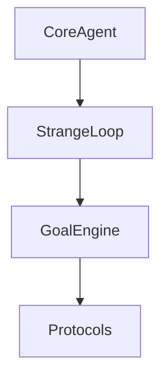

# Soothe Wiki Architecture

**Created**: 2026-06-06
**Status**: Design Proposal
**Purpose**: Comprehensive wiki structure plan for Soothe documentation

---

## Design Principles

1. **Audience-First Organization**: Structure content for different audiences (users, developers, contributors)
2. **Progressive Disclosure**: Start simple, link to advanced topics
3. **Cross-Linking Strategy**: Connect wiki pages to RFCs, IGs, and API docs
4. **Discoverability**: Clear navigation paths and search-friendly structure
5. **Maintainability**: Modular structure that mirrors codebase organization

---

## Wiki Structure Overview

```
docs/wiki/
├── README.md                    # Wiki hub and navigation
├── getting-started/             # Quick start and onboarding
│   ├── README.md                # Getting Started hub
│   ├── Installation.md          # System requirements, installation methods, troubleshooting
│   ├── Quick-Start.md           # First session, common workflows, tips
│   └── Basic-Concepts.md        # Core architecture, goals, threads, subagents
│
├── user-guide/                  # End-user documentation
│   ├── README.md
│   ├── cli-reference.md         # (move from existing)
│   ├── tui-guide.md             # (move from existing)
│   ├── configuration.md         # (move from existing)
│   ├── thread-management.md    # (move from existing)
│   ├── autonomous-mode.md       # (move from existing)
│   ├── subagents.md             # (move from existing)
│   ├── skills-and-tools.md
│   ├── mcp-servers.md
│   └── troubleshooting.md      # (move from existing)
│
├── architecture/                # System architecture
│   ├── README.md
│   ├── conceptual-design.md
│   ├── three-level-execution.md
│   ├── protocol-first.md
│   ├── daemon-architecture.md
│   └── event-system.md
│
├── modules/                     # Module documentation
│   ├── README.md
│   ├── core/                    # Core framework
│   │   ├── README.md
│   │   ├── agent.md
│   │   ├── runner.md
│   │   ├── events.md
│   │   ├── workspace.md
│   │   ├── context.md
│   │   ├── scheduling.md
│   │   ├── persistence.md
│   │   ├── middleware.md
│   │   ├── goal-engine.md
│   │   ├── strangeloop.md
│   │   └── resolver.md
│   │
│   ├── protocols/               # Protocol definitions
│   │   ├── README.md
│   │   ├── overview.md
│   │   ├── context-protocol.md
│   │   ├── memory-protocol.md
│   │   ├── planner-protocol.md
│   │   ├── policy-protocol.md
│   │   ├── durability-protocol.md
│   │   ├── vector-store-protocol.md
│   │   ├── loop-protocols.md
│   │   └── remote-protocol.md
│   │
│   ├── backends/                # Protocol implementations
│   │   ├── README.md
│   │   ├── memory-backends.md
│   │   ├── durability-backends.md
│   │   ├── vector-store-backends.md
│   │   └── persistence-backends.md
│   │
│   ├── subagents/               # Built-in subagents
│   │   ├── README.md
│   │   ├── overview.md
│   │   ├── explore.md
│   │   ├── plan.md
│   │   ├── veritas.md
│   │   ├── tacitus.md
│   │   ├── claude.md
│   │   └── browser-use.md
│   │
│   ├── skills/                  # Agent skills
│   │   ├── README.md
│   │   ├── overview.md
│   │   ├── builtin-skills.md
│   │   ├── skill-registry.md
│   │   └── budget-management.md
│   │
│   ├── middleware/              # Middleware components
│   │   ├── README.md
│   │   ├── overview.md
│   │   ├── system-prompt.md
│   │   ├── policy-enforcement.md
│   │   ├── workspace-context.md
│   │   ├── execution-hints.md
│   │   └── advanced-middleware.md
│   │
│   ├── mcp/                     # MCP integration
│   │   ├── README.md
│   │   ├── overview.md
│   │   ├── server-management.md
│   │   └── tool-discovery.md
│   │
│   ├── daemon/                  # Daemon server
│   │   ├── README.md
│   │   ├── overview.md
│   │   ├── multi-transport.md   # (move from existing)
│   │   ├── authentication.md    # (move from existing)
│   │   ├── daemon-management.md # (move from existing)
│   │   └── thread-lifecycle.md
│   │
│   └── sdk/                     # Plugin SDK
│       ├── README.md
│       ├── overview.md
│       ├── plugin-development.md
│       ├── tool-development.md
│       ├── subagent-development.md
│       └── event-registration.md
│
├── development/                 # Developer documentation
│   ├── README.md
│   ├── contributing.md
│   ├── development-setup.md
│   ├── testing-guide.md
│   ├── debugging.md            # (move from existing howto_debug.md)
│   ├── coding-standards.md
│   ├── implementation-guides.md
│   └── rfc-process.md
│
├── api-reference/               # API documentation
│   ├── README.md
│   ├── python-api/
│   │   ├── README.md
│   │   ├── soothe.core.md
│   │   ├── soothe.protocols.md
│   │   ├── soothe.backends.md
│   │   ├── soothe.middleware.md
│   │   └── soothe_sdk.md
│   │
│   └── rest-api/
│       ├── README.md
│       └── endpoints.md         # (reference RFC-450)
│
├── tutorials/                   # Step-by-step guides
│   ├── README.md
│   ├── basic-usage/
│   │   ├── first-agent.md
│   │   ├── working-with-files.md
│   │   └── web-search.md
│   │
│   ├── intermediate/
│   │   ├── custom-subagent.md
│   │   ├── custom-skill.md
│   │   ├── mcp-integration.md
│   │   └── thread-management.md
│   │
│   └── advanced/
│       ├── custom-backend.md
│       ├── custom-protocol.md
│       ├── plugin-development.md
│       └── multi-agent-workflow.md
│
├── operations/                  # Deployment and operations
│   ├── README.md
│   ├── installation.md
│   ├── configuration-management.md
│   ├── monitoring.md
│   ├── logging.md
│   ├── backup-recovery.md
│   └── security-hardening.md
│
├── reference/                   # Reference materials
│   ├── README.md
│   ├── rfc-index.md             # (link to docs/specs/rfc-index.md)
│   ├── ig-index.md              # Implementation guide index
│   ├── config-reference.md      # Full configuration schema
│   ├── event-catalog.md         # Event types reference
│   ├── error-codes.md
│   ├── glossary.md
│   └── faq.md
│
└── examples/                    # Example collections
    ├── README.md
    ├── basic-examples.md
    ├── advanced-examples.md
    └── community-examples.md

```

---

## Page Templates

### Module Page Template

```markdown
# [Module Name]

> **Purpose**: One-line purpose statement

## Overview

Brief description of the module's role in the architecture.

## Architecture

```
Diagram or component overview
```

## Key Components

### [Component 1]

Description and usage.

### [Component 2]

Description and usage.

## API Reference

Key classes and functions.

## Configuration

Configuration options specific to this module.

## Examples

```python
# Code example
```

## Related

- **RFCs**: [RFC-XXX](../specs/RFC-XXX.md), [RFC-YYY](../specs/RFC-YYY.md)
- **IGs**: [IG-XXX](../impl/IG-XXX.md)
- **Backends**: [Backend Module](./backend.md)
```

### Protocol Page Template

```markdown
# [Protocol Name]

> **Purpose**: What this protocol abstracts

## Protocol Definition

```python
class ProtocolName(Protocol):
    def method(self, ...) -> ...:
        ...
```

## Contract

What implementations must provide.

## Built-in Implementations

- **Implementation A**: Description
- **Implementation B**: Description

## Custom Implementation

How to create custom implementations.

## Configuration

How to configure via YAML or code.

## Related

- **RFC**: [RFC-XXX](../specs/RFC-XXX.md)
- **Backends**: [Backends](../backends/README.md)
```

---

## Cross-Linking Strategy

### 1. RFC Links
Every wiki page should link to relevant RFCs:
```markdown
## Architecture

This module implements [RFC-200: Autonomous Goal Management](../specs/RFC-200.md).
```

### 2. IG Links
Implementation guides should be referenced when relevant:
```markdown
## Recent Changes

The module structure was refactored in [IG-276: Core Directory Refactoring](../impl/IG-276.md).
```

### 3. API Links
All code examples should link to API reference:
```markdown
```python
from soothe.core.agent import create_soothe_agent
```
See [API Reference: soothe.core.agent](../api-reference/python-api/soothe.core.md).
```

### 4. Module Cross-Links
Related modules should be linked:
```markdown
## Related Modules

- [StrangeLoop](./strangeloop.md) - Uses this protocol for execution
- [GoalEngine](./goal-engine.md) - Delegates to StrangeLoop
```

---

## Navigation Structure

### Sidebar Navigation (suggested)

```
🏠 Home
├── 🚀 Getting Started
│   ├── Installation
│   ├── First Run
│   ├── Basic Concepts
│   └── Quickstart Examples
│
├── 📖 User Guide
│   ├── CLI Reference
│   ├── TUI Guide
│   ├── Configuration
│   ├── Thread Management
│   ├── Autonomous Mode
│   ├── Subagents
│   ├── Skills & Tools
│   └── MCP Servers
│
├── 🏗️ Architecture
│   ├── Conceptual Design
│   ├── Three-Level Execution
│   ├── Protocol-First Design
│   ├── Daemon Architecture
│   └── Event System
│
├── 📦 Modules
│   ├── Core
│   ├── Protocols
│   ├── Backends
│   ├── Subagents
│   ├── Skills
│   ├── Middleware
│   ├── MCP
│   ├── Daemon
│   └── SDK
│
├── 💻 Development
│   ├── Contributing
│   ├── Development Setup
│   ├── Testing Guide
│   ├── Debugging
│   ├── Coding Standards
│   └── RFC Process
│
├── 📚 API Reference
│   ├── Python API
│   └── REST API
│
├── 🎓 Tutorials
│   ├── Basic
│   ├── Intermediate
│   └── Advanced
│
├── 🔧 Operations
│   ├── Installation
│   ├── Configuration
│   ├── Monitoring
│   └── Security
│
└── 📋 Reference
    ├── RFC Index
    ├── IG Index
    ├── Config Reference
    ├── Event Catalog
    ├── Error Codes
    ├── Glossary
    └── FAQ
```

---

## Content Migration Plan

### Phase 1: Reorganize Existing Content

| Current Location | New Location | Action |
|------------------|--------------|--------|
| `docs/wiki/*.md` (root) | `docs/wiki/user-guide/` | Move user-facing docs |
| `docs/howto_debug.md` | `docs/wiki/development/debugging.md` | Move and expand |
| `docs/specs/rfc-index.md` | `docs/wiki/reference/rfc-index.md` | Create symlink or copy |

### Phase 2: Create New Structure

1. Create all directories
2. Create README.md hub pages
3. Create module documentation pages
4. Create API reference stubs
5. Create tutorial outlines

### Phase 3: Populate Content

1. Document core modules first (highest priority)
2. Document protocols
3. Document backends
4. Document subagents
5. Document SDK

---

## Documentation Priorities

### P0: Critical (Must Have)

1. **Getting Started** - Installation, first run, basic concepts
2. **Core Modules** - agent, runner, events, workspace
3. **Protocol Overview** - What protocols are and why
4. **Configuration** - Full config reference
5. **API Reference** - Core Python API

### P1: Important (Should Have)

1. **Subagents** - Built-in subagent documentation
2. **Middleware** - All middleware components
3. **Backends** - Backend implementations
4. **Development Guide** - Contributing, testing, debugging
5. **Tutorials** - Basic usage tutorials

### P2: Nice to Have

1. **Advanced Tutorials** - Custom backends, protocols
2. **Operations Guide** - Deployment, monitoring
3. **Architecture Deep Dives** - Detailed architecture docs
4. **FAQ** - Common questions
5. **Glossary** - Term definitions

---

## Cross-Reference Matrix

### Core Modules → RFCs

| Module | Primary RFCs | Secondary RFCs |
|--------|--------------|----------------|
| core/agent | RFC-100 | RFC-000, RFC-001 |
| core/runner | RFC-200, RFC-201 | RFC-220 |
| core/goal_engine | RFC-200, RFC-204 | RFC-222 |
| core/loop | RFC-201, RFC-220 | RFC-200 |
| core/events | RFC-401, RFC-403 | RFC-303 |
| core/workspace | RFC-103 | RFC-102 |
| core/context | RFC-104, RFC-217 | RFC-300 |
| core/scheduling | RFC-216 | RFC-221 |
| core/persistence | RFC-802 | RFC-215 |

### Protocols → RFCs

| Protocol | RFC |
|----------|-----|
| ContextProtocol | RFC-300, RFC-302 |
| MemoryProtocol | RFC-300, RFC-303 |
| PlannerProtocol | RFC-304 |
| PolicyProtocol | RFC-305 |
| DurabilityProtocol | RFC-306 |
| VectorStoreProtocol | RFC-611 |
| LoopWorkingMemory | RFC-224 |
| LoopPlanner | RFC-226 |
| RemoteProtocol | RFC-450 |

### Subagents → RFCs

| Subagent | RFC |
|----------|-----|
| explore | RFC-613 |
| plan | RFC-618 |
| veritas | RFC-623 |
| tacitus | RFC-619 |
| claude | RFC-601 |

---

## Style Guide

### Writing Style

1. **Clear and Concise**: Use simple language, avoid jargon
2. **Example-First**: Show code examples before explaining concepts
3. **Progressive Complexity**: Start simple, add complexity gradually
4. **Cross-Link Liberally**: Link to related docs, RFCs, APIs
5. **Keep Current**: Update when code changes

### Formatting

```markdown
# Page Title

> **Purpose**: One-line purpose

## Overview

Brief introduction.

## [Section]

### [Subsection]

**Bold** for emphasis, `code` for inline code.

```python
# Code examples with comments
from soothe.core.agent import create_soothe_agent
```

## Related

- **RFCs**: [RFC-XXX](link)
- **Modules**: [Module](link)

## See Also

- [Related Page 1](link)
- [Related Page 2](link)
```

---

## Tooling Recommendations

### Documentation Generation

1. **MkDocs** with Material theme for static site
2. **mkdocstrings** for Python API docs from docstrings
3. **mkdocs-mermaid2-plugin** for diagrams
4. **mkdocs-redirects** for URL redirects during migration

### Diagrams

Use Mermaid for diagrams:


### Search

Integrate with Algolia or similar for full-text search.

---

## Implementation Checklist

### Phase 1: Structure Setup

- [ ] Create directory structure
- [ ] Create README.md hub pages
- [ ] Create navigation sidebar
- [ ] Set up MkDocs configuration

### Phase 2: Content Migration

- [ ] Move existing wiki pages
- [ ] Update internal links
- [ ] Create redirect map

### Phase 3: Core Documentation

- [ ] Document all core modules
- [ ] Document all protocols
- [ ] Document all backends
- [ ] Document all subagents
- [ ] Document middleware components

### Phase 4: API Reference

- [ ] Generate Python API docs
- [ ] Document REST API endpoints
- [ ] Create code examples

### Phase 5: Tutorials

- [ ] Basic tutorials
- [ ] Intermediate tutorials
- [ ] Advanced tutorials

### Phase 6: Operations

- [ ] Installation guide
- [ ] Configuration reference
- [ ] Monitoring guide
- [ ] Security guide

---

## Success Metrics

1. **Coverage**: All public APIs documented
2. **Discoverability**: All pages accessible within 3 clicks
3. **Freshness**: Docs updated within 1 week of code changes
4. **Usability**: New users can complete first task in < 10 minutes
5. **Completeness**: All RFCs have corresponding wiki pages

---

## Appendix A: Existing Wiki Pages to Migrate

| File | Topic | New Location |
|------|-------|--------------|
| `getting-started.md` | Installation | `getting-started/README.md` |
| `authentication.md` | Auth | `modules/daemon/authentication.md` |
| `daemon-management.md` | Daemon | `modules/daemon/daemon-management.md` |
| `multi-transport.md` | Transports | `modules/daemon/multi-transport.md` |
| `query-processing-flow.md` | Flow | `architecture/query-processing.md` |
| `troubleshooting.md` | Troubleshooting | `user-guide/troubleshooting.md` |
| `autonomous-mode.md` | Autopilot | `user-guide/autonomous-mode.md` |
| `tui-guide.md` | TUI | `user-guide/tui-guide.md` |
| `configuration.md` | Config | `user-guide/configuration.md` |
| `cli-reference.md` | CLI | `user-guide/cli-reference.md` |
| `thread-management.md` | Threads | `user-guide/thread-management.md` |
| `subagents.md` | Subagents | `modules/subagents/overview.md` |

## Appendix B: RFCs Needing Wiki Pages

All 73 RFCs should have corresponding wiki pages summarizing their content for users who don't need to read full specifications. Priority RFCs:

1. **RFC-000**: System Conceptual Design → `architecture/conceptual-design.md`
2. **RFC-200**: Autonomous Goal Management → `modules/core/goal-engine.md`
3. **RFC-201**: StrangeLoop Architecture → `modules/core/strangeloop.md`
4. **RFC-220**: LangGraph Agent Loop → `modules/core/runner.md`
5. **RFC-600**: Plugin System → `modules/sdk/plugin-development.md`

## Appendix C: Implementation Guides Index

Create `reference/ig-index.md` linking to all IGs with brief summaries. Priority IGs for documentation:

1. **IG-047**: Module Self-Containment Pattern
2. **IG-051**: Plugin API Implementation
3. **IG-052**: Event System Optimization
4. **IG-276**: Core Directory Refactoring
5. **IG-394**: LangGraph Agent Loop Orchestrator

---

**Next Steps**: Create implementation plan and begin Phase 1 structure setup.